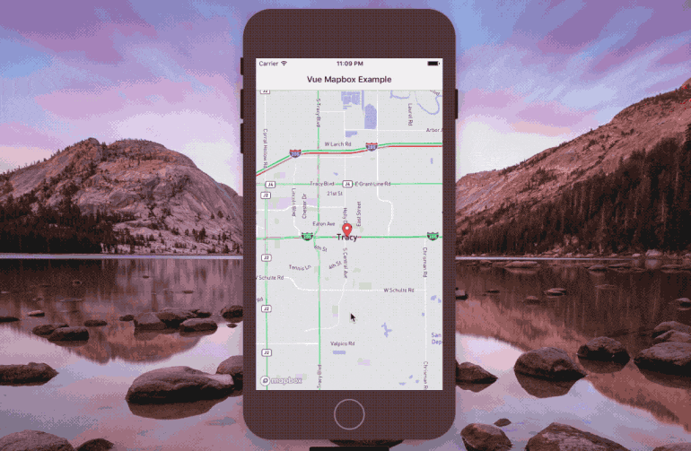

# Include Feature-Rich Maps in a NativeScript-Vue App with Mapbox

description = "Learn how to use Mapbox in a NativeScript application that uses the Vue.js JavaScript framework to work with feature rich maps."

Vue.js has been all the rage lately and is proving to be a strong competitor to Angular and React. When it comes to the mobile development frameworks, we're lucky that NativeScript allows us to create native Android and iOS applications [with Vue.js](https://nativescript-vue.org/). A little less than a year ago I wrote a tutorial titled, [Using a Mapbox in a NativeScript Angular Application](https://www.thepolyglotdeveloper.com/2017/11/mapbox-nativescript-angular-application/), that demonstrated including feature-rich maps in an application built with Angular.

Being that we're all polyglots here, wouldn't it be nice if we could accomplish the same with NativeScript and [Vue.js](https://vuejs.org/)?

We're going to see how to include [Mapbox](https://www.mapbox.com/), a strong competitor to Google Maps, in our [NativeScript](https://www.nativescript.org/) with Vue.js application using clean and efficient code that can be easily expanded upon.

While you can do quite a bit with Mapbox in NativeScript, we're going to focus our energy on getting it into our application and including a map marker or two. An example of what we hope to accomplish can be seen in the animated image below.

*Notice that we can interact with the marker as well as the map.*

## Creating a Fresh NativeScript with Vue.js Project

To keep this project simple and easy to understand, we're going to create it from scratch and work our way into it. Assuming that you've got the [Vue CLI and the NativeScript CLI installed](https://nativescript-vue.org/en/docs/getting-started/installation/), execute the following:

	vue init nativescript-vue/vue-cli-template mapbox-project
	cd mapbox-project
	npm install
	npm run watch:ios

The above commands will create a project called **mapbox-project**, install the Vue.js and NativeScript dependencies, and emulate it with hot-reload on an iOS simulator. If you're not using iOS, switch the command for Android and it will accomplish the same thing.

With the project created, we can integrate the [Mapbox plugin](https://market.nativescript.org/plugins/nativescript-mapbox).

## Including the Mapbox UI Plugin for NativeScript

Mapbox is a great service that can be used for free, but you'll still need an account. If you don't already have a Mapbox access token, create an account via the [Mapbox](https://www.mapbox.com/) website and hold onto the token for now.

Next we need to download the Mapbox plugin for NativeScript. From the command line, execute the following:

	npm install nativescript-mapbox --save

The above command will install the plugin, but this plugin is not like most that you'll see online. The Mapbox plugin is a UI plugin which means certain steps must be taken in order to make it functional within the XML markup.

Open the project's **src/main.js** file and include the following line:

	Vue.registerElement("Mapbox", () => require("nativescript-mapbox").MapboxView)

Now we'll be able to use the `Mapbox` that we registered within our XML markup for any component.

## Developing a Component with Map Logic

Because we're trying to keep it simple, we're going to use the **src/components/HelloWorld.vue** component that came with our freshly generated project. Feel free to create something fresh or integrate what comes next into your existing project.

Open the project's **src/components/HelloWorld.vue** file and include the following:

	<template></template>
	
	
	
	

You'll notice in the above code that I've cleared the `<template>` and `<style>` blocks. We're going to focus on the `<script>` block first and work our way out.

It is a little boring to just show a marker on a map, so we're going to have it open a website when we click on it. For this reason we need to import the `utils` module.

When using a Mapbox, it isn't immediately ready and available when we start our application. Instead we have to let it tell us when it's ready, hence the `onMapReady` method:

	onMapReady(args) {
	    args.map.addMarkers([
	        {
	            lat: 37.7397,
	            lng: -121.4252,
	            title: "Tracy, CA",
	            subtitle: "Home of The Polyglot Developer!",
	            onCalloutTap: () => {
	                utils.openUrl("https://www.thepolyglotdeveloper.com");
	            }
	        }
	    ]);
	}

When the map is ready, we're going to add a marker at the given longitude and latitude which represents Tracy, CA. We're giving it a title to match, however, the title can be whatever you want.

When the marker is tapped, the title and subtitle will show. When the messaging shows, if we click the message, the browser will open with our website.

Now let's take a look at the `<template>` block:

	<template>
	    <Page class="page">
	        <ActionBar class="action-bar" title="Vue Mapbox Example"></ActionBar>
	        <GridLayout>
	                <Mapbox
	                    accessToken="YOUR-ACCESS-TOKEN-HERE"
	                    mapStyle="traffic_day"
	                    latitude="37.7397"
	                    longitude="-121.4252"
	                    hideCompass="true"
	                    zoomLevel="12"
	                    showUserLocation="false"
	                    disableZoom="false"
	                    disableRotation="false"
	                    disableScroll="false"
	                    disableTilt="false"
	                    @mapReady="onMapReady($event)">
	                </Mapbox>
	        </GridLayout>
	    </Page>
	</template>

Remember the `Mapbox` reference we made in our **src/main.js** file? We're using it as a tag in our UI. Per the [plugin documentation](https://github.com/EddyVerbruggen/nativescript-mapbox), there are many different properties that can be used on the map. However, we need to include the `accessToken` and `@mapReady` attributes. The map will fail to load without a valid token and we need an event to tell us when the map is ready. When the map is ready, our method will be called and the marker will be added.

*We accomplished a lot and it wasn't too difficult, right?*

## Conclusion

You just saw how to include [Mapbox](https://www.mapbox.com/) in your Android and iOS application built with [NativeScript](https://www.nativescript.org/) and the Vue.js JavaScript framework. There are a lot of things that you can do with Mapbox, for example you could include `geolocation` or add `polylines`, depending on your application needs.

If you're an Angular developer, have a look at my [previous tutorial](https://www.thepolyglotdeveloper.com/2017/11/mapbox-nativescript-angular-application/) which is very similar in the setup.
