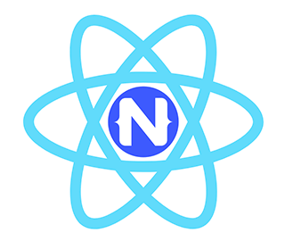
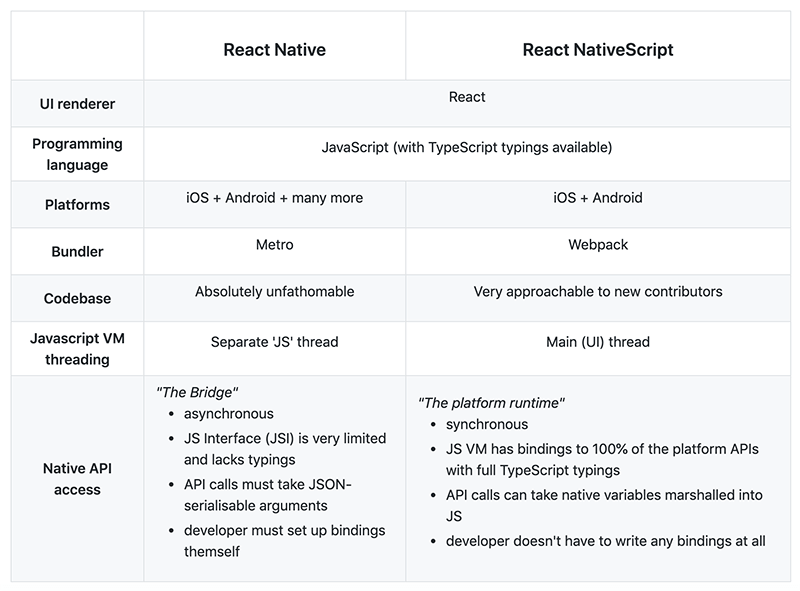

# An Interview with React NativeScript Creator Jamie Birch

Given that React Native has been around for quite some time (almost as long as NativeScript!), it may seem odd that the NativeScript community would want to take on the task of creating a React integration *for* NativeScript.

But there are some significant differences between the architectures (and developer experiences) of React Native and NativeScript, and some key advantages NativeScript brings to the table. And this all led Jamie Birch to initiate the React NativeScript project.

**Why React NativeScript?** In his GitHub repo's readme, Jamie outlines some key differences between React Native and React Nativescript:

*In order to get some more background from Jamie on what inspired him to focus his energies on React NativeScript, we asked him a variety of questions about the past, present, and future of this initiative:*

### What is your technical background?

I got into programming four years ago by taking a master's-level conversion course in computer science. Now I'm a software engineer working for Strategy & Technology, principally involved in making Hybrid Broadcast Broadband Television (HbbTV) apps. In my spare time, I dabble in native and cross-platform (formerly React Native; nowadays NativeScript) apps.

### What initially drew you to the React framework?

I liked how React keeps things comparatively simple: strictly one-way data binding; direct usage of JS expressions rather than template syntax or directives; and how it considers itself to be just a UI library rather than an opinionated application framework. The fact that it furthermore seemed to be the industry-favourite UI library sealed the deal.

### What inspired you to start a new community initiative with NativeScript and React?

I'd already played around with React Native for a while, and had loved its approach of translating native app idioms into concepts more familiar to a web developer (i.e. CSS, Flexbox, and React). However, I'd also come to realise that accessing native APIs in React Native was far from ergonomic. Setting up native modules was a huge time sink and synchronising state between the native and JS contexts of my app was a constant pain. Both of these issues were due to the asynchronous, JSON-based JS-native bridge. 

Somehow, I came across NativeScript, having been surprised to learn of a TypeScript-based cross-platform framework. I was immediately impressed by its novel architecture: every native API could be accessed synchronously, and all data types could be seamlessly marshalled back and forth between JS and native contexts (no more JSON serialisation needed). In short, there was no bridge – native code could simply be written in-line in JS.

So I began by making a couple of apps in NativeScript Core, but I ultimately found it hard to get the hang of NativeScript Core's XML syntax and its data-binding, and missed the ability to code declaratively. Basically, although I liked NativeScript, I wanted to re-use my existing knowledge of React rather than learn yet another new framework.

The answer, I concluded, was to bring React to NativeScript! I set about this task on 20th March 2019, building it entirely in snatches of spare time and with no prior experience in making a custom React renderer (an art which is under-documented to begin with).

### Why NativeScript? Why not Cordova or another WebView-based option?

Although many cross-platform frameworks have some sort of solution for accessing native APIs, NativeScript is unique in providing synchronous JS bindings to 100% of the platform APIs (including marshalling of all data types), with TypeScript declarations to accompany. It's hard to describe just how magical the developer experience is of calling out to native code in-line and synchronously in the middle of a TypeScript file.

As for WebView-based frameworks, I haven't tried any myself, but the common arguments are that they are disproportionately resource-hungry and provide an inferior user experience (at least in certain aspects).

### What’s special about React NativeScript? What makes React NativeScript different from React Native?

I like to regard it, in short, as a bridgeless alternative to React Native. You get much of the developer experience of React Native (e.g. TypeScript, Flexbox, and CSS), but with sync access to 100% of the platform APIs. Oh, and if you're from a web development background, React NativeScript's use of Webpack as its bundler is probably a welcome change to Metro.

Anti-pitch: React Native of course still has a place in this world. It has wide platform reach, a huge ecosystem of existing libraries, and sees a lot of use in industry, to say the least.

But if you are looking to work closely and frequently with native code – especially if you foresee a lot of context-switching between JS and native – then I'd really recommend giving React NativeScript a try. It was made specifically to solve React Native's pain point of native access.

Have you received any feedback from the React Native team (or community) yet?

To my surprise, I haven't heard anything from the React Native core team at all. There is some inquisitive interest from the community, but no real momentum yet. React NodeGUI (a React renderer for desktop application development) is a similar idea and recently took off though, so I think that with just a bit more exposure, React NativeScript has all the ingredients to snowball into something bigger.

### What are your near- and long-term plans with React NativeScript?

My next immediate task is to publish a documentation website, as it's the last real barrier to adoption. I also hope to give some conference talks on React NativeScript to get some more visibility for it and attract collaborators.

Long-term, I'd like React NativeScript to have some form of compatibility with React Native. That is, the ability to consume React Native plugins (Stanisław Chmiela's proof-of-concept sets a precedent for this) and eventually full codebases (React Native Web is a successful example of translating from one React renderer to another – from Native to DOM – and I began a proof-of-concept to investigate translating from Native to NativeScript). Intercompatibility would allow React NativeScript to piggyback the efforts of the very large React Native community. The endgame would be a best-of-both: for React NativeScript to have access to the whole React Native ecosystem yet also be bridgeless.

And at some point, I'd like a chance to actually use it to rebuild my app that posed so much friction when porting to React Native and started me on this whole project: LinguaBrowse. It's a web browser for the foreign-language internet, if curious. Or even if not curious!

### What can others in the community do to help?

Now that I've built the foundation, I hope for the community to expand upon both the core codebase and the ecosystem in general. For example, it would be great if NativeScript UI plugin authors could add support for React, so I do hope to stabilise the API for this and document it fairly soon. Translations of the documentation will always be welcome. And there's an open niche for a navigation framework to be built.

But above all, it would be great to see people simply building apps with React NativeScript. By making apps, we can determine what the library is lacking and elucidate best practices.

This is the first open-source project of this scale that I've ever produced, and I've gradually come to the humbling realisation that I can't be in all places doing everything at once. I welcome any and all help in improving React NativeScript and hope to do my best in coordinating community efforts.

As ever, if you have any difficulties using React NativeScript, please feel free to file an issue. And if you'd benefit more from some dialogue, we're always happy to assist in the #react channel of the NativeScript community Slack.