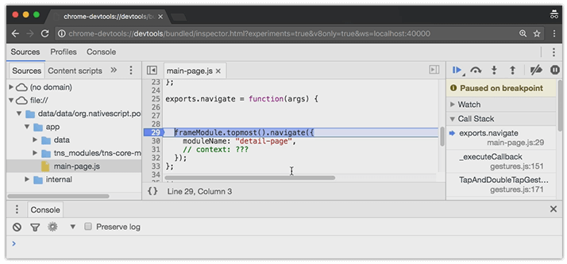
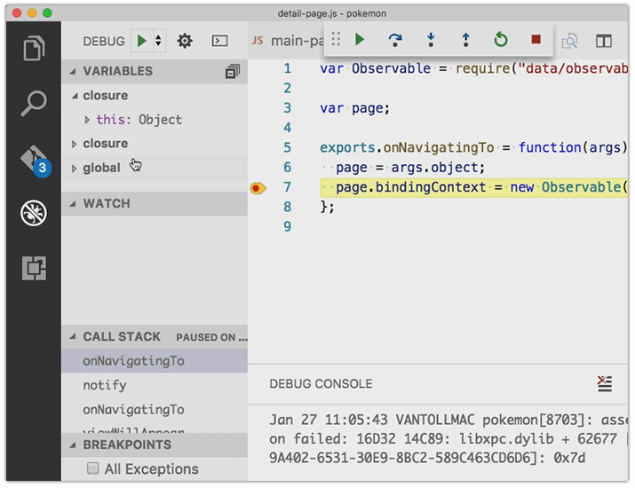

# NativeScript 2.5 is Now Available

*Summary: Another feature-packed release of NativeScript is available for download! Version 2.5 brings a variety of fixes and enhancements including support for WebPack 2.0, debugging via Chrome DevTools, and a variety of CLI improvements.*

I am super excited to announce the immediate availability of NativeScript 2.5! The NativeScript team worked hard to deliver a solid and feature-rich release that adds even more value on top of our framework.

In order to do an even better job of demonstrating some of the high value features in this release, we put together a NativeScript 2.5 video for you:

 <!--<iframe width="560" height="315" src="https://www.youtube.com/embed/2Tx7IV8A9KE" frameborder="0" allowfullscreen></iframe>-->

*Let us know in the comments if this kind of a release presentation resonates with you!*

On to the details of NativeScript 2.5:

- [Improved WebPack Story](#webpack)
- [Chrome DevTools Debugger Integration](#chrome)
- [CLI Improvements](#cli)
- [Visual Studio Code Extension Improvements](#vscode)
- [New Release of UI for NativeScript](#ui)
- [Updated Marketplace Demo App](#marketplace)
- [Open Source QA Tests and Framework](#qa)
- [Updated Starter Application](#starter)
- [What's Next from NativeScript?](#next)

## Improved WebPack Story

**Support for WebPack 2.0:** Bundling your code with [webpack](https://webpack.github.io/) is now easier and more extensible than ever. The [nativescript-dev-webpack plugin](https://www.npmjs.com/package/nativescript-dev-webpack) now uses webpack 2.0 and allows you to freely modify your webpack config. We have also added numerous small improvements like:

- Support for Angular 2 lazy loading;
- Transparent font registration in iOS;
- A mechanism for copying additional files to your device via the [copy-webpack-plugin](https://www.npmjs.com/package/copy-webpack-plugin);
- Minification support via [Uglify.js](https://github.com/mishoo/UglifyJS2).

The minification feature has been on our roadmap for quite some time, but it required shipping changes to several components. You can now trigger a minified build by passing the `--uglify` flag to your build/run npm script. Of course, all Uglify options can be fully customized by configuring the `UglifyJsPlugin` in your webpack config.

**Ahead of Time (AoT) Compilation:** When you install the `nativescript-dev-webpack` plugin, it comes with the AoT compiler enabled for Angular 2 applications.

## Chrome DevTools Debugger Integration

For this release we have enabled debugging in Chrome DevTools! This includes debugging plain JavaScript as well as TypeScript. For Android this is the default experience when you run the `tns debug android` command, while for iOS it is exposed behind a flag: `tns debug ios --chrome`. The reasoning behind this difference is that the existing AppInspector integration (which is a modified version of the Safari DevTools) provides much richer functionality for iOS than Chrome. As we continue to expose features in the Chrome DevTools that are already available in AppInspector, we will consider making Chrome the default option at some point.

As a side note - because it will technically difficult to enable all the features (such as profilers and timeline) of AppInspector in Chrome DevTools for iOS, we’d love to know what's the added value of having Chrome DevTools versus the existing AppInspector. Sound off in our comments section below!

## CLI Improvements

Besides the [numerous bug fixes](https://github.com/NativeScript/NativeScript/issues?q=is%3Aissue+milestone%3A2.5.0+is%3Aclosed), there are several improvements over the current CLI behavior. The `tns run <platform>` command, for example, now automatically enables the `livesync -- watch` behavior. This is something that the entire team considers less confusing and much more straightforward during the development life cycle.

We are also deprecating support for Node.js 4.x and now require support for Node.js LTS 6.x. For more information on the behavior of the development workflow commands you may [follow this wiki](https://github.com/NativeScript/nativescript-cli/wiki/Workflow-commands-spec#run).

## Visual Studio Code Extension Improvements

The debugging experience when using the [Visual Studio Code extension](https://www.nativescript.org/nativescript-for-visual-studio-code) is now even better! The newly introduced watching behavior of the default launch commands makes the process of editing, deploying, and debugging the app faster than ever before. The feature was initially added in v0.5 of the extension with the name `Sync on iOS/Android`. In the new v0.6 it is enabled by default in the `Launch on iOS/Android` command and the old `Sync on iOS/Android` has been removed. If you want to learn more about the way it works [check out the docs article](https://docs.nativescript.org/tooling/visual-studio-code-extension).

## New Release of Telerik UI for NativeScript

The latest version of [UI for NativeScript](http://www.telerik.com/nativescript-ui) is out to the public as well and features a brand new Gauges component, a further polished and more customizable DataForm control, and an improved AutoCompleteTextView component. For more information you can read the [separate announcement blog post](https://www.nativescript.org/blog/a-new-and-improved-telerik-ui-for-nativescript-is-here) for UI for NativeScript.

## Updated Marketplace Demo App

The NativeScript demo application for [iOS](https://itunes.apple.com/us/app/examples-nativescript/id1046772499?mt=8) and [Android](https://play.google.com/store/apps/details?id=org.nativescript.examples), developed exclusively by the engineering team to showcase the capabilities of NativeScript, got some fresh new updates.

It will feature push notifications with updates on the latest from NativeScript as well as blog posts and a "What's new" section available under the sidebar menu. It will also feature two new samples on the [DataForm component](http://www.telerik.com/nativescript-ui#dataform), part of UI for NativeScript. You will see the updated version in the app stores very soon.

## Open Source QA Tests and Framework

Our QAs are doing an incredible job in securing stable releases along the road. They have actually [developed an entire framework](https://github.com/NativeScript/functional-tests-core) that we'd like to share with you, hoping you will find it useful when you create automated tests for your NativeScript applications!

Among the key [features](https://github.com/NativeScript/functional-tests-core#features) worth mentioning:

- This framework can be used for any kind of native Android or iOS app, whether if they are developed with NativeScript or not;
- The framework works for emulators/simulators and real devices equally well;
- It does not require modifications to the tested app;
- It is cross-platform (produces Android and iOS tests with same code);
- It provides a mechanism to locate and interact with elements based on images. This helps in cases where accessibility is not implemented (like charts and games for example).

More hands-on samples and usage [may be found here](https://github.com/NativeScript/functional-tests-demo).

## Updated Starter Application

The "starter" application that we use to generate the [NativeScript Code Samples section](http://docs.nativescript.org/angular/code-samples/overview.html) in our docs also received several valuable new additions:

- Using [nested router component](https://github.com/NativeScript/nativescript-sdk-examples-ng/tree/master/app/routing/nested-routers) in NativeScript Angular2 project;
- Three new layout scenarios for the Flexbox layout: [one](https://github.com/NativeScript/nativescript-sdk-examples-ng/tree/master/app/ui-category/layouts/flexbox-layout-one), [two](https://github.com/NativeScript/nativescript-sdk-examples-ng/tree/master/app/ui-category/layouts/flexbox-layout-two), and [three](https://github.com/NativeScript/nativescript-sdk-examples-ng/tree/master/app/ui-category/layouts/flexbox-layout-three).

## What's Next from NativeScript?

As always, we have big plans for our next release. Be sure to keep an eye on our [public roadmap](https://www.nativescript.org/roadmap) for updates. You can also impact our roadmap by [sounding off on our ideas portal](https://nativescript.ideas.aha.io/)!

In the meantime, you can get up-to-the-second information through a variety of outlets:

- NativeScript Blog (hey, you're already here!)
- [NativeScript Forum](http://forum.nativescript.org/)
- [Slack Channel](https://nativescriptcommunity.slack.com/messages/general/)
- [Twitter](https://twitter.com/nativescript)
- [Reddit](https://www.reddit.com/r/nativescript/)