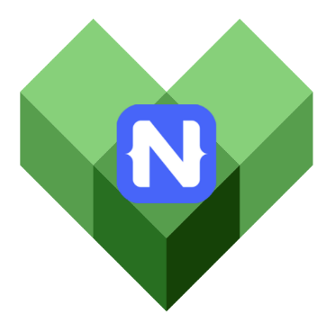
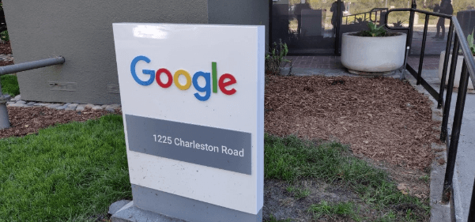

# Building NativeScript Apps with Google's Bazel 

At the end of last year, [Sebastian Witalec](https://twitter.com/sebawita) and I visited Google’s Angular team in Mountain View, California. Over the past year, we have been working closely with the Angular team. The purpose of this trip was simple – try to build a NativeScript app with [Bazel](https://bazel.build/). I have good knowledge of the way NativeScript apps are built, as I have been working on the NativeScript CLI for the last couple of years, but Bazel...this is a whole new world for me!

On the other side, the Angular team is already familiar with Bazel and in fact there’s a way to build your Angular application with Bazel. So, we spent several days with the Angular team and in this article I’ll try to describe what we’ve done (and if you read till the end, you’ll find out it is possible to build NativeScript apps with Bazel!).

## What is Bazel?

[Bazel](https://bazel.build/) is an open-source build and test tool similar to Make, Maven, and Gradle. It uses a human-readable, high-level build language. Bazel supports projects in multiple languages and builds outputs for multiple platforms. Bazel also supports large codebases across multiple repositories, and a large numbers of users.  

Bazel was designed to fit the way software is developed at Google. It has the following features: 

- Multi-language support 
- High-level build language 
- Multi-platform support 
- Reproducibility 
- Scalable 

To get a better understanding of what Bazel is, who is using it, and why it was created, you can take a look at the [official site](https://bazel.build/) and the [FAQ section](https://bazel.build/faq.html).

## Why Do We Want to Build {N} Apps with Bazel?

There are many reasons why we wanted to try building NativeScript applications with Bazel. Bazel’s power to work with large scale projects and to have exactly the same result every time the app is built, no matter of the installed tooling, seemed like a “the toy we would love to have”. Years ago, we had similar problems with our NativeScript CLI – we wanted to minimize the actions and the time needed to show user’s changes in the codebase on the device. At that point, we had implemented our own non-generic solution, that is still part of our CLI and it tries to determine the minimum count of actions that we need to execute in order to apply the changes on device. Bazel seems to resolve this issue in a more generic way and we were interested to give it a try and see if it will work.  

On the other side, we know there’s a way to build your Angular applications with Bazel and we were jealous that you could not build your NativeScript Angular application with Bazel! 

There were many other reasons, some of them may seem not so important, but at the end of the day, we all love to resolve such technical challenges. So, Sebastian and I headed to Mountain View, CA to find out how we can use Bazel.

## Meeting the Angular team

I can’t express my excitement when we got out of the Uber and I was in front of the Google sign in front of the building. It was not my first visit to the US, but the emotion of being in front of Google’s office can’t be explained. It was an honor, a dream become true.

At the office, we were welcomed by [Alex Eagle](https://twitter.com/Jakeherringbone) – a really impressive person who was our host and my personal guide in the Bazel world for the next few days. We also met [Brad Green](https://twitter.com/bradlygreen), many people from the Angular team, Material team, etc. It was such a pleasure to meet all of you, thanks for being such great hosts!

The Angular team was willing to help us in our ambitious task to build a NativeScript app with Bazel, so we started immediately. Alex Eagle and I worked together for the next few days – I was explaining how NativeScript builds work (and even I was surprised by some of the steps we need to do during the build 😊) and Alex was translating these steps to Bazel rules.

## Trying to Build NativeScript Apps with Bazel

### The Approach

We discussed how to approach the task and decided to start from a simple JavaScript NativeScript "Hello World" application (the one you receive when you use `tns create myApp --js`). The idea was to use [Bazel’s Android rules](https://docs.bazel.build/versions/master/be/android.html) and see if they can be used to build the native Android project that the NativeScript CLI creates inside the project’s `platforms/android` directory.

### How does the NativeScript CLI Build Android Projects?

The process of building the app is pretty complicated, but we can separate it into several steps: 

1. Create native Android project inside project’s `platforms/android` directory. 
1. Place all of the `.js` files (from project’s `app/src` directory and from `node_modules`) inside `assets` directory of the native project. 
1. Place all `App_Resources` in the correct location in the native project. 
1. Include all native files (`.aar` files, `.jar` files, `include.gradle` files) from `node_modules` to the build process of the native project. 
1. Spawn gradle, so it can execute all of the tasks defined in project’s `build.gradle` file.

The last part executes a lot of stuff: NativeScript’s `build.gradle` executes several tasks specific to NativeScript applications, like the metadata generation for example, required to be able to call Java methods directly from JavaScript.

Our idea was to start with the last point and replace Gradle with Bazel.

### Use Bazel to Rebuild Prepared NativeScript App

As the `build.gradle` of a NativeScript project is pretty complicated, and as Bazel works with a `BUILD.bazel` file, not with gradle files, we decided to start with a very small step – build the NativeScript app with NativeScript CLI and after it finishes its work, place required Bazel files inside the native project and try to build it with Bazel. This way we guarantee all of the required actions, producing of files, metadata classes, etc. have already happened and we could just see if the Bazel Android rules could work. 

So, we started working on it. After some rough time with building the generated classes, we finally made it. **We had a running NativeScript application built with Bazel’s rules for Android!!!** 

It was a huge win for us, and it gave us power to continue working. Bazel is awesome, but it has its own specifics that you need to get used to. However, we had Alex Eagle, who was like a magician – he was able to work without break for hours and he always had ideas what to try next. 

At this point we proved we can use Bazel, but we had done it just for an already-built application, i.e. we’ve used Gradle and after that we used Bazel. Now, we wanted to remove Gradle from the picture - we wanted to execute all the things we do in `build.gradle` directly with Bazel.

### Building NativeScript Apps for Android with Bazel Instead of Gradle

The process of “translating” all the steps was not easy. One of the main problems we faced was related to the tools we use during the build process – from `build.gradle` we start two Node.js process to generate some metadata files that generate resources/files that must be included in the built project after that. It is not a problem to spawn Node.js process from Bazel, there are [Node.js Bazel rules](https://github.com/bazelbuild/rules_nodejs) as well. The tricky part is when to execute these rules, as they must be executed at exact point during the build. The other problem was that the executed scripts rely on files that they expected to be right next to them on the file system. In Bazel, you cannot rely to have such files – the logic in Bazel rules is that you have input files and output. If the input is modified since last build, the step will be executed, if not – it will be skipped. In our case we had to “hack” some of the steps, so they could be compatible with the way Bazel handles builds. More details about the issue can be found in [Alex Eagle’s blogpost](https://medium.com/@Jakeherringbone/running-tools-under-bazel-8aa416e7090c).

The other problem we faced was with the native libraries that were included during build from plugin’s `include.gradle` files. In the `build.gradle` we had logic to iterate over all `node_modules`, find the `include.gradle` files and just apply them. For the purpose of the POC, we decided to make this manually – just hard code all the libraries we need in the project. 

After several hacks, some help from the guys who work on Bazel’s rules from Android, some help from the guys who work on Android’s builds for NativeScript and with the genius of Alex Eagle, we finally made it. We had NativeScript application prepared with NativeScript CLI (i.e. we created it with NativeScript CLI and created the native project with the NativeScript CLI), built and deployed on device with Bazel!!! We started it on the device and...it was smoothly running a NativeScript app built with Bazel! You can see our smiley faces after this success:

*From left to right Rosen Vladimirov (me), Sebastian Witalec, and Alex Eagle.*

At this point we had done a lot of work and it was time for us to leave Mountain View, but we had the proof of concept working. We tried it with a NativeScript Angular application as well and it was working well, so we were really happy with the final result.

### Create a Plugin

We discussed the proper way to show this POC to users and give them the ability to extend it. In NativeScript projects we have the concept of developer plugins, which are installed as a `devDependency` of the project. Their purpose is to be part of the build process, so we decided that it is a proper way to create [nativescript-dev-bazel plugin](https://github.com/NativeScript/nativescript-dev-bazel). Once you add it to your application, you have to execute `tns prepare android` and the plugin will add required Bazel specific files to your application.

And now you can try building your app with `bazel build //platforms/android:android`.

## Summary

During our time with Angular team, we were able to create a POC for building NativeScript application with Bazel. The POC allows you to prepare NativeScript applications with the NativeScript CLI and build them for Android with Bazel. The POC does not include Bazel rules for Angular apps, i.e. features like AOT are not used, but you are still able to build your NativeScript Angular applications. We do not recommend using this POC in your production-ready applications, but we’d be glad if you could give it a try and see how it works. 

Bazel is a great tool that could be useful in many cases. Having the option to build NativeScript applications with Bazel is a great addition to the NativeScript tooling family. Imagine a world where you can create mobile and web Angular applications, share code between them and build both of them with Bazel. Doesn’t it sound tempting?  

In case you want to extend the current POC, [check the repository](https://github.com/NativeScript/nativescript-dev-bazel) – it contains several TODO items, just grab some of them and give it a try! We’ll be glad to accept PRs.