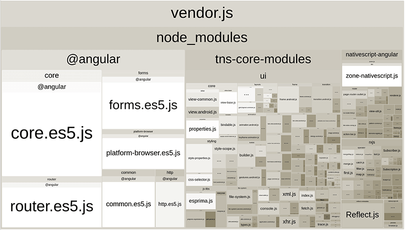
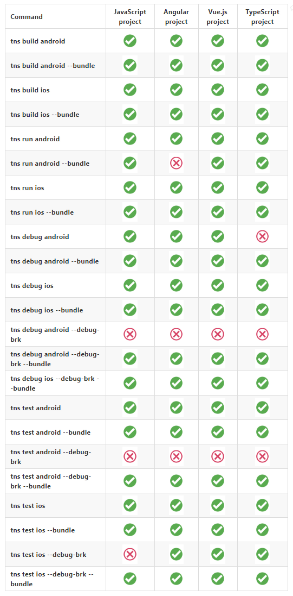

# The Future of Building NativeScript Apps

We are actively working on [NativeScript 6.0](https://www.nativescript.org/roadmap-and-releases#releases) and now is an excellent time to review what we've done in the past and share our plans for the next release. As part of the NativeScript CLI team, I would like to talk about our ideas for improving the development workflow and the way you build NativeScript applications.

## Brief History of the NativeScript CLI

Since day one of NativeScript we wanted to provide the best development workflow - fast and reliable builds, LiveSync functionality that allows you to see your changes almost immediately on device, etc. At that time we were dealing with Node.js 0.10, Xcode 5, Android builds were using `ant`, Angular 2 was still a dream, and Vue.js did not have a stable version yet.

At that point we had to create a process of building a native mobile app and including the project's JavaScript files in it.

*I won't get into details about the whole process, but here's a high level overview:*

When you create an app, you have a directory with your JavaScript/TypeScript files (commonly named `app` or `src`), `package.json`, `node_modules` and several other configuration files. When we build the application for one of the platforms (i.e. `Android` or `iOS`), we need to prepare an actual native `Gradle`/`Xcode` project to be able to build a binary that can be installed on device. All the JavaScript that you want to use must be included in this native project, so when you run the application on device, it can find the files and actually execute them.

During project preparation, the NativeScript CLI copies your project files (the ones from `app`/`src` directory) in the native project. As you know, we need to copy `node_modules` as well, so the CLI copies all of your project's dependencies and their dependencies and their dependencies and so on...to the native project. After copying all JavaScript files to the native project, the CLI processes them to replace the platform-specific files (i.e. when building for Android any file called `app.android.js` will be renamed to `app.js`).

> More information on how to use platform-specific files in your app is available in [this blog post](https://dev.to/progress/platform-specific-development-with-nativescript-dd1).

In the past, we had to deal with new versions of the tooling for iOS and Android, adding support for different configurations of native projects, but the process of preparing the JavaScript files is almost identical to the one we created long ago.

However, recently we've been working on an alternate way of building NativeScript apps...or at least the JavaScript files that need to be included in the apps. We call it `bundle workflow`. That's the way the CLI builds your application when you pass the `--bundle` flag.

## Problems with the "no-bundle" Workflow ❌

Well, it turned out our implementation has several limitations that impact app builds, the LiveSync process (LiveSync is the process of automatically uploading any change you make in your project to the connected device, i.e `tns run` command) and even the performance at runtime.

*Here are just some of the issues:*

* **Every app file is included in the build process** - regardless if it is being used at runtime, all JavaScript files are included in the native app. This means that your app size is much bigger than needed as all of your `node_modules` (excluding devDependencies) are included in the build.
* **Slow build time** - all JavaScript files are used as `assets` in the native project. The native build systems (`Xcode`/`Gradle`) are just not designed to work with so many assets. Imagine the number of files that you have in these assets with all of your`node_modules`. A while ago I read that the Android application with most assets in the PlayStore has around a thousand files. In our case we have a thousand files with a simple hello world application. `Xcode` and `Gradle` are powerful tools, but as I've said, they are not designed to handle a large number of assets, so building the app becomes slower and slower with every package you add in your code.
* **Much slower application start** - as there are many files that must be required at startup, the application startup is much slower. Every require is an I/O operation that is using the [marshalling mechanism](https://docs.nativescript.org/core-concepts/ios-runtime/Marshalling-Overview) which makes them slower.
* **NativeScript CLI restarts the application from scratch when changing a JavaScript file in your application** (during `tns run`) - The application is restarted even if you change an unused file. 
* **The application state is not preserved** - If you, for example, navigate five pages deep and change a JavaScript file, you’ll need to re-navigate to that page to see the change.
* **Unable to use V8 snapshots** - V8 snapshots are a powerful way to speed up application loading, however you can snapshot only a single file. With the current approach we had thousands of files, so we were unable to use the snapshots.

## How the "bundle" Workflow Solves these Problems ✔️

When you pass `--bundle`, the NativeScript CLI uses [webpack](https://webpack.js.org/) under the hood. Tools like webpack significantly improve the developer experience and that is why bundling has an essential place in mobile app optimization.

Webpack itself is used in Angular and Vue.js, so it made a lot of sense to give it a try and provide better integration between NativeScript and these frameworks. During the last year and a half, we've put a lot of efforts to integrate webpack in our build process as it seems to resolve all of the issues listed previously:

* **Every application file is included in the build process** - webpack uses a "tree shaking" mechanism and includes only the files that are actually used in your code.
* **Slow build time** - with webpack, the generated JavaScript files that are included in the native build are just a few, five-six in most cases. Native build tooling can handle this easily, so the build process is much faster.
* **Much slower application start** - with webpack, the files required at startup of the app are just a few, so the app starts much faster.
* **NativeScript CLI restarts the application from scratch when changing a JavaScript file in your application** - webpack has the concept of [Hot Module Replacement](https://webpack.js.org/guides/hot-module-replacement/) which resolves this problem and allows you to replace modules without restarting the application.
* **The application state is not preserved** - with the other workflow, when a JavaScript file is changed, the application is restarted. Thanks to Hot Module Replacement, we are able to replace the changed module and ensure the application navigation and state are preserved.
* **Unable to use V8 snapshots** - with `webpack` just a few files are generated and all `node_modules` can be snapshotted, which makes the application significantly faster.

## Improving the Development Workflow in NativeScript 5.x

In the last few releases the team has concentrated on providing a stellar development experience. As noted, when using the `bundle workflow` (and webpack particularly) we were able to resolve most of the issues listed above. But with the last several releases, we were able to push the `bundle workflow` to a level that we never imagined. Just check this video demonstrating the difference between the default and the webpack workflows:

<iframe width="560" height="315" src="https://www.youtube.com/embed/hE4L1UuUSKE?rel=0&autoplay=1" frameborder="0" allow="accelerometer; autoplay; encrypted-media; gyroscope; picture-in-picture" allowfullscreen></iframe>

### NativeScript 5.0 Changes
  
We were so excited to announce [Beta support for Hot Module Replacement](https://www.nativescript.org/blog/nativescript-hot-module-replacement). It was a huge win to make it possible to change a JavaScript file and see the change on the device in less then a second.
  
### NativeScript 5.3 Changes 

We introduced [official support for Hot Module Replacement](https://www.nativescript.org/blog/nativescript-5.3-hot-module-replacement-officially-supported-and-more). Also, we provided a way to enable HMR development experience by default by setting `useLegacyWorkflow` to false in `nsconfig.json` file. More info can be found in [the documentation](https://docs.nativescript.org/angular/core-concepts/project-structure#nsconfigjson-enabling-hmr-example). 
  
### NativeScript 5.4 Changes

Currently the `bundle workflow` gives you the best possible experience, so we want to ensure our users are using it by default. We’re planning to introduce the HMR development experience for new projects out of the box. **In other words, `tns create` will automatically set `useLegacyWorkflow` to false in `nsconfig.json` file.** No additional actions will be required from developers to enable bundle workflow.

For all of your old projects, CLI will prompt you to use the `bundle workflow`. We strongly recommend you to start using it and in case you have any issues, please report them in [NativeScript CLI's repository](https://github.com/NativeScript/nativescript-cli/issues).

> **NOTE:** In case you are not using `bundle workflow` at the moment, you can execute `tns update --workflow` to make your project compatible with the `bundle workflow`.

## The Problem Supporting Two Build Workflows

As explained above, currently we support two different build/development workflows. Each of them has its own specific behavior, which makes it really hard for us to cover all scenarios. Consider the following table that illustrates issues found by our QAs when testing a release (green is working, red marks a command that is not working as expected):

We have a lot of automated tests, but fixing and supporting all of these commands with two different workflows for two different platforms (`Android` and `iOS`) has become really difficult for us. 
So we were thinking what is the best experience that we can give to our users and reduce the supported scenarios, i.e. we want to have one great workflow instead of several cool ones.

## Preparing the NativeScript CLI 6.0 Release

Based on all of the above, we've decided that from the 6.0 release going forward, the NativeScript CLI will support only our `bundle workflow`. We want to focus on making this the best possible experience with NativeScript. Supporting only `bundle workflow` will allow us to clean NativeScript CLI's code from a lot of dirty hacks too.

We will also drop several development plugins `nativescript-dev-sass`, `nativescript-dev-typescript`, `nativescript-dev-less`, etc. as `webpack` already has a way to handle such files.

All of this will allow us start working on other highly demanded features that we are currently not able to work on, such as:

 - Intellisense support in Visual Studio Code Extension
 - LiveSync over Wi-fi
 - Solid unit-testing and e2e testing story
 - Improve automatic setup of local environment

## What this Means for You and Your Apps

If you currently using the `bundle workflow`, there will be no change in your workflow!

If not, we strongly recommend you to start using it, as in the NativeScript 6.0 release, there will be no other way to build and run your applications. The `bundle workflow` provides the best development and production experience, so we encourage you to start using it as soon as possible and inform us in case you have any issues with it.

## How You Can Help

As usual, your feedback is crucial, so let us know what you think - maybe we've missed something, maybe you are aware of some issue with `webpack` that is blocking you from using it - just [create a new issue](https://github.com/NativeScript/nativescript-cli/issues) and we'll investigate it with you!