# Accessing Relational, Big Data, and SaaS data from NativeScript

Most of us have our data either residing in relational databases like SQL Server, DB2, Oracle, or MySQL, in a Big Data ecosystem utilizing any of the flavors available like Apace or Cloudera, or have it in cloud-based systems like Salesforce or Google Analytics. While building your NativeScript application, you may need to access these data sources from anywhere and you need a REST API to do that. Well, of course you can go and build your own REST API, but then you need to focus on scaling, performance issues, maintaining the API, and you end up unnecessarily spending lot of energy.

**What if you could generate a standards-based REST API, by just configuring your connection parameters and not worry about scaling or performance issues?** [Progress DataDirect Hybrid Data Pipeline (HDP)](https://www.progress.com/cloud-and-hybrid-data-integration) does exactly that. Once you have configured your database in HDP it provides you with an OData endpoint.

> To learn more about OData, please [visit odata.org](http://www.odata.org/).

In this tutorial, we will be showing you how you can generate an OData API for your own database using HDP and use it in your NativeScript application to get **real-time access to your data**. I will be using a SQL Server database and using the open source [chinook](https://github.com/lerocha/chinook-database) dataset. Chinook also has scripts for other databases like Oracle, DB2, and MySQL. If you use the scripts from this project, regardless of database, the NativeScript application in this tutorial will work.

## Generating a REST API for your database

To get started, you need to download and install [Hybrid Data Pipeline](https://www.progress.com/cloud-and-hybrid-data-integration). You can do this on your local machine, VM, or a server.

> In case you have trouble with the installation, please follow [this tutorial](https://www.progress.com/tutorials/cloud-and-hybrid/deploying-progress-datadirect-hybrid-data-pipeline-on-amazon-aws) on how to install it or [visit the documentation](https://documentation.progress.com/output/DataDirect/hybridpipeinstall/#page/install%2Finstalling-the-hybrid-data-pipeline-server.html%23).

Once you have completed the installation, go to `http://localhost:8080` and you should see a login page as shown below:

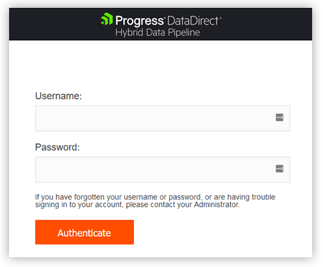

The default credentials are `d2cadmin/d2cadmin`. Login in to the portal and Go to the **Data Sources** tab -> and click on the **New Data Source** button. You should see a bunch of supported data stores:

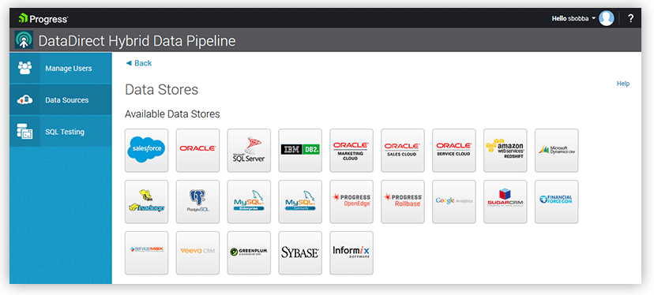

Click on SQL Server (or your own database) and you should now see a connection configuration page as shown below. Fill it in with the connection information for your database and click on the **Test Connect** button to verify the connection:

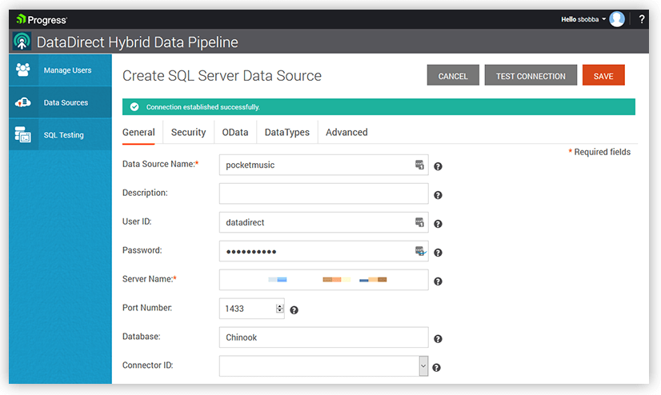

Now that you have a successful connection, let’s work on generating an OData API for your database. Go to the **OData** tab and click on **Configure Schema**:

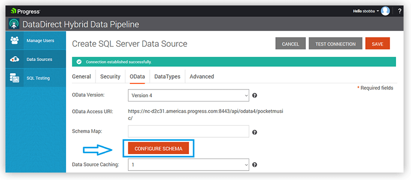

On the next screen, you will be asked to choose your schema. If you are using SQL Server choose **dbo** as your schema. As you select the schema, you should now see a list of all the tables from the Chinook dataset as shown below. Select all tables and click on **Save & Close** button:

> Note: If you are not seeing the tables as shown below, the NativeScript application in this tutorial will not work for you.

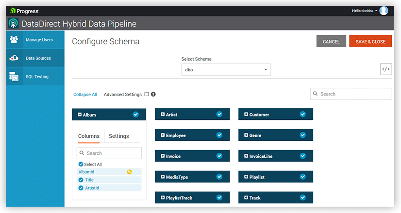

After you have saved it, you should be back at the OData tab page. Copy the **OData Access URI** and click on **Save** to save all the changes made to this data source.

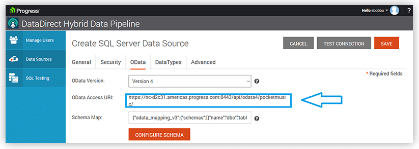

That’s it! **You now have an OData REST API for your database, without having to write single piece of code.**

Open your browser or [Postman](https://www.getpostman.com/) and try a `GET` Request and use basic authentication, with the credentials being the same as your login credentials for Hybrid Data Pipeline. You should see a response like below, showing all the tables available via this endpoint:

	{
	    "@odata.context": "http://<host>:8080/api/odata4/pocketmusic/$metadata",
	    "value": [{
	            "name": "Albums",
	            "url": "Albums"
	        }, {
	            "name": "Artists",
	            "url": "Artists"
	        }, {
	            "name": "Customers",
	            "url": "Customers"
	        }, {
	            "name": "Employees",
	            "url": "Employees"
	        }, {
	            "name": "Genres",
	            "url": "Genres"
	        }, {
	            "name": "Invoices",
	            "url": "Invoices"
	        }, {
	            "name": "InvoiceLines",
	            "url": "InvoiceLines"
	        }, {
	            "name": "MediaTypes",
	            "url": "MediaTypes"
	        }, {
	            "name": "Playlists",
	            "url": "Playlists"
	        }, {
	            "name": "PlaylistTracks",
	            "url": "PlaylistTracks"
	        }, {
	            "name": "Tracks",
	            "url": "Tracks"
	        }
	    ]
	}

> Note: You will probably see security errors due to lack of a SSL certificate in your local HDP installation and that’s normal. For testing purposes, you can fall back to http and use port 8080 to circumvent the issue. Do not use this workaround for production as it is insecure.

## Creating the NativeScript app

> You can find the source code for this application on [GitHub](https://github.com/saiteja09/MusicMeta) and you can refer to it when developing your own app.

Now that we have a backend API needed for the app, let’s start with creating the application. With the dataset we currently have, let’s build a Music Store app, where you can Browse, Search, and Buy/Refund music.

I didn’t want to start it from the scratch as this was my first time building the app and I wanted a side drawer navigation application. The best way to do this is to use [NativeScript Sidekick](https://www.nativescript.org/nativescript-sidekick), which helps you generate starter templates to get started easily. Once it had generated the template, I opened the project using my favorite editor, [Visual Studio Code](https://www.nativescript.org/nativescript-for-visual-studio-code), to do the coding.

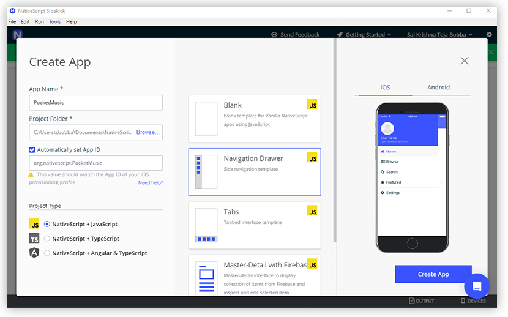

Using that template, start renaming your side drawer navigation items to **Library**, **Browse Store**, **Search Store** and **Settings** in `/shared/MyDrawer.xml` and your app should now look like this:

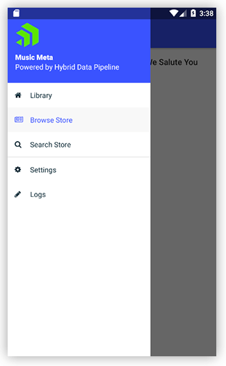

Let’s start with Browse Store as it will list all the Albums available and when you click on each album, it will list all the Tracks available in that Album. To give you an idea, below are screenshots of what we will implement:

*When you open Browse Store – Display All Albums*

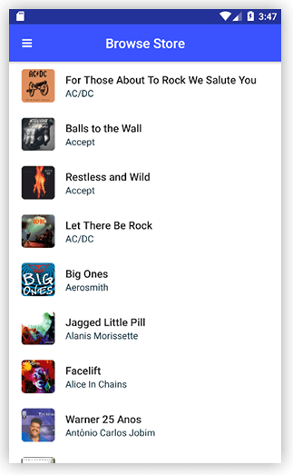

*When you Open Album -> Display all Tracks*

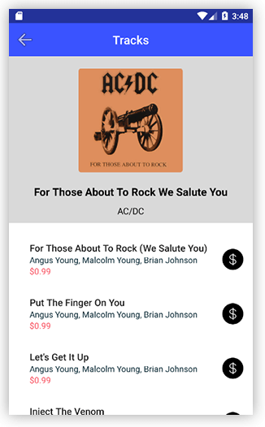

For the first interaction of “browse store”, it needs to display all the Albums available in a ListView. The easiest way to implement this is using Listview component in [NativeScript UI](https://www.nativescript.org/ui-for-nativescript). You will have to install the NativeScript UI package by running the following command:

	npm i nativescript-pro-ui

Once NativeScript UI is installed, in `browse/browse-page.xml`, use the following code to display Album name, artist Name, a hidden Album Id and Album art for that Album:

	<lv:RadListView id="listview" class="list-group" items="{{ items }}" selectionBehavior="Press" multipleSelection="false" itemSelected="onItemSelected"> 
	    <lv:RadListView.listViewLayout>
	        <lv:ListViewLinearLayout scrollDirection="Vertical"/>
	    </lv:RadListView.listViewLayout>
	    <lv:RadListView.itemTemplate>
	        <GridLayout rows="auto" columns="auto, *" class="album-browse">
		        <Image src="{{ '~/images/' + AlbumId + '.jpg' }}" row="0" col="0" width="50" height="50" class="thumb img-rounded"/>
		        <StackLayout class="list-group-item" row="0" col="1"> 
		            <Label text="{{ Title }}" class="list-group-item-heading label-track-name" />
		            <Label text="{{ Name }}" textWrap="true" class="list-group-item-text" />
		            <Label text="{{ AlbumId }}" class="list-group-item-text list-albumid" />
		        </StackLayout>
	        </GridLayout>
	    </lv:RadListView.itemTemplate>
	</lv:RadListView>

Next step is to get the data and bind it with the Listview. If you observe the schema we have Table Album with Album ID and Album name and another Table Artist with Artist Id and Artist Name. For this view, we need both Album and Artist data. In general, if you were dealing with any other API, you would have to get Album data first, then get the Artist data and blend them to get the result.

But with OData, it offers a nifty feature called `$expand`, which lets you *expand* to related entities, if you have defined foreign key relationships between these tables in your database. Here is the OData query that I used to fetch Album and Artist data in a single request using the `$expand` option.

	http://<host>:8080/api/odata4/pocketmusic/Albums?$expand=Artist

And the response should be like this:

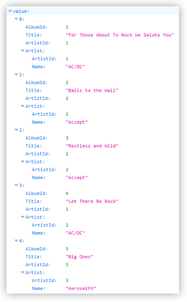

In your `browse-page.js` file, you make a request to this endpoint and bind the data to the listview as shown below in the code:

    fetch(odata_URL, init).then(function (response) {
        if (!response.ok) {
            var toast = Toast.makeText(response.status);
            toast.show();
        }
        return response.json().then(function(json){
           
            var albumData = json.value;
            
            for(var i=0; i< albumData.length; i++)
            {
                var album = albumData[i];
                listItems.push({
                    AlbumId: album.AlbumId,
                    Title: album.Title,
                    Name: album.Artist.Name
                })
            }
            
            pageData.set("items", listItems);
            appSettings.setString("albumData", JSON.stringify(listItems._array));
        });
    }).catch(function (error) {
        var toast = Toast.makeText("Something bad happened: " + error);
        toast.show();
    });

Once you have done this, you should now see the listview populated with Albums and Artists. In an equivalent way, you can implement the next action, where you click on Album and you need to show all the Tracks in that Album.

Another interesting feature of OData is text `$search` on columns. To do this, you would have to create indexes on text type column on which you intended to perform a search. For this application, I wanted to have a feature where users can search Album names. To do that you must create non-clustered index on title column in the Albums table, if using SQL Server.

To enable `$search`, head back to the Hybrid Data Pipeline “configure OData” page and enable advanced settings as shown below.

Under the **Settings** tab, choose search options as “Substring” as shown below as well:

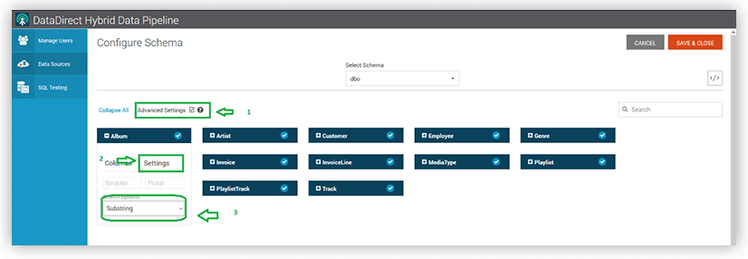

Now go back to the **Columns** tab and click on tiny search button next to the **Title** column to enable search as shown below:

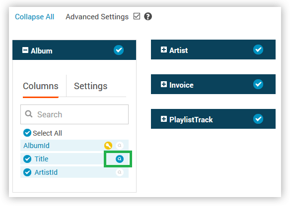

**Save & Close** the configuration to enable the OData search. To test it out run this OData query where it searches for an Album with “Billy” in its title:

	http://<host>:8080/api/odata4/pocketmusic/Albums?$search=Billy

Using this endpoint, now you can implement search feature in this application and display the results using a ListView as shown below:

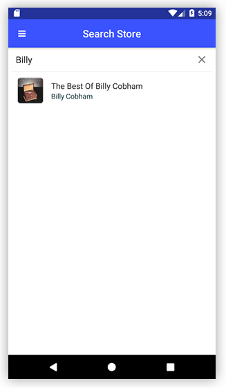

> Reminder: You can find the source code for this application on [GitHub](https://github.com/saiteja09/MusicMeta)!

## Summary

I hope this tutorial helped you to understand how you can RESTify any of your databases using [Progress DataDirect Hybrid Data Pipeline](https://www.progress.com/cloud-and-hybrid-data-integration) and use it with a NativeScript application. Feel free to contact us in GitHub or in the comments below if you have any questions. 