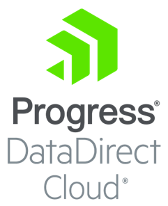
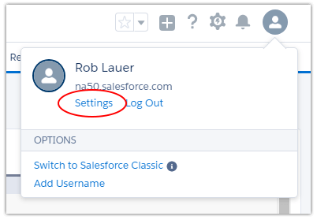
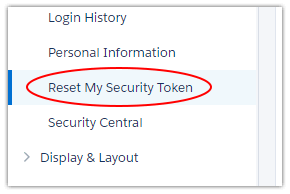
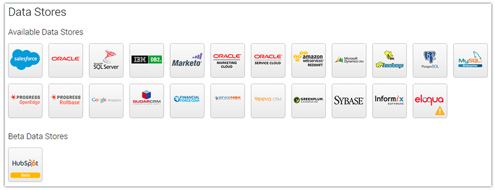
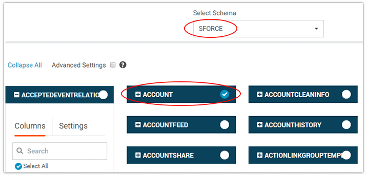
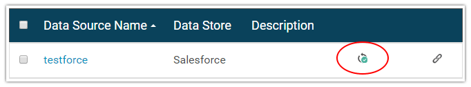
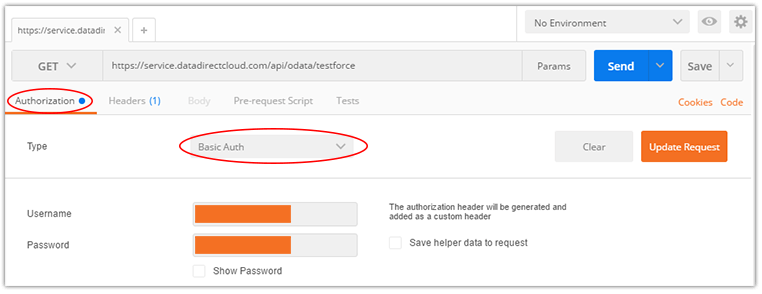
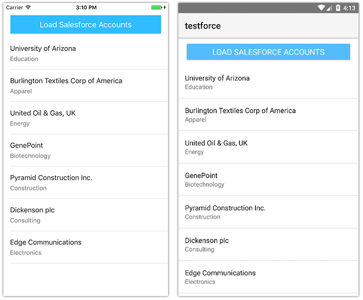

# Accessing Salesforce Data with NativeScript

As the preeminent CRM (Customer Relationship Management) software available today, [Salesforce](https://www.salesforce.com/) is the engine behind countless business apps. And as teams become more mobile, having the ability to access Salesforce data on the road is increasingly critical. Add to that the offline, remote sync, and engaging user experience capabilities of native apps, and the combination of Salesforce and NativeScript becomes an obvious solution.

Let's take a look at how you can expose Salesforce data within a cross-platform native iOS/Android NativeScript app by leveraging Progress DataDirect Cloud.

## What is DataDirect Cloud?

From the [DataDirect website](https://www.progress.com/cloud-data-integration):

> DataDirect Cloud is our powerful hosted connectivity service that provides a single point of universal connectivity for all your data whether in the cloud or on-premises behind a firewall. Connect through a single standard interface—SQL (ODBC, JDBC) or REST (OData).

In a nutshell, DataDirect Cloud simplifies data access for you, by providing cloud-based connectivity to a wide variety of relational, big data, analytics, and SaaS data providers. You choose how you want to access the data, including via a RESTful API - which just so happens to be what we will use today to access our Salesforce data.

If you don't have an account already, you can sign up for a [free 30 day trial of DataDirect Cloud](https://pacific.progress.com/console/register?productName=d2c&ignoreCookie=true).

**Let's get started!**

## Retrieve Your Salesforce Security Token

There is very little configuration that has to happen in your Salesforce instance. Feel free to breathe a sigh of relief now.

You do need your Salesforce security token, so DataDirect Cloud has permission to access your Salesforce data. If you don't have a security token in-hand, it's very easy to request a new one.

> Don't have a Salesforce instance to use? You can [sign up for a free developer account](https://developer.salesforce.com/signup).

Navigate to your profile settings:

And click on **Reset My Security Token** in the menu provided:

Follow the instructions provided to reset your security token, and a new one will be promptly emailed to you.

## Create Salesforce Data Source

Log in to your [DataDirect Cloud instance](https://www.progress.com/cloud-data-integration) and click on **Data Sources** in the menu provided:

Click the **New Data Source** button and then the **Salesforce** logo:

> Tip: Make sure you have your adblocker disabled when using DataDirect Cloud. There are some key elements misidentified as ads!

Fill out the form provided to create your Salesforce data source:

- **Data Source Name** is a user-defined name for your data source;
- **Description** is an optional description of the data source;
- **User id** and **Password** are the credentials you use to log into Salesforce;
- **Salesforce Login URL** is the URL you use to login to Salesforce;
- **Security Token** is the character string you should have on-hand from the previous section.

**Save** your data source and then click the **Test Connection** button to make sure everything connects properly.

> Trouble creating your data source? Check out the [support resources](https://www.progress.com/cloud-data-integration/support) for DataDirect Cloud.

## Create an OData Endpoint

What's that? OData? [OData](http://www.odata.org/) is a standard to help us define RESTful APIs. DataDirect Cloud uses the OData standard to securely expose our data to the outside world.

In your existing Salesforce data source, click on the **OData** tab, and then click on the **Configure Schema** button. From the schema dropdown provided, choose **SFORCE**.

You can then choose the data entities that you want to expose in your OData endpoint. In my case, I'm just going to choose the `ACCOUNT` table:

When you're done, click the **Save & Close** button in the top-right corner.

Next, copy the **OData Access URI** provided and save it for later. For instance, mine is:

	https://service.datadirectcloud.com/api/odata/testforce

Finally, click the **Update** button to update your data source.

You'll be redirected back to your list of data sources. You'll know when your data source is fully updated when the green checkbox appears that denotes your schema map was successfully updated:

## Test Your Endpoint

Open up your API testing tool of choice. I usually go with [Postman](https://www.getpostman.com/) as it is free and provides all of the testing features I need.

You're going to be executing a *GET* request to test your endpoint. With Postman open, in the **Enter request URL** field, paste the **OData Access URI** you previously copied.

Before you click the **Send** button, make sure you click on the **Authorization** tab and choose **Basic Auth** from the dropdown provided. Enter your DataDirect Cloud credentials and click **Update Request**:

Now, click **Send** and see what magic happens!

Provided everything worked correctly, you should see a response that looks something like this (depending on which data entities you selected in DataDirect Cloud):

	<?xml version='1.0' encoding='utf-8'?>
	<service xmlns="http://www.w3.org/2007/app" 
			 xml:base="https://service.datadirectcloud.com/api/odata/testforce/"
			 xmlns:atom="http://www.w3.org/2005/Atom" xmlns:app="http://www.w3.org/2007/app">
	    <workspace>
	        <atom:title>Default</atom:title>
	        <collection href="ACCOUNTS">
	            <atom:title>ACCOUNTS</atom:title>
	        </collection>
	    </workspace>
	</service>

In my case, I only chose the `ACCOUNT` table, so that's all I see here. Let's make sure my `ACCOUNT` data is loaded correctly.

Change your *GET* request to append the name of a table (plural). In my case, my new *GET* request will be:

	https://service.datadirectcloud.com/api/odata/testforce/ACCOUNTS

And sure enough, I'm seeing test account data returned:

	...    
	<d:ROWID>0016A000004HEYDQA4</d:ROWID>
    <d:SYS_ISDELETED m:type="Edm.Boolean">false</d:SYS_ISDELETED>
    <d:MASTERRECORDID m:null="true"/>
    <d:SYS_NAME>University of Arizona</d:SYS_NAME>
    <d:TYPE>Customer - Direct</d:TYPE>
    <d:PARENTID m:null="true"/>
	...

Now we need the generated authorization header. Click the **Headers** tab (next to the **Authorization** tab) and copy the Authorization key value. It should look something like this: `Basic lsjfl8yLDf8uds8fjsfdj==`. Copy this value and save it for later.

**So far so good!** We know our API is functioning, so now let's create a mobile app with NativeScript to wire it all up.

## Create a NativeScript App

> If you are new to NativeScript, the best way to get started is to go through our [quick setup and getting started tutorials](http://docs.nativescript.org/).

Open up your terminal or command prompt and create a new NativeScript app with:

	$ tns create test-salesforce
	$ cd test-salesforce
	$ tns run ios (or android)

The default app should build, deploy, and run in the iOS Simulator or an [Android emulator](https://docs.nativescript.org/tooling/android-virtual-devices).

Replace your existing `main-page.xml` file (in your `app` directory) with this content:

	<Page xmlns="http://schemas.nativescript.org/tns.xsd" navigatingTo="onNavigatingTo">
	    <StackLayout>
	        <Button text="Load Salesforce Accounts" tap="fetchAccounts" class="btn btn-primary" />
	        <ListView items="{{ accountList }}" class="list-group">
	            <ListView.itemTemplate>
	                <StackLayout class="list-group-item">
	                    <Label text="{{ name }}" class="list-group-item-heading" />
	                    <Label text="{{ industry }}" textWrap="true" class="list-group-item-text"/>
	                </StackLayout>
	            </ListView.itemTemplate>
	        </ListView> 
	    </StackLayout>    
	</Page>

Likewise, replace your existing `main-page.js` code with this:

	var http = require("http");
	var observableArray = require("data/observable-array");
	var observableModule = require("data/observable");
	var accountList = new observableArray.ObservableArray([]);
	var pageData = new observableModule.Observable();
	
	function fetchAccounts(args) {
	    http.request({
	        // Insert your DataDirect Cloud OData URL with your table name appended to the end along with ?$format=json:
	        url: "https://service.datadirectcloud.com/api/odata/testforce/ACCOUNTS?$format=json",
	        method: "GET",
	        // Insert your Basic Authorization token:
	        headers:{"Content-Type":"application/json","Authorization":"<INSERT BASIC AUTH TOKEN HERE>"}
	    }).then(function (r) {
	        var data = r.content.toJSON().d.results;
	        for (var i = 0; i< data.length; i++) {
	            var account = {
	                // Change the "SYS_NAME" and "INDUSTRY" fields to the names of columns from 
	                // your SForce table that you want to display.
	                // Note: If you change the "name" or "industry" titles you will have to edit
	                // main-page.xml to reflect these changes.
	                name: data[i].SYS_NAME,
	                industry: data[i].INDUSTRY      
	            }
	            accountList.push(account);
	        }
	    }),
	    function (exception) {
	        console.log(exception);
	    }
	}
	
	function onNavigatingTo(args) {
	    var page = args.object;
	    pageData.set("accountList", accountList);
	    page.bindingContext = pageData;
	}
	
	exports.fetchAccounts = fetchAccounts;
	exports.onNavigatingTo = onNavigatingTo;

**Before you save these files and crash your app, be sure to fill in two missing pieces of information!**

**1)** On line 10 of `main-page.js` you'll need to insert your OData endpoint URI. As reflected above, mine is `https://service.datadirectcloud.com/api/odata/testforce/ACCOUNTS?$format=json`. Note that I am appending `?$format=json` to return a json-formatted string.

**2)** On line 13 of `main-page.js` you'll need to insert your basic auth header that you previously copied from Postman.

**3)** Further down in `main-page.js` you may need to change the `account` object to map to fields other than those that appear in the `ACCOUNT` table.

**All set? Save your files and watch NativeScript LiveSync do it's magic.** Your app should reload (without having to do a full rebuild/redeploy). Tap the button and witness your Salesforce data loaded into a truly native app!

## Next Steps

Clearly this just scratches the surface of what you can do with NativeScript, Salesforce, and DataDirect Cloud. Where to go next? Check out these NativeScript resources that may be of interest to you:

- [Getting Started with NativeScript](https://docs.nativescript.org/#get-started)
- [CTO's Guide to NativeScript](https://www.nativescript.org/ctos-guide)
- [NativeScript FAQ](https://www.nativescript.org/faq)