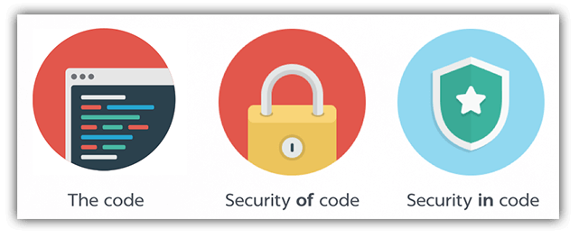
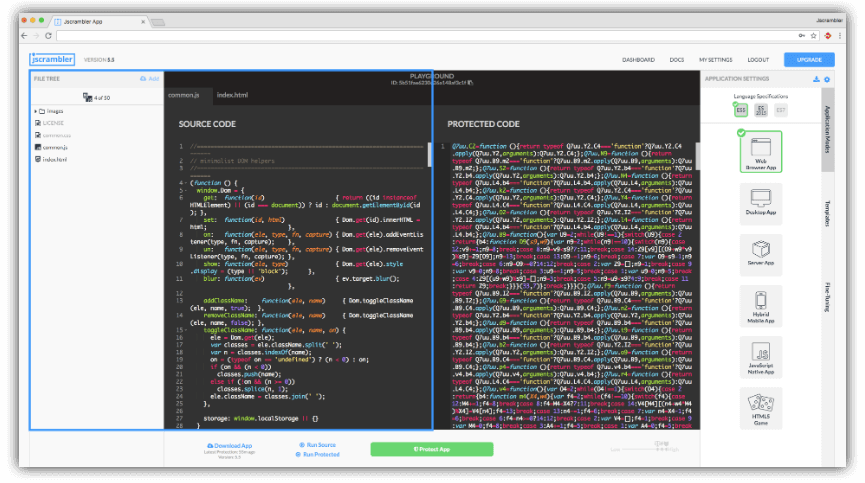
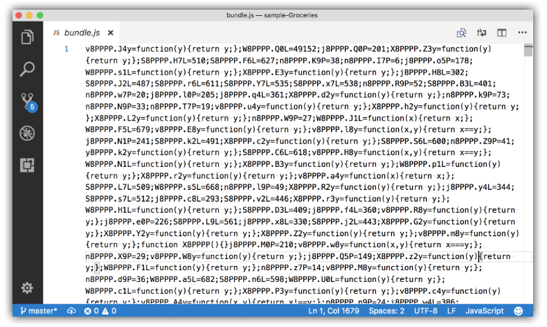
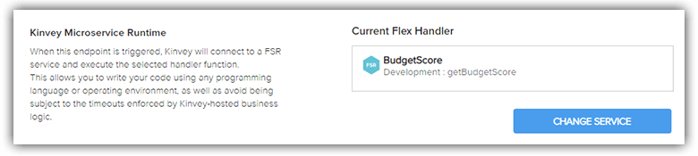

# Secure Your Mobile App - Episode One (Protecting the Code)

Whether you are developing a traditional native app, a cross-compiled app from the likes of Appcelerator or Xamarin, a hybrid app with Ionic, or a JavaScript-native app with NativeScript or React Native, a common thread that runs through each is app security.

Mobile security is something that can no longer be taken lightly. Virtually everyone is walking around with sensitive data, access to corporate secrets, and/or protected health information in their pockets.

> While you're here, but sure to [register for the upcoming webinar](https://www.progress.com/campaigns/kinvey/best-practices-for-securing-your-mobile-apps?utm_medium=social-owned&utm_source=blog&utm_campaign=kinvey-webinar-secureapps) on "Best Practices for Securing Your Mobile Apps", presented on January 23rd at 11AM ET.

## A Bit 'o History

Remember the 90's? I (mostly) do. And I also remember in my consulting days running across issues like:

- Storing user passwords in clear text;
- Sending requests with SSNs in the query string;
- Accepting credit card payments without SSL enabled.

Good times! 😬

Traditionally users have relied on the public app stores as the ultimate app gatekeepers: acting as virus wardens and preventing malicious API usage. The reality though is we developers are responsible for implementing additional security considerations before we deploy our next great app.

In this four-part series on the NativeScript blog, we are going to dive into a series of security-related tips and tricks for you to apply to your app. Most of these are incredibly easy to implement, as the heavy lifting has already been managed by our illustrious community of plugin developers.

- **Part One:** Protecting Your Source Code (hey that's this one!)
- **Part Two:** [Securing Data at Rest](https://www.nativescript.org/blog/secure-your-mobile-app-securing-data-at-rest)
- **Part Three:** [Ensuring Data Integrity Between Device and Server](https://www.nativescript.org/blog/secure-your-mobile-app-securing-data-in-transit)
- **Part Four:** [Enterprise User Authentication and Authorization](https://www.nativescript.org/blog/secure-your-mobile-app-secure-user-auth)

> Check out the new course from [NativeScripting.com](https://nativescripting.com/course/securing-nativescript-applications) on mobile app security and get 30% off with the code: NSSECURE.

## Source Code Security...?

Most of us come from a web development background. We are used to shipping our code (literally) via a server to a user's browser. Intellectual property (code copying) issues exist, yes, but there is little we can do to prevent those those. Desktop and mobile developers on the other hand, are a little more used to compiling code into mostly unreadable bits - protecting code and mitigating efforts to detect vulnerabilities.

So how does this new wave of "JavaScript native" apps, built with technologies like React Native and NativeScript, deal with these issues? And what about hybrid apps built with Ionic?

I hate to burst the collective bubble, but **source code shipped to the client is inherently insecure** - in that it is technically readable by the end user, one way or another. NativeScript, React Native, and Cordova/Ionic - none of these are compiled to native byte code. JavaScript is interpreted on the device, similar to how a web browser functions.

*So you're a traditional native app developer and think you're in the clear?* Think again - there are myriad options for tools to decompile your code and read your secrets. 🤐

**All is not lost though!** Let's look at some strategies for securing your source code and keeping prying eyes off your goods - protecting your intellectual property AND mitigating potential attacks to your apps and backend systems.

## Minification and Obfuscation

The first and, granted, least powerful method of securing your code is via minification/obfuscation. This is a time-honored technique to make your code unreadable to human eyes. A popular obfuscation library, [Uglify](http://lisperator.net/uglifyjs/), can take legible JavaScript code like this:

	const app = require("tns-core-modules/application");
	const HomeViewModel = require("./home-view-model");
	
	function onNavigatingTo(args) {
	    const page = args.object;
	    page.bindingContext = new HomeViewModel();
	}
	
	function onDrawerButtonTap(args) {
	    const sideDrawer = app.getRootView();
	    sideDrawer.showDrawer();
	}
	
	exports.onNavigatingTo = onNavigatingTo;
	exports.onDrawerButtonTap = onDrawerButtonTap;

...and turn it into slightly less readable code like this:

	const app=require("tns-core-modules/application"),HomeViewModel=require("./home-view-model");function onNavigatingTo(o){o.object.bindingContext=new HomeViewModel}function onDrawerButtonTap(o){app.getRootView().showDrawer()}exports.onNavigatingTo=onNavigatingTo,exports.onDrawerButtonTap=onDrawerButtonTap;

The [NativeScript CLI](https://docs.nativescript.org/start/cli-basics) allows you to uglify your app out of the box, assuming you are already using [Webpack](https://docs.nativescript.org/performance-optimizations/bundling-with-webpack) (and if you're not, you should be!). Simply issue the following command to build and uglify your code:

	tns build android|ios --bundle --env.uglify

**Warning:** This is the equivalent of the cheap bike locks we used in middle school!

It'll keep the casual hacker out of our business, but the problem is there are plenty of "beautification" resources out there that will take uglified code and make it a little more legible. Using one of these services on the above obfuscated code provided the following:

	const app = require("tns-core-modules/application"),
	    HomeViewModel = require("./home-view-model");
	
	function onNavigatingTo(o) {
	    o.object.bindingContext = new HomeViewModel
	}
	
	function onDrawerButtonTap(o) {
	    app.getRootView().showDrawer()
	}
	exports.onNavigatingTo = onNavigatingTo, exports.onDrawerButtonTap = onDrawerButtonTap;

Ok, well, it's a start. But I think we can do better.

> Many people mention [ProGuard](https://stuff.mit.edu/afs/sipb/project/android/sdk/android-sdk-linux/tools/proguard/docs/index.html#manual/introduction.html) as an option as well. ProGuard can obfuscate *Java* code, but does nothing for *JavaScript*.

## Jscrambler (Obfuscation+++)

Here on the NativeScript team, we've been in touch with the folks at [Jscrambler](https://jscrambler.com/) for many years now, dating back to our days of hybrid app development. Jscrambler is a service that provides advanced obfuscation to the point of the code being illegible, even after beautification.

Jscrambler prevents your code from being tampered with, by transforming your JavaScript into a form that is protected against reverse-engineering using automated static analysis attacks. Jscrambler can also add "code traps" that restrict when, where, and by whom the JavaScript can be executed.

For example, we can take some JavaScript in a NativeScript app, run it through Jscrambler, and get the following:

👍👍

With verified NativeScript compatibility, it's well-worth giving Jscrambler a try. Start your free trial at [jscrambler.com](https://jscrambler.com/).

> [Check out this in-depth tutorial](https://www.nativescript.org/blog/protecting-your-source-code-with-jscrambler) on using Jscrambler with NativeScript.

At this point we've taken some pretty solid steps to secure and protect the code we are delivering to our end users. How about taking an *additional step* to reduce the potential footprint of *who* can even install our app?

## Limit Access via Private App Stores

The public app stores provide virtually no restrictions on who can download your app. It doesn't matter the purpose or audience, a 14 year old in Australia generally has the same access as an 80 year old in Arizona.

> Granted, you can restrict by age and geo-restrict your apps to make them available in certain countries, but that has little to do with app security.

If you are developing an app that only needs to be delivered to a single entity (i.e. a set of users or a single company/organization) **a better option may be a private app store**.

### Enterprise MAM/MDM Options

If you are part of a large enough organization, there is a good chance that your company relies on Mobile App Management (MAM) or Mobile Device Management (MDM) software to help secure your internal apps and/or devices. With a MAM provider, like [MobileIron](https://www.mobileiron.com/en/modern-security-modern-work) or [AirWatch](https://www.air-watch.com/), you are provided with an internal "enterprise" app store, so you don't have to worry that an unauthorized third party has the ability to download your apps.

There are other, less expensive and less intrusive options though:

### Apple Developer Enterprise Program

The [Apple Enterprise Developer Program](https://developer.apple.com/programs/enterprise/) allows you to circumvent the public iOS App Store and deliver your apps directly to your organization's users. While the cost is higher than the traditional developer agreement ($299/year vs $99/year), the flexibility in distribution is priceless.

The process for code signing and provisioning profile generation is exactly the same as with the standard method. You simply are provided with an additional, separate provisioning option for in-house/ad hoc app deployment.

Easy! But in some ways Android makes it even easier:

### Android Private Distribution

Google is far less restrictive when it comes to deploying apps outside of Google Play. You can set up your own private app marketplace (or even create your own *app* that acts as an app store) without ruffling feathers like you would at Apple. Google even allows you to distribute apps via email, your own website, or even a [managed Google Play store](https://developer.android.com/distribute/google-play/work).

> **NOTE:** If you don't use Google Play, you can't use the in-app billing and licensing services.

The only trick is that your end users have to [opt-in to install unknown apps](https://developer.android.com/distribute/marketing-tools/alternative-distribution#unknown-sources).

There are also numerous services that provide similar functionality, in case you don't want to roll your own. [Applivery](https://www.applivery.com/) is an example of such a service.

## Keep Business Logic in the Cloud

Instead of trying to secure private business logic on the device, why not offload it to a backend system? Similar to the way web apps tend to keep complex business logic on the backend, you can do the same for your mobile app.

For many scenarios you may be far better off transferring sensitive business logic from your app to the cloud, whether it's for security or performance.

An easy way to do this with NativeScript is by using [FlexServices](https://devcenter.kinvey.com/nativescript/guides/flex-services) - lightweight Node.js microservices provided by [Progress Kinvey](https://www.progress.com/kinvey).

> **TIP:** Kinvey provides SDKs for numerous mobile frameworks like [Ionic](https://devcenter.kinvey.com/phonegap/reference), [Xamarin](https://devcenter.kinvey.com/xamarin/reference), [native iOS](https://devcenter.kinvey.com/ios/reference), [native Android](https://devcenter.kinvey.com/android/reference), and of course [NativeScript](https://devcenter.kinvey.com/nativescript/reference)!

You may occasionally have some proprietary business logic stored in your app that would be better-served living in the cloud (be it for IP protection or performance considerations, or even hiding *other* API keys on the server!). So instead of keeping this logic in your app, you can write a FlexService with Kinvey.

For instance, the following FlexService (provided by the illustrious [TJ VanToll](https://twitter.com/tjvantoll)) reads financial transaction data and scores how well you're doing, based on a proprietary algorithm:

	const sdk = require('kinvey-flex-sdk');
	
	function getTransactions(modules) {
	  return new Promise((resolve, reject) => {
	    const store = modules.dataStore({ useUserContext: false });
	    const collection = store.collection('Transactions');
	    const query = new modules.Query();
	
	    collection.find(query, (err, result) => {
	      if (err) {
	        reject(err);
	      } else {
	        resolve(result);
	      }
	    });
	  });
	}
	
	function determineScore(transactions) {
	  var score = 100;
	  transactions.forEach((transaction) => {
	    if (transaction.amount < 0) {
	      score -= 5;
	    }
	    if (transaction.amount > 5) {
	      score += 10;
	    }
	    if (transaction.category === "restaurant") {
	      score -= 5;
	    }
	  });
	  return score.toString();
	}
	
	sdk.service((err, flex) => {
	  function getBudgetScore(context, complete, modules) {
	    getTransactions(modules).then((transactions) => {
	      complete().setBody({
	        score: determineScore(transactions)
	      }).done();
	    }).catch((err) => {
	      complete().setBody(new Error(err)).runtimeError().done();
	    });
	  }
	  
	  flex.functions.register('getBudgetScore', getBudgetScore);
	});

And this FlexService is accessed within our app via an endpoint provided by Kinvey:

	return this.http.post(
        "https://baas.kinvey.com/rpc/kid_<ID>/custom/BudgetScore",
        {},
        {
            headers: new HttpHeaders({
                "Content-Type": "application/json",
                "Authorization": "Basic <YOUR AUTH KEY>"
            })
        }
    );

Using this method your intellectual property is safe, your business logic is not exposed in any way to your users, AND you get the performance and reliability benefit of a fully scalable Kinvey instance.

> To see for yourself how Kinvey can benefit your mobile app development needs, [sign up for a free trial](https://www.progress.com/campaigns/kinvey/console-sign-up).

## Beware of Sharing Keys!

Ok, maybe this is too basic, but it happens WAY more often than you may believe: **make sure you aren't sharing private keys!**

When we use public repositories on GitHub, we often don't restrict which files are uploaded. And there are bots that regularly scan repos to find private AWS or Firebase keys, then use those keys for nefarious purposes, e.g.:

The simplest way to get around this is to use a `.gitignore` file and exclude the .ts/.js file(s) where you store private keys. Here is the standard `.gitignore` I use for my NativeScript projects (assuming I'm using TypeScript, this also excludes JavaScript files from my `app` directory):

	.vscode/
	.cloud/
	platforms/
	node_modules
	app/**/*.js
	app/**/*.map
	npm-debug.log
	app/keys.*
	hooks/
	app/**/google-services.json
	app/**/GoogleService-Info.plist

Not only does this exclude private keys, but also prevents the `platforms` and `node_modules` directories from being shared (which are totally unnecessary if you're cloning the app - not to mention full of thousands of files!).

## On to Episode Two: Securing Data at Rest!

Today we've learned how we can take some relatively simple steps towards protecting our app code, mitigating attempts by malicious users to view our code, reducing our app installation footprint, and offloading sensitive business logic to the cloud.

[In the next part](https://www.nativescript.org/blog/secure-your-mobile-app-securing-data-at-rest) we are going to look at how we can **better secure data stored on the device**.

> Don't forget to [register for our mobile app security webinar](https://www.progress.com/campaigns/kinvey/best-practices-for-securing-your-mobile-apps?utm_medium=social-owned&utm_source=blog&utm_campaign=kinvey-webinar-secureapps) coming up on January 23rd!

