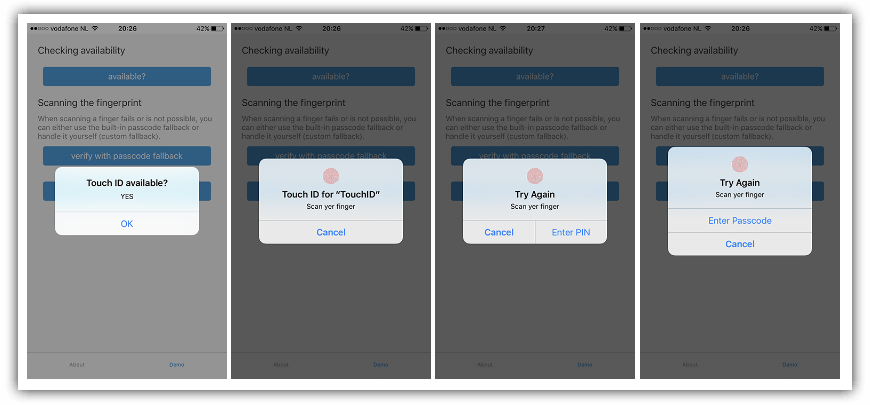
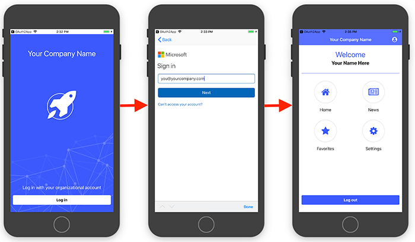

# Secure Your Mobile App - Episode Four (Secure User Auth)

Whether you are developing a traditional native app, a cross-compiled app from the likes of Appcelerator or Xamarin, a hybrid app with Ionic, or a JavaScript-native app with NativeScript or React Native, a common thread that runs through each is app security.

> While you're here, but sure to [register for the upcoming webinar](https://www.progress.com/campaigns/kinvey/best-practices-for-securing-your-mobile-apps?utm_medium=social-owned&utm_source=blog&utm_campaign=kinvey-webinar-secureapps) on "Best Practices for Securing Your Mobile Apps", presented on January 23rd at 11AM ET.

In the previous article, we made sure that data in transit was 100% secure from end-to-end, device to cloud. We learned that by leveraging [Progress Kinvey](https://www.progress.com/kinvey) we have a turnkey solution ensuring data integrity, compliance, and robust performance.

As we wrap up this series, we want to conclude with a topic that is critically important: securely authenticating and authorizing your app users.

- **Part One:** [Protecting Your Source Code]()
- **Part Two:** [Securing Data at Rest]()
- **Part Three:** [Ensuring Data Integrity Between Device and Server]()
- **Part Four:** Enterprise User Authentication and Authorization (hey that's today!)

> Check out the new course from [NativeScripting.com](https://nativescripting.com/course/securing-nativescript-applications) on mobile app security and get 30% off with the code: NSSECURE.

## Biometric Authentication

We are long past the days of passwords and passcodes being the standard in securely authenticating our app users. With biometric security capabilities (e.g. fingerprint and facial id) built in to most iOS and Android devices, our apps should be focused on leveraging these vastly more secure technologies.

For fingerprint recognition, [Touch ID](https://support.apple.com/en-us/HT201371) is an iOS feature that allows users to unlock their devices with the tip of their finger. Android has an equivalent effectively known as "fingerprint scanning". Both are, of course, based on authenticating users via their fingerprints scanned before devices are unlocked.

For facial recognition, [Face ID](https://www.apple.com/iphone-xs/face-id/) is a system designed and developed by Apple for the iPhone X line. Face ID will likely eventually succeed Touch ID as the defacto biometric authentication technology on iOS devices.

To use these biometric authentication options in your app, there is a fantastic plugin built by [Eddy Verbruggen](https://twitter.com/eddyverbruggen) called [nativescript-fingerprint-auth](https://market.nativescript.org/plugins/nativescript-fingerprint-auth).

> **TIP:** Even though it's called a "fingerprint" plugin, it also [supports Face ID](https://market.nativescript.org/plugins/nativescript-fingerprint-auth#face-id-ios) on the iPhone X line of devices!

Basic usage of this plugin includes capabilities such as checking if biometric support is available:

	import { FingerprintAuth, BiometricIDAvailableResult } from "nativescript-fingerprint-auth";
	
	class MyClass {
	  private fingerprintAuth: FingerprintAuth;
	
	  constructor() {
	    this.fingerprintAuth = new FingerprintAuth();
	  }
	
	  this.fingerprintAuth.available().then((result: BiometricIDAvailableResult) => {
	    console.log(`Biometric ID available? ${result.any}`);
	    console.log(`Touch? ${result.touch}`);
	    console.log(`Face? ${result.face}`);
	  });
	}

And verifying a fingerprint (or face on iPhone X):

	fingerprintAuth.verifyFingerprint(
		{
		  title: 'Android title', // optional title (used only on Android)
		  message: 'Scan yer finger', // optional (used on both platforms) - for FaceID on iOS see the notes about NSFaceIDUsageDescription
		  authenticationValidityDuration: 10, // optional (used on Android, default 5)
		  useCustomAndroidUI: false // set to true to use a different authentication screen (see below)
		})
		.then((enteredPassword?: string) => {
		  if (enteredPassword === undefined) {
		    console.log("Biometric ID OK")
		  } else {
		    // compare enteredPassword to the one the user previously configured for your app (which is not the users system password!)
		  }
		})
		.catch(err => console.log(`Biometric ID NOT OK: ${JSON.stringify(err)}`)
	);

> Check out [this tutorial](https://www.progress.com/blogs/how-to-integrate-biometric-authentication-in-ios-and-android) for a walkthrough of using this plugin with NativeScript and a Progress Kinvey backend.

The nativescript-fingerprint-auth is a great way to easily add biometric security to our apps. But what about using existing secure protocols and services to tie a verified individual to authorized roles in our backend systems?

## OAuth 2.0

You've probably heard of OAuth before, as [OAuth 2.0](https://oauth.net/2/) is a commonly used industry-standard protocol for user authorization. Thanks to our extensive community of plugin developers, there is in fact a plugin for interacting with OAuth 2.0 in NativeScript, the [nativescript-oauth2](https://market.nativescript.org/plugins/nativescript-oauth2) plugin.

The OAuth 2.0 plugin helps to simplify access to OAuth providers that support the OAuth 2.0 protocol (e.g. Microsoft, Facebook, and Google), but you can also roll your own (or even use your organization's own provider).

> Be sure to [consult the plugin documentation](https://market.nativescript.org/plugins/nativescript-oauth2) for a full set of documentation.

If you're curious about how the technical implementation of this plugin works with NativeScript apps, check the provided demo apps available for all NativeScript-supported frameworks:

- [Angular](https://github.com/alexziskind1/nativescript-oauth2/tree/master/demo-angular)
- [Vue.js](https://github.com/alexziskind1/nativescript-oauth2/tree/master/demo-vue)
- [Core (plain TypeScript)](https://github.com/alexziskind1/nativescript-oauth2/tree/master/demo)

## Easy Enterprise Authentication

Still with me? Ok, let's face it: user authentication is a giant pain.

If you're rolling our own auth provider, you have to tediously set up login forms, password recovery systems, and the supporting backend infrastructure. Or maybe you’re trying to integrate with an existing enterprise auth provider that uses acronyms like SAML, OAuth (see above), or Open ID. 😵

For *easier* enterprise authentication, look no further than the [Enterprise Auth template](https://docs.nativescript.org/sidekick/user-guide/enterprise-auth/intro) in [NativeScript Sidekick](https://www.nativescript.org/nativescript-sidekick).

NativeScript Sidekick offers an [Enterprise Auth template](https://docs.nativescript.org/sidekick/user-guide/enterprise-auth/intro), as well as a handful of new features designed to help you connect to your authentication provider as quickly as possible. Powered by [Progress Kinvey](https://www.progress.com/kinvey), the Enterprise Auth template guides you through the process of connecting to your provider of choice and makes it easy to customize the look and feel of your login screen.

You can read more about using the Enterprise Auth app template [here on the NativeScript blog](https://www.nativescript.org/blog/enterprise-authentication-made-easier-with-nativescript), or even register for a [free online course on NativeScripting.com](https://courses.nativescripting.com/p/nativescript-enterprise-auth/?product_id=308158&coupon_code=AUTH101) that walks you through the usage.
​
> **TIP:** If you are rolling your own authentication system, you'll want to design a UI that is intuitive and as user-friendly as possible. We've put together a [blog post and example app](https://www.nativescript.org/blog/building-an-awesome-login-screen-with-nativescript) to show off some best practices for building your own *awesome* login screen with NativeScript.

## Conclusion of the 📱🔐 Series 

**We've covered A LOT over the past four articles!** We started out learning how to easily secure our source code, moved to making sure data stored locally is safe and encrypted, talked about some best practices for securing data over the wire, and concluded with some easy ways to make sure we are securely authenticating and authorizing our end users.

But is that all you need to know about app security? Not even close! [Register for our mobile app security webinar](https://www.progress.com/campaigns/kinvey/best-practices-for-securing-your-mobile-apps?utm_medium=social-owned&utm_source=blog&utm_campaign=kinvey-webinar-secureapps) coming up on January 23rd to dive into more details and here from some more experts in the field.