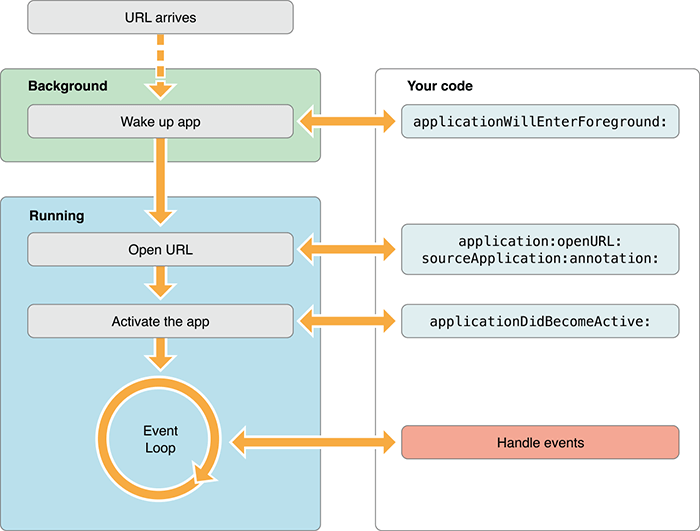
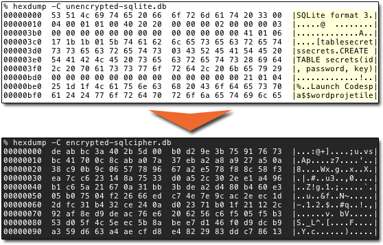

# Securing the Modern Mobile App

## Introduction

Mobile app security. Where does one even begin when confronted with the myriad threats presented to us? From user-focused phishing attempts, to man-in-the-middle attacks between apps and servers, to compromised devices, to unsecured legacy backend systems of record, the security landscape has never been more intimidating.

Take a moment and think back 20+ years to the dawn of the information age. Many of us were performing numerous anti-patterns which today could lead to massive data breaches (and lawsuits):

- Storing user passwords unencrypted in clear text;
- Sending requests with social security numbers in the query string (AND getting stored in the web server's log);
- Accepting credit card payments without SSL/TLS enabled.

As app developers and enterprise architects, our responsibility is to ensure data integrity, compliance, and security of our users' data. From the moment they pick up their device until they put it down again, security needs to be on our minds, so it doesn't have to be on theirs. The benefits of a secure app model from day one not only include reduced potential liability issues, but also lead to a more satisfied consumer, and thus increased revenue down the road.

While the security threats presented are immense, this doesn't mean we don't have ways to mitigate those threats. And while we need not be scared, we need to be constantly vigilant, willing to adjust our practices, and remain up-to-date on modern techniques for securing the modern mobile app.

What follows is a four-pronged set of defenses to help you with some tactical tips and tricks to secure your app, today, using code and techniques that are incredibly easy to implement (and priceless):

- **Part One:** Protecting Your Source Code
- **Part Two:** Securing Data at Rest
- **Part Three:** Ensuring Data Integrity Between Device and Server
- **Part Four:** Enterprise User Authentication and Authorization

## Part One (Protecting Your Source Code)

Whether you are developing a traditional native app, a cross-compiled app from the likes of Appcelerator or Xamarin, a hybrid app with Ionic, or a JavaScript-native app with NativeScript or React Native, a common thread that runs through each is a dire need to secure the app code. Literally securing the bits and bytes that live in your app package (the .apk and .ipa files) that house your code.

Traditionally users have relied on the public app stores as the ultimate app gatekeepers: acting as virus wardens, preventing malicious API usage, and making sure our apps fall in the hands of (generally speaking) the users we want to target. The reality though is we developers are responsible for implementing additional security considerations before we deploy our next great app - and the truth is our source code is, by default, at risk of compromise.

### Why Do We Need to Secure Source Code?

Most of us come from a web development background. We are used to shipping our code (literally) via a server to a user's browser. Intellectual property (code copying) issues exist, yes, but there is little we can do to prevent those those. Desktop and mobile developers on the other hand, are a little more used to compiling code into mostly unreadable bits - protecting code and mitigating efforts to detect vulnerabilities.

So how does this new wave of "JavaScript native" apps, built with technologies like React Native and NativeScript, deal with these issues? And what about hybrid apps built with Ionic? Do "traditional" iOS and Android developers have to deal with this potential threat?

> New to NativeScript? The free and open source NativeScript framework lets you build truly native apps for iOS, Android, and the Web from a single JavaScript-based codebase. You can also use popular JavaScript frameworks like Angular and Vue.js.

I hate to burst our collective bubble, but **source code shipped to the client is inherently not secure** - in that it is technically readable by an individual who has a copy of your app package, one way or another. NativeScript, React Native, and Cordova/PhoneGap/Ionic - none of these are compiled to native byte code. JavaScript is interpreted on the device at runtime in a JavaScript Virtual Machine, similar to how a web browser functions with client-side code it receives from a server.

If you're what we call a "traditional" native iOS or Android developer (in terms of developing with Objective-C/Swift with Xcode or Java/Kotlin with Android Studio), you too are exposed to this risk. Even though your app packages are compiled, there are numerous freely available tools to decompile your code and read your secrets.

### The Risks of Exposed Source Code

As stated previously, web developers have been sending unencrypted source code bits down the wire from a backend web server to the client browsers for years. And the vast majority of the time this isn't a problem. But when it becomes a problem is when we are concerned with:

- Intellectual property considerations
- Vulnerability of our backend systems

The same exact considerations must be made of our mobile apps, but the issues are even more significant, as more of your business logic is now stored and processed on the device.

For example, if your mobile app has premium features baked in that are only exposed when someone makes a payment, it is certainly possible for an end user to examine your source for how a "premium" flag is set, and manually change the code and re-build the app for their own purposes. While this is a narrow threat, it's easy to see how this could scale for popular apps and torrent sites!

Is your intellectual property important to you? It should be, as there is a massive risk of "copycat apps" in the public app stores. Organization A has a great idea for a new game priced at $9.99. Shady Organization B copies the source code and markets the same game for $2.99.

Are you relying heavily on a backend system to manage your app? Are API calls to your backend system properly secured? Could a hacker alter some parameters of those remote API calls and change the behavior of the app, or worse, the backend system itself?

Again, the point of this paper is not to instill fear, but rather to clarify the issues and inspire some level of confidence that we can mitigate these threats. Let's look at some strategies for securing your source code and keeping prying eyes off your goods - protecting your intellectual property AND mitigating potential attacks to your apps and backend systems.

### Minification and Obfuscation of Source Code

The first and, granted, least powerful method of securing your code is via a process called minification and obfuscation. This is a time-honored technique to optimize your code for speed, but has the side effect make your code unreadable to human eyes. A popular obfuscation library, [Uglify](http://lisperator.net/uglifyjs/), can take legible JavaScript code like this:

	const app = require("tns-core-modules/application");
	const HomeViewModel = require("./home-view-model");
	
	function onNavigatingTo(args) {
	    const page = args.object;
	    page.bindingContext = new HomeViewModel();
	}
	
	function onDrawerButtonTap(args) {
	    const sideDrawer = app.getRootView();
	    sideDrawer.showDrawer();
	}
	
	exports.onNavigatingTo = onNavigatingTo;
	exports.onDrawerButtonTap = onDrawerButtonTap;

...and turn it into slightly less readable code like this:

	const app=require("tns-core-modules/application"),HomeViewModel=require("./home-view-model");function onNavigatingTo(o){o.object.bindingContext=new HomeViewModel}function onDrawerButtonTap(o){app.getRootView().showDrawer()}exports.onNavigatingTo=onNavigatingTo,exports.onDrawerButtonTap=onDrawerButtonTap;

When using The [NativeScript CLI](https://docs.nativescript.org/start/cli-basics) allows you to uglify your app out of the box, assuming you are already using [Webpack](https://docs.nativescript.org/performance-optimizations/bundling-with-webpack) (and if you're not, you should be!). Simply issue the following command to build and uglify your code:

	tns build android|ios --bundle --env.uglify

**Warning:** This is really not a viable security mechanism, it only prevents the most casual of snooping on your source code!

Minification and light obfuscation will keep the novice hacker out of our business, but the problem is there are plenty of "beautification" resources out there that will take uglified code and make it a little more legible. Using one of these services on the above obfuscated code provided the following:

	const app = require("tns-core-modules/application"),
	    HomeViewModel = require("./home-view-model");
	
	function onNavigatingTo(o) {
	    o.object.bindingContext = new HomeViewModel
	}
	
	function onDrawerButtonTap(o) {
	    app.getRootView().showDrawer()
	}
	exports.onNavigatingTo = onNavigatingTo, exports.onDrawerButtonTap = onDrawerButtonTap;

It's a start, but there are opportunities to do far more with securing code on the device.

> [ProGuard](https://stuff.mit.edu/afs/sipb/project/android/sdk/android-sdk-linux/tools/proguard/docs/index.html#manual/introduction.html) is an option for Android apps. However, ProGuard can only obfuscate *Java* code, but does nothing for *JavaScript*.

### Enterprise-Grade Obfuscation and Code Protection

What if you could combine the ease of command-line convenience (like you get with Webpack and Uglify) with proven source code obfuscation, that provides legitimate security?

[Jscrambler](https://jscrambler.com/) is a service that provides advanced obfuscation to the point of the code being illegible, *even after beautification*.

Jscrambler prevents your code from being tampered with, by transforming your JavaScript into a form that is protected against reverse-engineering using automated static analysis attacks. Jscrambler can also add "code traps" that restrict when, where, and by whom the JavaScript can be executed.

For example, we can take some JavaScript from an existing mobile app, run it through the Jscrambler service, and get the following completely obfuscated code:

The beauty of Jscrambler is that this obfuscated code cannot be beautified for later reading by human eyes. With the aforementioned "code traps", Jscrambler can inject JavaScript to make tampering with your source actually break app functionality.

Securing the code stored in the app on the device is an excellent first step. However, how about moving your code to the cloud?

### Store Business Logic in a Secure Cloud

Instead of trying to secure private business logic *on the device*, why not offload it to a backend system? Similar to the way web apps tend to keep complex business logic on the backend, you can do the same for your mobile app.

For many scenarios you may be far better off transferring sensitive business logic from your app to the cloud, whether it's for security or performance.

An easy way to do this with NativeScript is by using [FlexServices](https://devcenter.kinvey.com/nativescript/guides/flex-services) - lightweight Node.js microservices provided by [Progress Kinvey](https://www.progress.com/kinvey).

> **TIP:** Kinvey provides SDKs for numerous mobile frameworks like [Ionic](https://devcenter.kinvey.com/phonegap/reference), [Xamarin](https://devcenter.kinvey.com/xamarin/reference), [native iOS](https://devcenter.kinvey.com/ios/reference), [native Android](https://devcenter.kinvey.com/android/reference), and of course [NativeScript](https://devcenter.kinvey.com/nativescript/reference)!

You may occasionally have some proprietary business logic stored in your app that would be better-served living in the cloud (be it for IP protection or performance considerations, or even hiding *other* API keys on the server!). So instead of keeping this logic in your app, you can write a FlexService with Kinvey.

For instance, the following FlexService (provided by the illustrious [TJ VanToll](https://twitter.com/tjvantoll)) reads financial transaction data and scores how well you're doing, based on a proprietary algorithm:

	const sdk = require('kinvey-flex-sdk');
	
	function getTransactions(modules) {
	  return new Promise((resolve, reject) => {
	    const store = modules.dataStore({ useUserContext: false });
	    const collection = store.collection('Transactions');
	    const query = new modules.Query();
	
	    collection.find(query, (err, result) => {
	      if (err) {
	        reject(err);
	      } else {
	        resolve(result);
	      }
	    });
	  });
	}
	
	function determineScore(transactions) {
	  var score = 100;
	  transactions.forEach((transaction) => {
	    if (transaction.amount < 0) {
	      score -= 5;
	    }
	    if (transaction.amount > 5) {
	      score += 10;
	    }
	    if (transaction.category === "restaurant") {
	      score -= 5;
	    }
	  });
	  return score.toString();
	}
	
	sdk.service((err, flex) => {
	  function getBudgetScore(context, complete, modules) {
	    getTransactions(modules).then((transactions) => {
	      complete().setBody({
	        score: determineScore(transactions)
	      }).done();
	    }).catch((err) => {
	      complete().setBody(new Error(err)).runtimeError().done();
	    });
	  }
	  
	  flex.functions.register('getBudgetScore', getBudgetScore);
	});

And this FlexService is accessed within our app via an endpoint provided by Kinvey:

	return this.http.post(
        "https://baas.kinvey.com/rpc/kid_<ID>/custom/BudgetScore",
        {},
        {
            headers: new HttpHeaders({
                "Content-Type": "application/json",
                "Authorization": "Basic <YOUR AUTH KEY>"
            })
        }
    );

Using this method your intellectual property is safe, your business logic is not exposed in any way to your users, AND you get the performance and reliability benefit of a fully scalable Kinvey instance.

> To see for yourself how Kinvey can benefit your mobile app development needs, [sign up for a free trial](https://www.progress.com/campaigns/kinvey/console-sign-up).

Up to now we've taken some solid steps to secure and protect the code we are delivering to our end users. How about taking an *additional step* to reduce the potential footprint of *who* can even install our app?

### Limit Access to Apps with Private App Stores

The public app stores provide virtually no restrictions on who can download your app. It doesn't matter the purpose or audience, a 14 year old in Australia generally has the same access as an 80 year old in Arizona.

> Granted, you can restrict by age and geo-restrict your apps to make them available in certain countries, but that has little to do with app security.

If you are developing an app that only needs to be delivered to a single entity (i.e. a set of users or a single company/organization) **a better option may be a private app store**.

#### Enterprise MAM/MDM Options

If you are part of a large enough organization, there is a good chance that your company relies on Mobile App Management (MAM) or Mobile Device Management (MDM) software to help secure your internal apps and/or devices. With a MAM provider, like [MobileIron](https://www.mobileiron.com/en/modern-security-modern-work) or [AirWatch](https://www.air-watch.com/), you are provided with an internal "enterprise" app store, so you don't have to worry that an unauthorized third party has the ability to download your apps. Combined with complete device management and role-based app deployment, MAM providers such as these provide a high grade of security for app provisioning (and deprovisioning).

For smaller companies there are other, less expensive and less intrusive options though. However, this does mean effectively rolling your own app store:

#### Apple Developer Enterprise Program

The [Apple Enterprise Developer Program](https://developer.apple.com/programs/enterprise/) allows you to circumvent the public iOS App Store and deliver your apps directly to your organization's users. While the cost is higher than the traditional developer agreement ($299/year vs $99/year), the flexibility in distribution is priceless.

The process for code signing and provisioning profile generation is exactly the same as with the traditional method for iOS developers. You simply are provided with an additional, separate provisioning option for in-house/ad hoc app deployment.

Easy! But in some ways Android makes it even easier:

#### Android Private Distribution

Google is far less restrictive when it comes to deploying apps outside of Google Play. You can set up your own private app marketplace (or even create your own *app* that acts as an app store) without ruffling feathers like you would at Apple. Google even allows you to distribute apps via email, your own website, or even a [managed Google Play store](https://developer.android.com/distribute/google-play/work).

> **NOTE:** If you don't use Google Play, you can't use the in-app billing and licensing services.

The only trick is that your end users have to [opt-in to install unknown apps](https://developer.android.com/distribute/marketing-tools/alternative-distribution#unknown-sources).

There are also numerous services that provide similar functionality, in case you don't want to roll your own. [Applivery](https://www.applivery.com/) is an example of such a service.

### Beware of Sharing Private Keys

File this in the "common sense" bin, but in truth it happens far more often than you may believe: **make sure you aren't sharing private API keys!**

When we use public repositories on GitHub or Bitbucket, we often don't restrict which files are uploaded. And there are bots that regularly scan repositories to find private AWS or Firebase keys for example, then use those keys for nefarious purposes, such as crypto currency mining.

The simplest way to avoid this issue is to use a `.gitignore` file and exclude the .ts/.js file(s) where you store private keys. Here is the standard `.gitignore` a developer could use for a NativeScript app for instance (assuming you are using TypeScript, this also excludes JavaScript files from the `app` directory):

	.vscode/
	.cloud/
	platforms/
	node_modules
	app/**/*.js
	app/**/*.map
	npm-debug.log
	app/keys.*
	hooks/
	app/**/google-services.json
	app/**/GoogleService-Info.plist

Not only does this exclude private keys, but also prevents the NativeScript `platforms` and `node_modules` directories from being shared (which are totally unnecessary if you're cloning the app - not to mention full of thousands of files!).

### Source Code: Secured

So far we've learned how we can take some relatively simple steps towards protecting our app code, mitigating attempts by malicious users to view our code, reducing our app installation footprint, and offloading sensitive business logic to the cloud.

Next up we are going to look at how we can **better secure data stored on the device**.

## Part Two (Securing Data at Rest on the Device)

We love our data. We love storing sensitive company documents, passcodes, personal health information, and other private data on our phones. However, this convenience comes with a cost. By copying data from a secure backend system of record to a local not-so-secure mobile device, there is some amount of risk with losing said data.

Let's focus in on how we store (and secure) data locally, on the user's device.

### Encrypt Local Data

Out of the box, both iOS and Android prevent data stored by one app to be accessed by any other app on the device (effectively known as "sandboxing"). Historically this has been a very effective way of making sure data isn't shared across distinct apps. However there are plenty of valid use cases for *wanting* data to be shared between apps. This is where the concept of "custom URL schemes" come into play. These allow data to pass between applications using simple URLs:

While custom URL schemes are not inherently unsecure, they do pose some risk for sharing data between apps using this shared URL scheme.

In any case, it's always best to encrypt any and all data we are saving to the device.

For NativeScript apps, [nativescript-secure-storage](http://market.nativescript.org/plugins/nativescript-secure-storage) is a key plugin for easily and securely storing data. The Secure Storage plugin allows us to encrypt, save, decrypt, and retrieve key/value pairs:

	// require the plugin
	import { SecureStorage } from "nativescript-secure-storage";
	
	// instantiate the plugin
	let secureStorage = new SecureStorage();
	
	// async
	secureStorage.set({
	  key: "foo",
	  value: "I was set at " + new Date()
	}).then(success => console.log("Successfully set a value? " + success));
	
	// sync
	const success = secureStorage.setSync({
	  key: "foo",
	  value: "I was set at " + new Date()
	});
	
> **NOTE:** Internally, on iOS this plugin uses KeyChain via the [SAMKeychain library](https://github.com/soffes/SAMKeychain) and Android via the [Hawk library](https://github.com/orhanobut/hawk) (which in turn uses [Facebook conceal](https://github.com/facebook/conceal)).

### Database Encryption with SQLite + SQLCipher

[SQLite](https://www.sqlite.org/index.html) is quite possibly the most popular relational database on the market. In contrast to many other relational database management systems, SQLite is not a typical client–server database engine. Rather, it is embedded into the app itself, and stored locally. The attraction of SQLite comes from app developers who are more familiar and comfortable with SQL (as opposed to constructing queries for document databases like MongoDB).

For NativeScript developers, there is a [full-featured NativeScript plugin](https://market.nativescript.org/plugins/nativescript-sqlite) as well. This free version of the SQLite plugin provides all of the capabilities you've come to expect from SQLite. However, there is a [paid option](https://nativescript.tools/product/10) that also includes encrypting your SQLite database at rest. By leveraging [SQLCipher](https://www.zetetic.net/sqlcipher/), you can have transparent 256-bit AES encryption of your SQLite database on device.

### Online/Offline Data Sync + Encryption

Many of us use mobile backend services (mBaaS) like [Firebase](https://market.nativescript.org/plugins/nativescript-plugin-firebase) or [Progress Kinvey](https://www.progress.com/kinvey) for our remote backends. And when developing mobile apps, we need to be aware of online/offline connectivity, and syncing up data for when users toggle between those states (lest the app crashes without a network connection!).

Out of the box, Kinvey comes with [online/offline data sync](https://devcenter.kinvey.com/nativescript/guides/datastore) baked in, as outlined in this extensive code sample example from the Kinvey documentation:

	// Retrieve an instance
	const dataStore = Kinvey.DataStore.collection('books', Kinvey.DataStoreType.Sync) as Kinvey.SyncStore;
	// Pull data from the backend and save it locally on the device.
	const promise = dataStore.pull()
	  .then((entities: Array<{}>) => {
	    // ...
	  })
	  .catch((error: Kinvey.BaseError) => {
	    // ...
	  });
	// Find data locally on the device.
	const subscription = dataStore.find()
	  .subscribe((data: Array<{}>) => {
	    // Called once, with local data
	  }, (error: Kinvey.BaseError) => {
	    // ...
	  }, () => {
	    // Called after the local data has been retrieved
	  });
	// Save an entity locally to the device. This will add the item to the sync table to be pushed to the backend at a later time.
	const entity = {};
	const promise = dataStore.save(entity)
	  .then((entity: {}) => {
	    // ...
	  })
	  .catch((error: Kinvey.BaseError) => {
	    // ...
	  });
	// Syncs this store with the backend. This will first push any pending changes on the device to the backend and then pull data from the backend onto the device.
	const promise = dataStore.sync()
	  .then((entities: Array<{}>) => {
	    // result will contain the results of the push to the backend and a pull from the backend
	    // result = {
	    //   push: [], // pushed entities
	    //   pull: [] // pulled entities
	    // };
	    //
	    // Each item in the array of pushed entities will look like the following
	    // { _id: '<entity id before push>', entity: <entity after push> }
	    // It could also possibly have an error property if the push failed.
	    // { _id: '<entity id before push>', entity: <entity after push>, error: <reason push failed> }
	  })
	  .catch((error: Kinvey.BaseError) => {
	    // ...
	  });

Additionally, [Kinvey provides for encryption of the data](https://devcenter.kinvey.com/nativescript/guides/encryption) at rest on the device, using SQLite and SQLCipher, which is simply configured automatically when you initialize Kinvey:

	Kinvey.init({
		appKey: '<appKey>',
		appSecret: '<appSecret>',
		encryptionKey: '<encryptionKey>'
	});

### Backend Compliance and Security Considerations

Many of us who develop apps in the enterprise are acutely aware of compliance and security regulations. Here in the US, a big one for developers creating apps for health care providers or insurance companies is [HIPAA](https://en.wikipedia.org/wiki/Health_Insurance_Portability_and_Accountability_Act).

> If you are developing an app that deals with PHI (private health information) in the health care industry, you absolutely need to make sure the data storage and transmission of said data is HIPAA-compliant.

Kinvey reviews, affirms, and evolves security controls on an annual basis via SOC2, HIPAA, GDPR, Sarbanes-Oxley, and other compliance activities. For customers in banking focused on FFIEC or GLBA regulations, in health care focused on HIPAA, or doing business in the EU and concerned about GDPR, the Kinvey platform provides comprehensive end-to-end security with the capabilities needed to support your regulatory compliance efforts.

[Read more here](https://www.progress.com/kinvey/enterprise-security) about how Kinvey can provide your organization the security and compliance coverage it requires.

### Data at Rest: Secured

We just covered storing private data elements securely in our app and even looked into some local and remote secure data storage options. Next we are going to look into how we *securely transfer* data back and forth from the client to the server. And it's not quite as simple as SSL.

## Part Three (Securing Data in Transit)

Preserving the integrity of your app's data as it moves back and forth to and from your backend is another critical piece of this puzzle, so next our focus in on how we protect and secure data while in transit.

### SSL/TLS Everywhere

The default method for securing communications between two distinct endpoints is SSL, or rather TLS 1.2 (Transport Layer Security).

TLS and SSL (which is now technically deprecated) are cryptographic protocols which provide communication security over a network. Implementations of these protocols are used of course in web browsing, email clients, IM clients, and voice over IP (VoIP). TLS aims primarily to provide privacy and data integrity between two or more communicating apps.

But just saying "I use TLS" isn't enough anymore. Let's take a closer look at what else we may want to layer on to secure communication between devices.

#### iOS Considerations

Introduced with iOS 9, App Transport Security (ATS) is a default feature that enforces increased security within iOS apps. When your iOS app makes an external connection, that connection *must* meet the following requirements:

- The server must support at least Transport Layer Security (TLS) protocol version 1.2;
- Connection ciphers are limited to those that provide forward secrecy;
- Certs must be signed using a SHA256 (or greater) signature hash algorithm;
- Invalid certificates result in a hard failure and no connection.

This is great for developers, as they are forced into having iOS apps communicate over secure channels by default. However, there is still a way around this, which I'm pointing out here as an anti-pattern for your `info.plist` file:

**⚠️ Anti-pattern alert! ⚠️**

	<key>NSAppTransportSecurity</key>
	<dict>
	    <key>NSAllowsArbitraryLoads</key>
	    <true/>
	    <key>NSExceptionDomains</key>
	    <dict>
	        <key>example.com</key>
	        <dict>
	            <key>NSExceptionAllowsInsecureHTTPLoads</key>
	            <true/>
	            <key>NSIncludesSubdomains</key>
	            <true/>
	        </dict>
	    </dict>
	</dict>

Setting `NSAllowsArbitraryLoads` to true allows for loading *any* remote resources, regardless of the security of the transfer protocol. This is not a wise idea, as you could be setting yourself up for easily-spoofed remote endpoints and subjecting your app users to malicious hackers.

#### Android Considerations

The most recent version of Android ([9.0 a.k.a. Pie](https://www.android.com/versions/pie-9-0/)) is a bit behind Apple, but does default to blocking HTTP traffic in apps by default.

This requirement will apply to all apps that target Android 9, but, like with iOS, will require a specific declaration in the app's `network_security_config.xml` file if any non-secure HTTP connections are needed via the [network security configuration](https://developer.android.com/training/articles/security-config) options. Like with iOS, this is another anti-pattern:

**⚠️ Anti-pattern alert! ⚠️**

	<base-config cleartextTrafficPermitted="true">
	    <trust-anchors>
	        <certificates src="system" />
	    </trust-anchors>
	</base-config>

So Rule #1 with securing data in transit, the simplest rule of them all, is to make sure that literally every remote call you make (I don't care if it's to an image or a remote endpoint) is performed with the TLS protocol.

### Preventing Man-in-the-Middle Attacks

Leveraging SSL/TLS is critical when transferring data and maintaining integrity, but just hitting an `https` endpoint doesn't necessarily guarantee security. This is where the dreaded "man-in-the-middle" attack comes into play.

A man-in-the-middle attack is a situation where someone secretly and transparently relays and possibly alters the communication between two parties who believe they are directly communicating with each other.

This is a major issue when we are talking about ensuring the integrity of data in transit - and the solution to this is to use a concept known as SSL pinning.

SSL Pinning is the act of verifying the server's certificate against a known copy of that certificate. By bundling your server's SSL certificate inside your app and making sure any request validates that the server's cert matches the cert stored with the app.

There is a NativeScript plugin to address just this scenario. The [nativescript-https](https://market.nativescript.org/plugins/nativescript-https) plugin is a drop-in replacement for the standard NativeScript [http module](https://docs.nativescript.org/ns-framework-modules/http). This allows you to add SSL pinning security *without* making any changes to your existing usage of the http module.

To enable SSL pinning with this plugin, you'll want to [install the SSL certificate](https://market.nativescript.org/plugins/nativescript-https#installing-your-ssl-certificate) and enable SSL pinning in code:

	import { knownFolders } from 'file-system'
	import * as Https from 'nativescript-https'
	let dir = knownFolders.currentApp().getFolder('certs')
	let certificate = dir.getFile('wegossipapp.com.cer').path
	Https.enableSSLPinning({ host: 'wegossipapp.com', certificate })

### End-to-End Data Encryption

Clearly the best solution for securing your data from the device to your backend is a fully integrated solution. This is where, again, [Progress Kinvey](https://www.progress.com/kinvey) comes into play.

As noted previously, with a feature-complete [NativeScript SDK](https://devcenter.kinvey.com/nativescript), Kinvey can encrypt data at rest on the device, protect the integrity of your data in transit, and secure your data in the cloud.

### Data in Transit: Secured

We've covered some simple, but effective mechanisms to make sure data integrity between device and cloud is secured. By relying on the default requirements of the iOS and Android platforms, we are forced to use TLS, and with SSL pinning we are guaranteeing that this traffic is secured.

## Part Four (Secure User Authentication)

As we wrap up this paper, we want to conclude with a topic that is critically important: securely authenticating and authorizing app users.

### Biometric Authentication

We are long past the days of passwords and passcodes being the standard in securely authenticating our app users. With biometric security capabilities (e.g. fingerprint and facial id) built in to most iOS and Android devices, our apps should be focused on leveraging these vastly more secure technologies.

For fingerprint recognition, [Touch ID](https://support.apple.com/en-us/HT201371) is an iOS feature that allows users to unlock their devices with the tip of their finger. Android has an equivalent effectively known as "fingerprint scanning". Both are, of course, based on authenticating users via their fingerprints scanned before devices are unlocked.

For facial recognition, [Face ID](https://www.apple.com/iphone-xs/face-id/) is a system designed and developed by Apple for the iPhone X line. Face ID will likely eventually succeed Touch ID as the defacto biometric authentication technology on iOS devices.

To use these biometric authentication options in a NativeScript app, there is a plugin called [nativescript-fingerprint-auth](https://market.nativescript.org/plugins/nativescript-fingerprint-auth).

> **TIP:** Even though it's called a "fingerprint" plugin, it also [supports Face ID](https://market.nativescript.org/plugins/nativescript-fingerprint-auth#face-id-ios) on the iPhone X line of devices.

Basic usage of this plugin includes capabilities such as checking if biometric support is available:

	import { FingerprintAuth, BiometricIDAvailableResult } from "nativescript-fingerprint-auth";
	
	class MyClass {
	  private fingerprintAuth: FingerprintAuth;
	
	  constructor() {
	    this.fingerprintAuth = new FingerprintAuth();
	  }
	
	  this.fingerprintAuth.available().then((result: BiometricIDAvailableResult) => {
	    console.log(`Biometric ID available? ${result.any}`);
	    console.log(`Touch? ${result.touch}`);
	    console.log(`Face? ${result.face}`);
	  });
	}

And verifying a fingerprint (or face on iPhone X):

	fingerprintAuth.verifyFingerprint(
		{
		  title: 'Android title', // optional title (used only on Android)
		  message: 'Scan yer finger', // optional (used on both platforms) - for FaceID on iOS see the notes about NSFaceIDUsageDescription
		  authenticationValidityDuration: 10, // optional (used on Android, default 5)
		  useCustomAndroidUI: false // set to true to use a different authentication screen (see below)
		})
		.then((enteredPassword?: string) => {
		  if (enteredPassword === undefined) {
		    console.log("Biometric ID OK")
		  } else {
		    // compare enteredPassword to the one the user previously configured for your app (which is not the users system password!)
		  }
		})
		.catch(err => console.log(`Biometric ID NOT OK: ${JSON.stringify(err)}`)
	);

There is even a [full tutorial](https://www.progress.com/blogs/how-to-integrate-biometric-authentication-in-ios-and-android) for using this plugin with NativeScript and a Progress Kinvey backend.

The nativescript-fingerprint-auth is a great way to easily add biometric security to our apps. But what about using existing secure protocols and services to tie a verified individual to authorized roles in our backend systems?

### OAuth 2.0

You've probably heard of OAuth before, as [OAuth 2.0](https://oauth.net/2/) is a commonly used industry-standard protocol for user authorization.

OAuth is an open standard for delegating access to resources, often used as a way for end users to grant apps access to their information but without turning over their login credentials. This mechanism is used by companies such as Amazon, Google, Facebook, Microsoft, and Twitter to allow users of those serivices to share information about their accounts with permitted third party apps.

Thanks to an extensive community of plugin developers, there is in fact a plugin for interacting with OAuth 2.0 in NativeScript: the [nativescript-oauth2](https://market.nativescript.org/plugins/nativescript-oauth2) plugin.

The OAuth 2.0 plugin helps to simplify access to OAuth providers that support the OAuth 2.0 protocol (e.g. Microsoft, Facebook, and Google), but you can also roll your own (or even use your organization's own provider).

> Be sure to [consult the plugin documentation](https://market.nativescript.org/plugins/nativescript-oauth2) for help getting started.

### Easier Enterprise Authentication

It's time to admit it: user authentication is a giant pain.

If you're rolling our own authentication provider, you have to tediously set up login forms, password recovery systems, and the supporting backend infrastructure. Or maybe you’re trying to integrate with an existing enterprise auth provider that uses acronyms like SAML, OAuth (see above), or Open ID.

For *easier* enterprise authentication, look no further than the [Enterprise Auth template](https://docs.nativescript.org/sidekick/user-guide/enterprise-auth/intro) in [NativeScript Sidekick](https://www.nativescript.org/nativescript-sidekick).

NativeScript Sidekick offers an [Enterprise Auth template](https://docs.nativescript.org/sidekick/user-guide/enterprise-auth/intro), as well as a handful of new features designed to help you connect to your authentication provider as quickly as possible. Powered by [Progress Kinvey](https://www.progress.com/kinvey), the Enterprise Auth template guides you through the process of connecting to your provider of choice and makes it easy to customize the look and feel of your login screen.

You can read more about using the Enterprise Auth app template [here on the NativeScript blog](https://www.nativescript.org/blog/enterprise-authentication-made-easier-with-nativescript), or even register for a [free online course on NativeScripting.com](https://courses.nativescripting.com/p/nativescript-enterprise-auth/?product_id=308158&coupon_code=AUTH101) that walks you through the usage.
​
> **TIP:** If you are rolling your own authentication system, you'll want to design a UI that is intuitive and as user-friendly as possible. We've put together a [blog post and example app](https://www.nativescript.org/blog/building-an-awesome-login-screen-with-nativescript) to show off some best practices for building your own *awesome* login screen with NativeScript.

## Conclusion of 📱🔐 

We started out learning how to easily **secure our source code**, moved to making sure **data stored locally is safe and encrypted**, talked about some best practices for **securing data over the wire**, and concluded with some easy ways to make sure we are **securely authenticating and authorizing our end users**.

Next step? Take a look at Progress Kinvey and how the built-in security and compliance offerings can ensure a secure path for your organization and your end users.