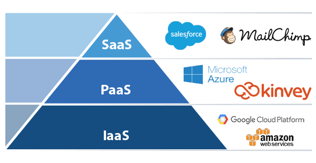

# What is Serverless and Why Does it Matter?

Let's not kid ourselves, until [Pied Piper's "new internet"](https://www.wired.com/2017/06/pied-pipers-new-internet-isnt-just-possible-almost/) goes public and renders data centers irrelevant, the world will still run on the server. Whether under your desk or in a cloud container, a server is still a server.

How many of us have had conversations with non-techie friends and family asking us what the *cloud* "is" and whether or not they should be "in" the cloud? Queue eye roll and a pithy explanation of how **the cloud is really just someone else's server**.

Throw "serverless" into the mix (along with acronyms like IaaS, PaaS, SaaS, and FaaS) and even the best of us end up with a spinning head 😵.

## A Brief History of the Cloud

Today most of us realize the value of the cloud and the ROI it provides for everyone from hobbyists to large enterprises. In the pre-cloud days, when deploying an app, developers had to concern themselves with:

- Buying a server;
- Finding a physical place to house it;
- Connecting it to the Internet;
- Installing and patching an OS;
- Securing it (e.g. physical security, firewall, DDoS prevention, etc);
- ...and then the long term maintenance of both hardware and software.

Then came companies like Rackspace (among many others), who promised to offload the responsibility of server logistics. **But at the end of the day, these providers were solving only a part of the problem.** Creating geo-specific fail-safe clusters, maintaining server software, and mirroring environments from dev -> test -> QA -> prod was still left to us common folk.

**Enter the ☁️.**

As virtualization technologies improved, the ability for Rackspace-like companies to spin up virtual machines at-will became the new norm. Instead of provisioning physical hardware, we were issuing commands and double-clicking our way to new servers and new environments.

And where there is money to be made in technology, you can be sure the tech behemoths aren't far behind. Amazon's AWS, Microsoft's Azure, and Google's Cloud Platform rolled over competitors and established themselves as the preeminent providers of cloud computing services, or better labeled, IaaS (Infrastructure-as-a-Service) providers.

These companies have dramatically shifted centralized computing resources from local servers (or even just server closets) to world-wide distributed data centers. Think of creating a clustered environment of x-number of servers to support your apps. Today this is accomplished with little to no upfront costs and a handful of CLI commands.

## IaaS, PaaS, FaaS, SaaS, oh my!

Today's cloud is best represented as a set of services that effectively build off of each other.

### Infrastructure-as-a-Service (IaaS)

The 2010-2012 version of the cloud was effectively just IaaS (Infrastructure-as-a-Service). Amazon had built up an amazing infrastructure to support their own business. Some evil genius realized that they could, and should, re-sell these services to the public (raking in over $17B in revenues in 2017 💰).

So instead of building and managing your own data center, you could offload those worries to the cloud. Makes sense so far! 😊

### Platform-as-a-Service (PaaS)

The next layer of our cloud pyramid is PaaS (Platform-as-a-Service). What is PaaS you ask? Good question! Well...um... 🤔

The best way for me to think of PaaS is the concept of deploying your app to a pre-configured environment. As the developer, you don't worry about underlying infrastructure, storage, or network considerations. But you do have control over the apps themselves and environmental configurations.

PaaS is easily the most vaguely-defined section of the cloud, yet also holds the most opportunity. You could argue Azure and [Progress Kinvey](https://www.progress.com/kinvey) are PaaS-focused, but both offer services beyond the typical PaaS definition.

### Software-as-a-Service (SaaS)

In the traditional cloud model, SaaS (Software-as-a-Service) sits at the top. This is the end game of software development. Digital bits that are offered up for a monthly fee to a virtually limitless number of users. Examples of popular SaaS offerings include Microsoft's O365, Google Docs, MailChimp, Salesforce, or even [NativeScript Sidekick's](https://www.nativescript.org/nativescript-sidekick) cloud build offerings. They are high performance, distributed services, that can be spun up almost immediately without any local configuration or installations necessary.

### Function-as-a-Service (FaaS)

But wait, where does FaaS (Function-as-a-Service) sit in the cloud pyramid. **And what about this "serverless" thing?**

Let's stop talking about FaaS (even though it fits nicely in our acronym model) and start talking about **serverless**. For all intents and purposes they are the same thing.

> You can easily argue that serverless is "bigger" or "more" than FaaS, but for the scope of this article, let's not overthink it.

### Serverless

Think about a mobile app today. A responsible developer will pick a framework like [NativeScript](https://www.nativescript.org/) (shameless plug 😄) to share code between iOS and Android. Add on a web variant that needs its own hosting environment. Likely there is a database somewhere, NoSQL or relational. Maybe a messaging service. A crash monitoring service. You get the picture.

While spinning up environments for all of these services is easier than it's ever been, that doesn't mean it's easy. PaaS providers take away a lot of the pain, but there is also the server-side business logic (a.k.a. cloud code) to handle. This is the beauty of serverless. **It's just your code, running in the cloud.**

**Of course, serverless doesn't mean server-less.** Serverless the concept of bridging the last gap of app deployment and obfuscating any and all decisions completely away from the developer. **You write code and deploy it. End of story.** Everything is provisioned and managed for you.

The serverless difference is development becomes focused on individual functions instead of services. Think in terms of [Kinvey FlexServices](https://devcenter.kinvey.com/guides/flex-services). These are low code and lightweight "microservices" that handle your app's server-side business logic.

For example, if you wanted to use the Google URL Shortener API, you might do something like:

	function shortenURL(context, complete, modules) {
	  const requestOptions = {
	    uri: 'https://www.googleapis.com/urlshortener/v1/url?key=',
	    body: {
	      longUrl: context.body.longUrl
	    },
	    json: true,
	    resolveWithFullResponse: true
	  };
	  _getConfig(complete, modules).then((result) => {
	    requestOptions.uri += result;
	    request.post(requestOptions, (error, res, body) => {
	      if (error) {
	        return complete().setBody(error).runtimeError().done();
	      }
	      complete()
	        .setBody({ shortUrl: body.id })
	        .done();
	    });
	  });
	}
	
	exports.shortenURL = shortenURL;

...with the full implementation [available here](https://github.com/remotesynth/flex-service-samples/tree/master/shorten-url).

**Find additional Flex Services examples in [this GitHub repository](https://github.com/remotesynth/flex-service-samples).**

These functions live in the cloud, and are executed in the cloud in an environment that is predictable, scalable, and reliable. Developers build systems out of these functions, piecing together apps in the most distributed and powerful way possible.

> Read more about [Getting Started with Kinvey FlexServices](https://www.progress.com/blogs/getting-started-with-kinvey-flexservices)

## The NativeScript Angle

While mobile apps are generally distributed via the app stores and of course run on mobile devices, nearly every app has a supporting backend. Therefore, when you are building your next NativeScript app, consider the serverless capabilities of [Kinvey](https://www.progress.com/kinvey). You can build a better app with capabilities like:

- 🏃 Quick access to [legacy databases](https://devcenter.kinvey.com/guides/rapid-data);
- 🔌 Easy connectivity to [enterprise authentication](https://www.progress.com/blogs/enterprise-authentication-kinvey) systems;
- 🍃 The ability to write [low code, lightweight microservices](https://devcenter.kinvey.com/guides/flex-services) for data integrations and business logic;
- 📲 [Push notifications](https://devcenter.kinvey.com/guides/push) for iOS and Android;
- 📂 [Data](https://devcenter.kinvey.com/guides/datastore) and [file](https://devcenter.kinvey.com/guides/files) storage;
- 👩‍💻 Role-based [user management](https://devcenter.kinvey.com/guides/users).

**Enjoy the 100% free tier of Kinvey to unlock these features and build a more robust, more secure, and scalable app.**

[Try Kinvey Today](https://console.kinvey.com/signup) <-- make a button

