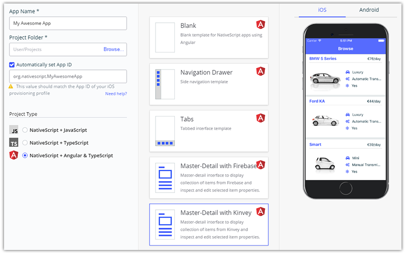
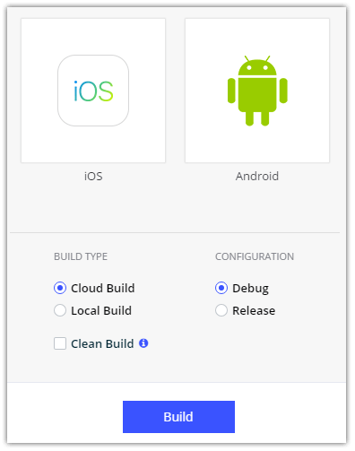
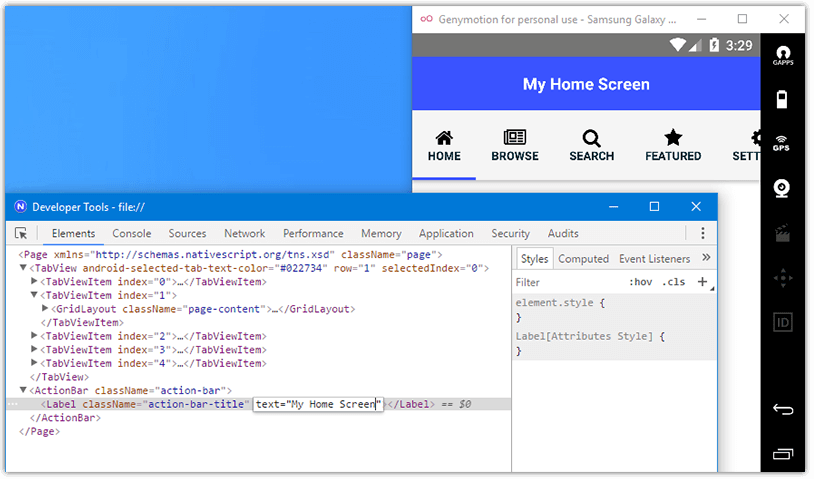
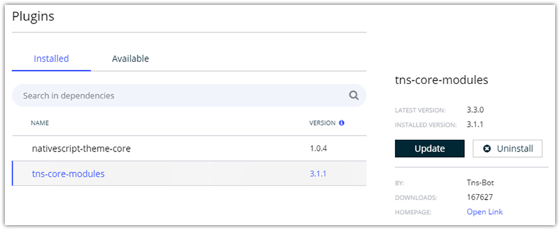
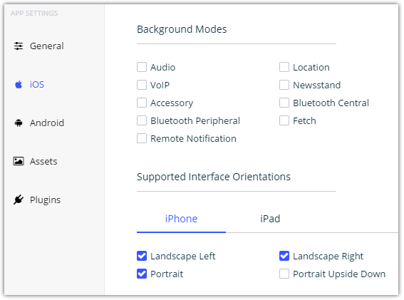

# Welcome to a Week of NativeScript Sidekick

As the popularity of NativeScript has grown, so have we seen a wide range of developers embrace it as their choice for cross-platform mobile app development. And with such breadth of developers comes an equally expansive range of comfort with command-line tooling. Many of us have grown to embrace CLIs as the most efficient way to integrate our diverse tooling options. Others are more used to visual tooling where we point and click our way to app utopia. Add to this mix developers on Windows who want to leverage tooling *only* available on macOS, and we find ourselves with a clear fit for a new product we call [NativeScript Sidekick](https://www.nativescript.org/nativescript-sidekick).

**This week the NativeScript blog is all about NativeScript Sidekick!** Let's kick it off with an intro to Sidekick and a preview of what we will be diving into this week.

## What is NativeScript Sidekick...Exactly?

NativeScript Sidekick is a desktop application that simplifies some of the more tedious aspects of mobile app scaffolding, development, and building. Sidekick is built on [Electron](https://electronjs.org/), giving us the best in desktop capabilities along with an ease of providing a cross-platform solution for Windows, macOS, and Linux.

Sidekick sits on top of the [NativeScript CLI](https://www.npmjs.com/package/nativescript), so many of the capabilities of the CLI are exposed through a gorgeous UI:

However, Sidekick doesn't preclude you from using the CLI! You can use Sidekick alongside the NativeScript CLI to use visual tooling when you want it, and command-line tooling when you need it.

Let's take a quick look at just some of the high value features of NativeScript Sidekick that we will be covering this week:

- [Starter Kits](#starter-kits)
- [Cloud Builds and iOS on Windows Features](#cloud-builds)
- [Debugging and LiveSync](#debugging-livesync)
- [Resource Management](#resource-management)

> Have you subscribed to [NativeScript News](https://www.nativescript.org/nativescript-newsletter) yet?

## Starter Kits

When building a new app, some of us like to start from scratch with a blank template. Others like some help with scaffolding out the basic UI and logic of our app. NativeScript Sidekick provides a set of easy-to-use "starter kits" for a variety of scenarios:

- Blank Template
- Side Drawer Navigation
- Tab Navigation
- Master/Detail (with [Firebase](https://firebase.google.com/) or [Kinvey](https://www.kinvey.com/) as your BaaS of choice)

Not only do we provide multiple starter kits, but each starter kit is also available in one of three flavors:

- JavaScript
- TypeScript
- Angular

## Cloud Builds and iOS on Windows Features

When it comes to native mobile app development, nothing can be much more annoying than configuring the myriad SDKs required to build an app for iOS and Android. Luckily for us, NativeScript Sidekick allows you to build an app in the cloud, with no configuration required on your end.

**Yes, that means Windows developers can generate builds for iOS without needing a Mac!** Plus, all of our iOS builds run on super fast Mac Pros, so unless you are running top-of-the-line Mac arrays in your home or office, there is a decent chance our cloud builds will actually be faster than your local builds (*depending on app size and network speed of course*)!

Windows developers can take advantage of iOS certificate and provisioning profile generation/management through Sidekick, and even submit apps to the app stores!

## Debugging and LiveSync

What's the next most annoying thing about mobile app development? Debugging! 🐛

Historically one of the huge trade-offs of moving from the web to native mobile was the lack of debugging tools. Not any more. With NativeScript Sidekick we provide a variety of capabilities to help improve your debugging experience across iOS and Android with:

**LiveSync** - Imagine being able to make changes to *any* part of your app, hit save, and have those changes appear almost instantly on any simulators or connected devices. That's LiveSync in a nutshell.

**Debugging** - Likewise, imagine tapping into the familiar debugging tools you've been using for years: the Chrome DevTools!

## Resource Management

"Resource" can mean just about anything, and Sidekick handles well, just about anything!

First, discovering and configuring NativeScript plugins has admittedly become much easier. With the [NativeScript Marketplace](https://market.nativescript.org/), finding the plugin right for the job is easier than ever before.

However, Sidekick also provides an interface for finding, installing, and updating plugins, making it awfully convenient to manage your plugins:

Next, managing app icons and splashscreens has always been a bit of an annoyance. Sidekick provides an easy to use UI for viewing what your current app icons are, and very soon, will provide the capability of creating both app icons and full splashscreens (for all platforms) from one source image!

What about app property pages? Manually messing with `AndroidManifest.xml` and `info.plist` can be a pain in the rear, so Sidekick makes it easier by providing a nice UI on top of these configuration options.

## Stay Tuned All Week!

This is the spot where I typically say, "it's just the beginning!". And well, that's true! All this week we will be providing more detailed posts on NativeScript Sidekick to make sure you're getting the most out of our fantastic tooling options.