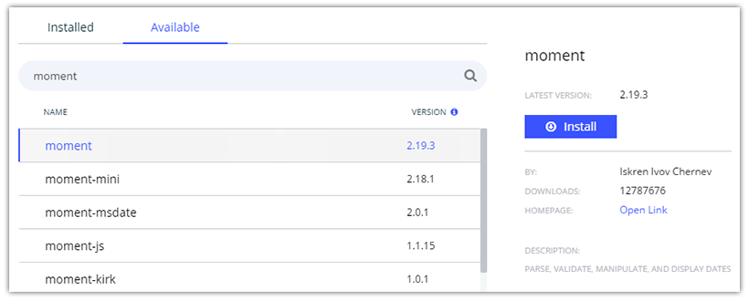
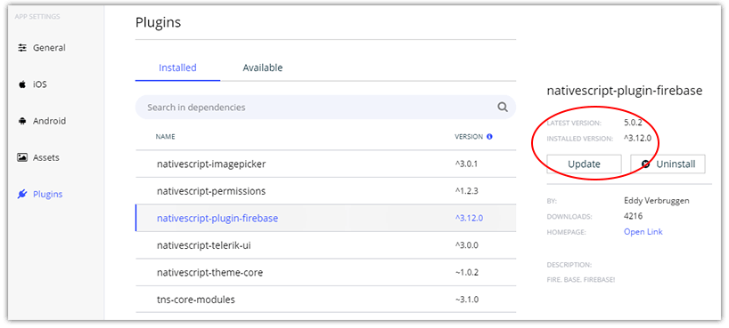
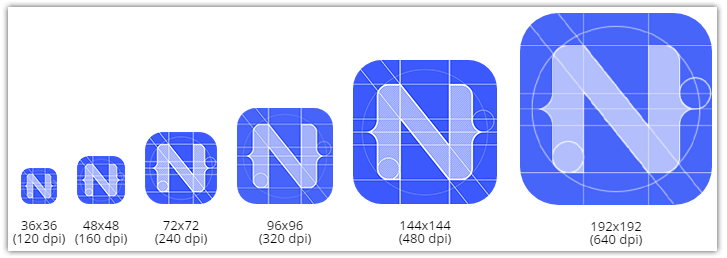
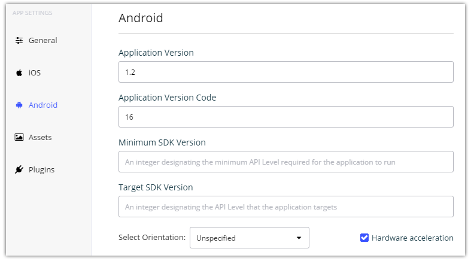

# Managing App Resources and Settings with NativeScript Sidekick

You made it through the week of [NativeScript Sidekick](https://www.nativescript.org/nativescript-sidekick)! All week we have been covering some of the most high-value features that help make your life easier developing cross-platform native mobile apps. The last post in this series is going to take a look at how Sidekick helps you to manage your app assets, resources, and settings.

Hopefully you've been following along all week. If not, no worries, as you can check back in on the other features we covered here:

- Intro to Sidekick
- Starter Kits
- Cloud Builds and iOS on Windows Features
- Debugging and LiveSync
- Resource and Settings Management (today!)

Gone are the days of manually editing your `AndroidManifest.xml` and `info.plist` files. Sidekick helps you to configure some of the most annoying and confusing options and settings for both Android and iOS.

## Plugin Discovery and Management 🔌

A few months back we released the [NativeScript Marketplace](https://market.nativescript.org/). Not only can you find any NativeScript plugin you need, but the Marketplace also introduced the concept of [verified plugins](https://github.com/NativeScript/marketplace-feedback/blob/master/docs/verified-plugins.md).

What does this have to do with NativeScript Sidekick? Well, for starters, Sidekick lets you easily discover new plugins for your app, with a friendly UI:

> Note that today Sidekick searches NPM directly, but will soon utilize the NativeScript Marketplace.

More importantly though, Sidekick will also let you know when an existing plugin needs to be updated. And the update is a click of a button:

## Icons and Splashscreens 🎨

One of the more annoying parts of mobile app development, creating, updating, and managing your app icons and splashscreens is a huge pain. Today Sidekick provides a clean interface for viewing all of your app icons and splashscreens created for your app.

However, in the future we plan on introducing a feature to Sidekick to actually *create* app icons and splashscreens for you, from one source image!

> In the meantime, you may want to check out the [NativeScript Image Builder](http://nsimage.brosteins.com/)

## App Settings 📋

Don't let manually editing your `info.plist` in Xcode get you down! NativeScript Sidekick obfuscates all of the cruft away so you can focus on the OS-specific settings you care about.

The pleasing UI provided on top of both iOS- and Android-specific settings makes it a matter of a few clicks to set:

- Android and iOS permissions;
- Supported screen orientations;
- Background modes (iOS);
- Build versions/targets and more!

## Thank You! ❤️

Thanks for reading up on the *Week of NativeScript Sidekick*! Hopefully you find [NativeScript Sidekick](https://www.nativescript.org/nativescript-sidekick) to be a useful component of your NativeScript development workflow. If you have any comments or suggestions, please sound off in our [Github issues page](https://github.com/NativeScript/sidekick-feedback/issues).
