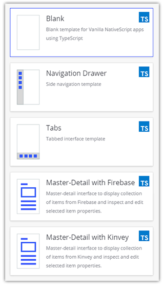
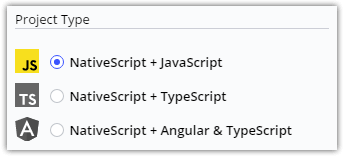
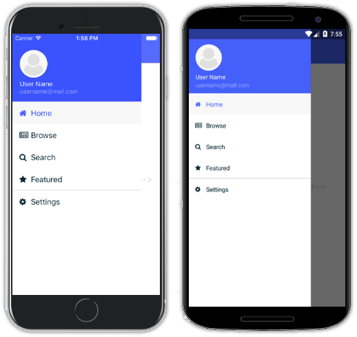
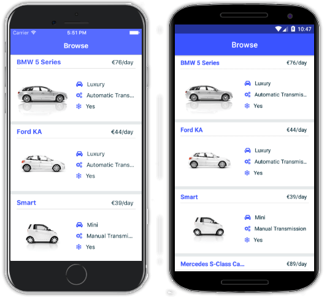

# Bootstrap Your Next App with NativeScript Sidekick Starter Kits

[NativeScript Sidekick](https://www.nativescript.org/nativescript-sidekick) is all about making your life developing cross-platform, native mobile apps even easier. And what better way to simplify app development than to provide easy-to-use (and nice looking) starter kits for you to bootstrap your app development process?

This post is part of our "Week of NativeScript Sidekick" that goes into the how-to of each major Sidekick feature. We are starting the week off with the starter kits of course!

- Intro to Sidekick
- Starter Kits (today!)
- Cloud Builds and iOS on Windows Features (coming Wednesday)
- Debugging and LiveSync (coming Thursday)
- Resource and Settings Management (coming Friday)

Whether you like to start with a blank slate, or with a fully functional master/detail app, Sidekick has some nice options to get you started. Let's dig in!

## Types of Starter Kits

When building a new app, many of us like some help scaffolding out the basic UI and logic of our app. NativeScript Sidekick provides a set of "starter kits" for a variety of scenarios:

- Blank Template
- Side Drawer Navigation
- Tab Navigation
- Master/Detail (with [Firebase](https://firebase.google.com/) or [Kinvey](https://www.kinvey.com/) as your BaaS of choice)

## JavaScript, TypeScript, Angular, Oh My!

Did we mention that each starter kit has an option for choosing a language/framework as well? Whether you are a JavaScript purist, lover of TypeScript, and/or an Angular developer, you'll be at home with the options provided by Sidekick:

## Blank Template

The "blank template" is just that. Blank! It effectively provides an empty canvas for you to start developing a NativeScript app. I'd put a picture in here, but that would be a blank screen ¯\_(ツ)_/¯.

However, you should know that if you use the blank template, we aren't leaving you stranded. There is some basic boilerplate code in there to make sure you get started on the right foot. Of course, your code-behind JavaScript will look different depending on the language you chose.

In the blank template, your `home.xml` file contains the markup for the first view of your page, and simply has an `ActionBar` and a placeholder for a `GridLayout`:

	<Page class="page" navigatingTo="onNavigatingTo" xmlns="http://www.nativescript.org/tns.xsd">
	    <!--Add your page content here-->
	    <ActionBar class="action-bar">
	        <Label class="action-bar-title" text="Home"></Label>
	    </ActionBar>
	    <GridLayout>
	    </GridLayout>
	</Page>

> Note the `class` names specified, these come from the default [NativeScript core theme](https://docs.nativescript.org/ui/theme)!

## Navigation Templates

Navigation is critical to any modern mobile app, so Sidekick provides two navigation-focused templates: one that uses the SideDrawer component from [NativeScript UI](https://www.nativescript.org/ui-for-nativescript) and the other that uses Tabs for navigation.

**Let's take a quick look at the drawer navigation template:**

Drawer-based navigation gives us a clean and easy way to utilize a hidden menu of navigation options. One potential gotcha of using a common template for navigation though, is re-use across multiple views. This is where NativeScript's [custom components](https://docs.nativescript.org/ui/basics#custom-components) come into play.

With custom components you can create a single component that is easily re-used across multiple views. Navigation is an obvious candidate. If you open up any of the *.xml views within this template, you'll see the following code snippet:

    <nsDrawer:RadSideDrawer.drawerContent>
        <StackLayout>
            <myDrawer:MyDrawer selectedPage="Browse"/>
        </StackLayout>
    </nsDrawer:RadSideDrawer.drawerContent>

The `<myDrawer:MyDrawer ... />` element is the shared component that is defined in `/shared/my-drawer`. This component holds the contents of the app drawer.

**Next, let's take a peek at the tab navigation template:**

Utilizing tab-based navigation in NativeScript is a little different than side drawers. A `TabView` is a component that *includes* other views within it. So if you were to open up the generated `tabs-page.xml` file, you would see something like this:

	<TabView selectedIndexChanged="onSelectedIndexChanged">
	  <TabView.items>
	    
		<TabViewItem title="Home" ios:iconSource="res://tabIcons/home">
	      <TabViewItem.view>
	        <home:HomeView/>
	      </TabViewItem.view>
	    </TabViewItem>
	
	    <TabViewItem title="Browse" ios:iconSource="res://tabIcons/browse">
	      <TabViewItem.view>
	         <browse:BrowseView/>
	      </TabViewItem.view>
	    </TabViewItem>
	
	    <TabViewItem title="Search" ios:iconSource="res://tabIcons/search">
	      <TabViewItem.view>
	         <search:SearchView/>
	      </TabViewItem.view>
	    </TabViewItem>
	
	  </TabView.items>
	</TabView>

...where "Home", "Browse", and "Search" are referenced again as [custom components](https://docs.nativescript.org/ui/basics#custom-components) within the `TabView`.

## Master/Detail Templates

Finally, there are two master/detail templates that showcase the capabilities of using NativeScript with popular BaaS providers, [Firebase](https://firebase.google.com/) and [Kinvey](https://www.kinvey.com/).

The master detail template is a great way to bootstrap many common business scenarios, where you are exposing a parent/child relationship between data entities. And while this template is very "car" focused, it's quite easy to substitute in your own variables and content.

One of the many Kinvey features demonstrated in this app template is the ability to easily upload files to your backend:

    return Kinvey.Files.upload(imageFile, metadata, { timeout: 2147483647 })
        .then((uploadedFile) => {
            const query = new Kinvey.Query();
            query.equalTo("_id", uploadedFile._id);

            return Kinvey.Files.find(query);
        })
        .then((files) => {
            if (files && files.length) {
                const file = files[0];
                file.url = file._downloadURL;

                return file;
            }
            else {
                Promise.reject(new Error("No items with the given ID could be found."));
            }
        });

## What's Next for Starter Kits?

While we are always working to improve on our existing set of starter kits, we are also looking to add and expand on our offerings. We are considering many options, such as community-generated starter kits and templates that focus on the Vue framework. Stay tuned!

P.S. Have you subscribed to [NativeScript News](https://www.nativescript.org/nativescript-newsletter) yet?