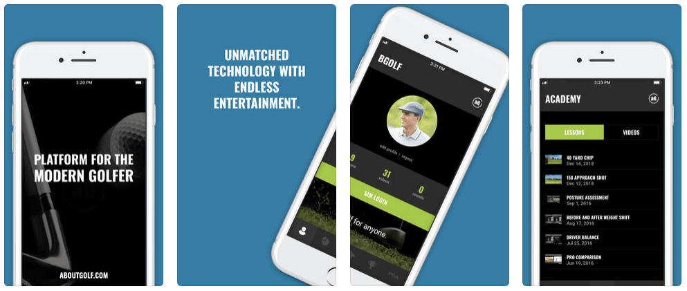

# NativeScript Success Story: aG Locker

[aboutGolf](https://www.aboutgolf.com/) is a premier provider of indoor simulator technology and the **official golf simulator of the PGA Tour**. Golfers around the globe enjoy the most accurate indoor golfing experience with proven 3Trak technology for accurate measurements of ball and club data.

> Download ag Locker on [Google Play](https://play.google.com/store/apps/details?id=com.aboutgolf.aglocker&hl=en_US) and the [iOS App Store](https://itunes.apple.com/us/app/ag-locker/id1446905085?mt=8)

*What follows is a Q&A between the NativeScript team and the developers of the "ag Locker" app.*

**Can you please describe the ag Locker app for the NativeScript community?**

aG Locker was created to be a digital locker for your rounds and lessons from using aboutGolf Golf Simulators. It is a gateway to aG Golf Simulators and a visual representation of all your sessions. Through the app you can visit any aG Sim around the world and login via your digital club card with QR code. Once you are logged in, you can play a round of golf on the sim or take a lesson knowing you can access your data anywhere. Whether you are on the course or at your house, you can see past rounds, scorecards, lessons and swings with instructor notes and video and all competitions you have played with a live leaderboard.

**Who uses the ag Locker? And what do they like most about it?**

As of now, anyone who has played on an aG Simulator can use the app and see their data. The response so far has been great. For a lot of players, the concern was once they took a lesson or played a round on their favorite course on the sims, the information was tied to the sim. Now they can view a round while sitting at the club house, see all the their club average distances while out on the course and more. The data is no longer tethered. Plus when they return to a sim, they don’t have to sign in, simply scan their digital club card from the app and it logs you in, pulling up your information and past sessions. 

**How did NativeScript help you develop the app?**

NativeScript really was the key to the project. I have tried several other frameworks and native languages to find something that marries my talents with a cross-platform option that doesn’t sacrifice performance. NativeScript was the answer. It is unmatched in performance and learning curve in my opinion. 

**What was your development experience like with NativeScript?**

Not to sound too cheesy, but it was amazing! I will put it this way: I went from not doing any NativeScript to launching an app to the app stores within two months (started Nov 2018 and launched in Jan 2019). This app by no means was a simple little list app, there were a lot of custom Vue.js components made, views, detail, and visual aspects that would have been impossible to do within that timeframe without this product and learning curve. Along every step of the way there was also a great community that pitched in to help with common “Got ya’s” I had or new bugs found along the way. There are very few frameworks that could have made this happen in that time frame without a load of stress, if any. 

**Which mobile technologies did you use before NativeScript? Why did you switch?**

Before I landed on NativeScript, I used Swift to create a few apps. Coming from a web background I found I wanted to stick with languages that I use more on a daily basis, plus use a shared code base. I then moved on to Ionic. I used that to just make some test apps to get a grips on what it was. From the start I knew I would not stick with it mostly because the performance seemed sluggish and I wanted a true cross platform app. Not to mention I felt the community was lacking. When I first saw NativeScript I knew it was the right fit. I was a little concerned about using TypeScript since it was not something I have tackled before but literally within a few weeks of finding it, Vue started to get some love. At that point I knew it was a perfect fit (my current web stack is all Vue for front end). 

**What could NativeScript do better?**

To be honest I can’t think of much off hand. You guys constantly have updated posts on new features, a great product, a great community and all around friendly atmosphere. If anything, I would recommend some more tutorial videos (intro, beginner, intermediate, advanced) just to help people learn on either how to get going or spark some creativity on features they didn’t know about. I, like most I assume, benefit from visual learning. 

**What is your favorite part about NativeScript?**

To be honest, my favorite part about NativeScript is the community. Not to say the framework, documentation, and code base were not all huge parts of choosing this product, but how active and friendly the community was made it a lot better than others I demoed. Between Slack, GitHub, and Forums there were few spots I could not only get help, but got it in a timely manner like I was talking to a friend. I feel there are few frameworks I have used where I can ask something and have so many people the actually help create the product reach out to me.  