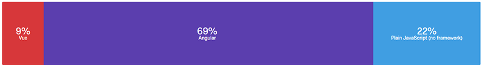
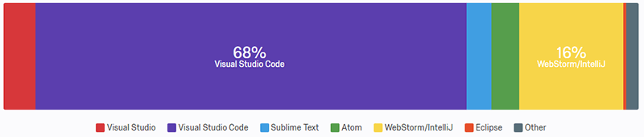
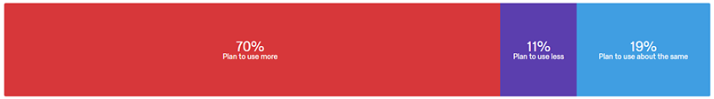
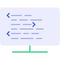
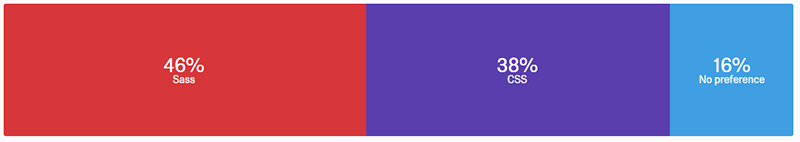
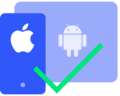

# NativeScript Community Survey Results - Winter 2017

In December of 2017, the NativeScript team released a survey to take the pulse of our community. *What are we doing right? What are we doing wrong?* **Where do you want to see NativeScript go in 2018?**

We've finished compiling the results and, while there were a few surprises, thankfully much of the data aligns with what we've witnessed over the past year in the mobile development space. Continue on for a closer look at some of the key insights we gleaned from this survey.

## tl;dr

More developers are using NativeScript than ever before, with a [350%](https://npm-stat.com/charts.html?package=nativescript&from=2016-12-01&to=2017-12-31) year-over-year increase in downloads from npm.

In the survey we saw very positive 📈 trends in usage beyond the first few months, along with a more than **60% increase in our NPS** ([net promoter score](https://en.wikipedia.org/wiki/Net_Promoter)) from May to December. We must be doing something right!

**Angular is more popular than ever**, with almost 70% of you stating it as your preferred way of developing with NativeScript.

But let's take a more detailed look at the results, shall we?

## But First: Prize Winners! 🎁

We gave out $100 gift cards to five lucky respondents to the survey. All of these folks have already been contacted, so if you think it's your name on the list, unfortunately it probably isn't 😉. Better luck next time though (and thanks for filling out the survey!).

- Todd F.
- Michael O.
- Tomas B.
- Ben M.
- Rob B.

## Getting Started with NativeScript

When looking at [getting started with NativeScript](https://docs.nativescript.org/), **59% of you started with the getting started tutorials** (as you should 😎) while 30% jumped right into the CLI. We saw an inverse correlation between *where* users started versus their *satisfaction* with the getting started experience (i.e. those who jumped into the CLI without some introduction weren't as happy 😩). This is a good example of feedback that we can use to improve the getting started experience for certain audiences.

When looking at pain points most often experienced with NativeScript, the top hit was **installing native dependencies** 😨. This is no surprise, as managing and configuring Xcode, Android Studio, and iOS/Android emulators is still a drag (but much easier with [NativeScript Sidekick](https://www.nativescript.org/nativescript-sidekick)).

## Frameworks, Languages, IDEs, oh my!

While [Angular has been a first class citizen](https://www.nativescript.org/nativescript-is-how-you-build-native-mobile-apps-with-angular) in the NativeScript ecosystem almost since day one (more on this in the next section), make no mistake that NativeScript allows for other frameworks and languages to be utilized.

Examining what people are using today: **69% of our audience prefers Angular, 22% plain JavaScript, and 9% Vue**.

This will get more interesting as our [community-backed Vue integration](https://nativescript-vue.org/#/) moves towards v1.0, as evidenced by Vue ending up in a tie with plain JavaScript when we asked what your *preferred* framework would be (React finished 4th in this question).

TypeScript usage remains quite popular, with **77% of you preferring TypeScript** over traditional JavaScript.

We have a "winner" in the IDE/text editor battle of 2017 as well, with [Visual Studio Code](https://www.nativescript.org/nativescript-for-visual-studio-code) coming out as the clear preference. Usage increased 8% since our last survey in May 2017, with almost **70% of our users preferring VS Code** over the next nearest competitor, [WebStorm/IntelliJ](https://plugins.jetbrains.com/plugin/8588-nativescript):

The Mac vs Windows vs Linux debate has yet to be settled, as our respondents are split with **45% on Mac, 40% on Windows, and 14% on Linux** (which *almost* equals 100% 😀).

Also, following most industry trends, a narrow majority of you are publishing to Google Play over the App Store, but a significant percentage (30%) are also publishing apps internally.

## Angular

Our [integration with Angular](https://www.nativescript.org/nativescript-is-how-you-build-native-mobile-apps-with-angular) remains as popular as ever, with almost **70% either actively using Angular or planning on using it**. Plus, almost 90% of these folks plan on using Angular more or the same as they do today:

When asking about what we could do to improve our Angular integration, the majority of you asked for a *common project structure between Angular web and NativeScript projects*. Which dovetails nicely into our next set of questions on web and mobile code sharing with Angular!

> Coming up on January 24th, 2018 we have a free online webinar on [Web/Mobile Code Sharing with Angular](https://attendee.gotowebinar.com/register/7713138227852952835?source=Blog+Announcement)

In a dramatic change from our last survey in May, almost **20% MORE of you stated you would be interested in sharing code** between your Angular web app and NativeScript apps. A narrow majority of these folks also stated interest in developing both web and mobile simultaneously, instead of creating a web or mobile app first.

## Roadmap Input

Creating a [roadmap](https://www.nativescript.org/roadmap) for an open source project such as NativeScript means nothing without community input. And "NativeScript" means a lot more than just the framework itself, as we also have the [CLI](https://www.npmjs.com/package/nativescript), [Playground](https://play.nativescript.org/), [Sidekick](https://www.nativescript.org/nativescript-sidekick), and [Marketplace](https://market.nativescript.org/) to manage! Let's take a quick look at some of the most-requested new features for each:

### NativeScript Framework

- Runtime performance improvements (it's always better to be 🚀);
- Add more components to [NativeScript UI](https://www.nativescript.org/ui-for-nativescript) (with our history at Telerik, we should always strive to be #1 in UI 🎨);
- Improved documentation, samples, and guides (this is a never-ending battle ⚔ that we are actively working on).

### NativeScript Playground

- Support usage of any plugin (easily the most popular request 🔌);
- Provide a library of runnable samples (who wouldn't want to copy-and-paste from a library 📚).

### NativeScript Sidekick

- Auto-generate app icons and splashscreens (it's a tedious process for sure 🖼);
- Auto-generate iOS certificates and provisioning profiles (it's much better today, but there is always room for improvement 🔐).

### NativeScript Marketplace

- Sample app repository (like with the Playground, we all love to copy-and-paste working code 🛠);
- Downloadable app themes (again, like with the core framework, we all want to make our apps look and feel gorgeous 😘).

**Needless to say, many of these items are already on their respective roadmaps for 2018!**

## OSS Contributions

NativeScript wouldn't be around today if it weren't for the contributions and issues we receive on [Github](https://github.com/nativescript). However, we've found that only about 18% of you have actively contributed to NativeScript. This isn't surprising, because the vast majority of you who haven't contributed to the open source project cite *lack of knowledge* (not true!) and *lack of time* (could be true...) as your top reasons.

While many of us suffer from the [impostor syndrome](https://en.wikipedia.org/wiki/Impostor_syndrome), we all know enough to contribute just a bit to NativeScript. Even if it's fixing a grammar issue in the docs, [contributions](https://www.nativescript.org/contribute) are ALWAYS welcome 🤗.

## UI/UX and App Styling

Gone are the days when providing a basic forms-over-data app to your audience was good enough. Today's app consumers demand more from the user experience.

It was a bit surprising, then, to see that **only about 1/3 of you are aware of (and regularly using) the [NativeScript core theme](https://docs.nativescript.org/ui/theme)**. Another 1/3 were just aware of it, and the final group not aware at all 😭. This is a travesty as the core theme builds on the native iOS and Android styles to provide a clean, consistent UI across all platforms. We can do better here!

Speaking of the core theme, those of you who *do* use it are most interested in seeing us *improve the existing styles* and *provide a better out-of-the-box experience* (along with making sure the cross-platform UI story is locked down).

The Sass vs CSS battle is one that is still waging on after all these years, with **46% of you preferring Sass, 38% CSS, and the rest couldn't care less** 😀:

## How Does {N} Measure Up?

When we look at NativeScript in the community, we also want to get your opinion of how we compare to some of our biggest competitors. When looking at one of the most obvious competitors, 30% of you are evaluating React Native as an alternative.

Make no mistake, we want your business, but the fact is that when you kick the tires of both NativeScript and React Native, you're helping to improve both frameworks as we both race to provide the best possible developer experience!

Hybrid (i.e. PhoneGap/Cordova) development continues to take a hit among our community, with **5% fewer developers creating hybrid apps** over the last six months and **only 16% thinking that hybrid development is improving**. Additionally, only 14% of you who have published a hybrid app would definitely build another in the future (citing *performance* and *better alternatives* as your two most-cited reasons).

## Thanks to Our Community

THANK YOU for taking the time to fill out the survey as you've helped positively impact our roadmap for 2018. This survey not only helped us to identify developer pain points, but also helped guide us to provide a more engaging and positive developer experience, all the way from getting started to releasing your apps on the app stores.