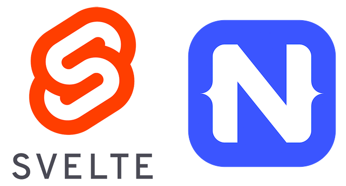

# An Interview with Svelte Native Creator David Pershouse

[Svelte Native](https://svelte-native.technology/) is a community-led integration that extends NativeScript into the popular new framework known as [Svelte](https://svelte.dev/). These are exciting times for NativeScript, as today the core team directly supports Angular and Vue.js, with the community offering early support for React and Svelte.

> Curious about Svelte? Svelte was created by Rich Harris Svelte to build *fast* apps. Read more about Svelte and Svelte Native in [this intro blog post by Rob Lauer](https://www.nativescript.org/blog/quick-intro-to-using-svelte-to-create-a-native-mobile-app).

*What follows is a brief interview with Svelte Native creator, David Pershouse:*

### What is your technical background?

Always been a fan of programming after learning on the Commodore 64. I enjoy all types of programming. I have built games, databases, windows line of business applications.

For the last ten or so years I have moved into web and mobile development, mainly C# and whatever flavour of the day front-end Javascript framework is doing the rounds (angular, backbone, prototype, jquery, ractive, riot, react, extjs).

### What initially drew you to the Svelte framework?

I was a late comer to Svelte, getting interested in it only when 3.0.0 was in the works. I had used Rich Harris's [RactiveJS](https://ractive.js.org/) for a couple of large customer projects and enjoyed the experience, so I knew that Svelte would be well designed, especially v3. The major version bump would allow those rough edges to be removed that require breaking changes.

I had recently used React/Preact and wanted something that had a smoother developer experience, looking at Vue reminded me very much of Ractivejs and prompted me to look at what Rich was up to. Svelte 3 with its compiler approach and unique handling of reactivity seemed like a step into the next generation of frameworks, so I hopped on board.

### What inspired you to start a new community initiative with NativeScript and Svelte? Why not Cordova or another WebView-based option?

I had recently released a mobile game written in preact and PhoneGap/Capacitor and was looking for a "native" mobile framework that would be as easy to deploy to multiple platforms as the PhoneGap solution, but with native speed/features. I wanted the ease and reactivity of modern JS frontend development, but with the cross platform native capability of something like Xamarin/Xamarin Forms. I tried React Native and Flutter before stumbling upon [Nativescript-Vue](https://nativescript-vue.org/), and through that I was introduced to Nativescript.  

Having used Xamarin for previous projects, I am aware how powerful it is to have the full mobile SDK available to your application framework and language runtime. **NativeScript manages to achieve the same goal as Xamarin, but for Javascript/Typescript instead of .Net.** The fact that it is open source, and maintained/developed by a company (Progress) already highly regarded in the .Net ecosystem, ticked some more boxes for me.

Having found Nativescript-Vue, I wanted a similar environment but for Svelte 3. It would also be a good project to teach myself NativeScript and Svelte.

### What’s special about Svelte Native?

The nice things about Svelte Native are the nice things about Svelte. Svelte Native doesn't require a special build of the Svelte compiler. It is a small DOM abstraction that the compiled svelte components interface with, and is **based on the DOM code found in Nativescript-Vue**.  Interestingly, due to Svelte's compiler nature, in the future we could remove the dependency on the DOM abstraction by writing a custom compile target for svelte that would emit Nativescript-core code directly. 

Svelte Native also provides an implementation of Svelte's awesome transition/intro outro system backed by NativeScript's native transition infrastructure (where possible).

### How does the core Svelte team feel about this initiative?

They are definitely supportive. There was mentioned a possible future move to under the svelte namespace and domain for the project site and source. Rich Harris helped out with with the REPL and allowed me to pinch the Svelte site design, and has been quick to fix any svelte bugs/behaviours that impacted svelte-native. They also setup a #nativedev channel on the [official Svelte discord server](https://discordapp.com/invite/yy75DKs).

### What are your near- and long-term plans with Svelte Native?

Near term is to get compatibility with the [professional NativeScript UI components](https://www.nativescript.org/ui-for-nativescript) and the new Tab feature of NativeScript 6.0. I would also like to enable HMR support in the default svelte native template.

Medium term is a showcase/examples page to show off apps people have made, and encourage more development.

Long term is to maintain the library to keep it supporting the latest NativeScript and Svelte versions.

### What can others in the community do to help?

[Take it for a spin](https://svelte-native.technology/tutorial) and report back any problems. Once you have written a mobile app in svelte, it is hard to go back to any other way of doing it. The code and documentation are all open source and [available on Github](https://github.com/halfnelson/svelte-native). Pull requests and/or issues are most welcome, or jump onto [#nativedev on the Svelte discord](https://discordapp.com/invite/yy75DKs) if you need a hand.
