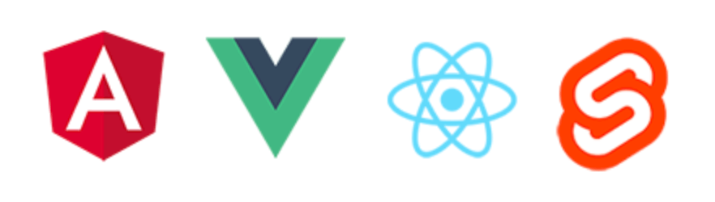
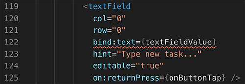

# Quick Intro to Using Svelte to Create a Native Mobile App

"Just what the world needs, *another* JavaScript framework..."

-- every frontend developer ever.

This being said, when the up-and-coming framework [Svelte](https://svelte.dev/) hit v3 a few months ago, the world did actually take notice:

<blockquote class="twitter-tweet">
I didn&#39;t mean for this to come out today, but the cat it out of the bag, so...  🚨🚨🚨 SVELTE 3 IS HERE 🚨🚨🚨<a href="https://t.co/2Z2tFhZn8U">https://t.co/2Z2tFhZn8U</a>
&mdash; Rich Harris (@Rich_Harris) <a href="https://twitter.com/Rich_Harris/status/1120342713843507201?ref_src=twsrc%5Etfw">April 22, 2019</a></blockquote> 

So what exactly is this Svelte thing - and why would someone want to use Svelte when frameworks like React, Angular, and Vue.js exist already? And why use Svelte to create *native* mobile apps?

Valid questions, all of them. So let's start with the easy one:

## What is Svelte?

Putting it simply, Svelte is a tool for building *fast* apps.

Svelte is similar to other JavaScript frameworks like React, Vue.js, and to a certain extent Angular. It's a "component framework" like these, but Svelte has one key difference: Svelte actually converts your app into "ideal JavaScript" at build time, rather than interpreting your code at runtime.

This leads to significant gains in terms of first app load, and eliminates the performance hit sometimes seen with the overhead of framework abstractions.

[Rich Harris](https://twitter.com/Rich_Harris), creator of Svelte, describes it far better than I ever could:

> Traditional frameworks allow you to write declarative state-driven code, but there's a penalty: the browser must do extra work to convert those declarative structures into DOM operations, using techniques like  that eat into your frame budget and tax the garbage collector.

With this methodology, Svelte provides blazing performance on the web (and on native mobile as we will see later on).

Personally, I find JavaScript written with Svelte to be amazingly terse. As Rich Harris also once stated:

> "the best API is no API at all"

So whereas with React you may write some code like:

	const { count } = this.state;
	this.setState({
	  count: count + 1
	});
	
...Svelte can condense this down to:

	count += 1;
	
**How?** Since Svelte compiles your JavaScript, it can supplement what you have written, behind the scenes, into something like this:

	count += 1; $$invalidate('count', count);
	
If you're curious about using Svelte on a web app, be sure to try out the [fantastic tutorial provided](https://svelte.dev/tutorial/basics) on the Svelte website.
	
## The NativeScript Advantage

With at least a rough idea of what Svelte is and the advantages it can provide, let's move the conversation to native mobile.

Web apps written with Svelte are blazing fast. While you could certainly use a technology like Apache Cordova to create a mobile app, you're likely better off using a *JavaScript-Native* framework like [NativeScript](https://www.nativescript.org/).

**Why NativeScript?** Many of you already know this, but NativeScript is like React Native, but for "the rest of us" who don't use React.

> It's a good time to point out that you *can* actually use NativeScript with React - it's another community project known as [React NativeScript](https://github.com/shirakaba/react-nativescript)

NativeScript uses JavaScript to power native UI. No WebViews involved, just native UI and native performance out of the box.

NativeScript also ships with support for both [Angular](https://www.nativescript.org/nativescript-is-how-you-build-native-mobile-apps-with-angular) and [Vue.js](https://www.nativescript.org/vue).

Herein lies a key advantage of NativeScript: the extensibility is unmatched. You can access literally any native device API, at any time, without restriction. NativeScript additionally provides [0-day support](https://www.nativescript.org/native-api-access) for all newly-released device APIs.

All of this inspired David Pershouse to use NativeScript as the core of his project, [Svelte Native](https://svelte-native.technology/).

## Svelte Native

Svelte Native allows you to take the existing Svelte framework and build truly native mobile apps for both iOS and Android, from one shared codebase. David provided some background information that I found incredibly helpful (and which we will be sharing in an upcoming blog post!):

*Svelte Native doesn't require a special build of the Svelte compiler. It is a small DOM abstraction that the compiled svelte components interface with, and is based on the DOM code found in Nativescript-Vue.*

*Interestingly, due to Svelte's compiler nature, in the future we could remove the dependency on the DOM abstraction by writing a custom compile target for svelte that would emit Nativescript-core code directly.*

*Svelte Native also provides an implementation of Svelte's awesome transition/intro outro system backed by NativeScript's native transition infrastructure (where possible).*

## Svelte Native Gotchas

Let's be clear: Svelte Native is very new. While it has some major advantages over other NativeScript extensions in that it is a very thin layer over the core framework (making future upgrades, updates, and modifications far easier). That doesn't mean it's 100% ready for prime time (yet).

In my experimentation with Svelte Native, I ran into a few gotchas right away that you may want to be aware of:

### Quirks with VS Code

[Visual Studio Code](https://code.visualstudio.com/) is, like for many of you, my go-to editor. And of course as a noob Svelte developer, I installed the [Svelte for VS Code](https://marketplace.visualstudio.com/items?itemName=JamesBirtles.svelte-vscode) extension. However, when creating a Svelte Native app, my `App.svelte` file displayed a warning in my editor:

Hmmm 🤔.

It turns out this is a known issue with Svelte and VS Code. Since the Svelte extension for VS Code can't handle pre-processing (yet), you'll get this warning. It's annoying, but you can safely ignore it and hopefully will be resolved soon.

### Camel Case Elements?

Traditional NativeScript developers are used to composing their UI layer in a consistent manner using Pascal case:

	<StackLayout>
		<Label text="Hello!"></Label>
	</StackLayout>
	
However, Svelte Native uses Camel case to let the Svelte compiler know that these are NativeScript views/elements and not Svelte components.

	<stackLayout>
		<label text="Hello!"></label>
	</stackLayout>

It'll take some getting used to! 😉

### Compatibility with "Pro" NativeScript UI

As of this writing, Svelte Native is not fully compatible with the ["Pro" NativeScript UI components](https://www.nativescript.org/ui-for-nativescript). This has already been identified as a top priority of the project though.

## Try Svelte Native Today

Interested in trying Svelte Native for yourself? Or maybe you've already bought in and want to contribute!?!

**Here are some next steps:**

1. Give the [Svelte tutorial](https://svelte.dev/tutorial/basics) (for the web) a try. It'll help you grok Svelte in general before you start looking at Svelte Native.
2. Try the (brief) [Svelte Native tutorial](https://svelte-native.technology/tutorial) to make your own "todo" app with NativeScript and Svelte.
3. Contribute to the [Svelte Native repo on GitHub](https://github.com/halfnelson/svelte-native). Help answer issues, improve the docs, and make Svelte an even more welcome member of the NativeScript community ❤️.

> Also, be sure to connect with like-minded developers on the `#nativedev` channel of the [official Svelte discord server](https://discordapp.com/invite/yy75DKs)!

Personally, this is just the very beginning of my own journey with Svelte Native, so stay tuned to the NativeScript blog as I learn more, document more, and make a fool of myself (even moreso than usual). 😅