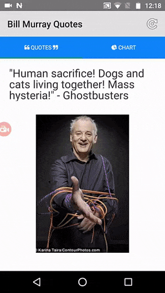

## Creating Your First NativeScript App with Visual Studio

Recently on the [Telerik Developer Network](http://developer.telerik.com/) (TDN), we published a series titled ["Creating Your First Native Mobile App with Visual Studio"](http://developer.telerik.com/products/nativescript/creating-your-first-native-mobile-app-with-visual-studio-part-1/). This is a great introductory tutorial for those of you on Windows who use Visual Studio as your primary IDE.

By leveraging Visual Studio, you can take advantage of the integration with [Telerik AppBuilder](http://www.telerik.com/platform/appbuilder) to handle app builds in the cloud (meaning no Mac needed to develop for iOS), utilize on-device debugging features, and quickly view your app on a device with the provided Companion Apps.

By following along in this series, you will develop every part of a cross-platform NativeScript app from scratch (with a sweet Bill Murray theme!), using typical Microsoft technologies like:

- [Visual Studio](https://www.visualstudio.com/) (of course)
- [TypeScript](http://www.typescriptlang.org/)
- [SQL Server](https://www.microsoft.com/en-us/sql-server/sql-server-2016)
- [ASP.NET Web API](https://www.asp.net/web-api)

The end result of the series will provide you with an app that features the following common app capabilities:

- Tab-based navigation;
- Custom UI layouts;
- Remote data access (with SQL Server and ASP.NET Web API);
- Theming with CSS;
- Charting with [UI for NativeScript](http://www.telerik.com/nativescript-ui);
- Custom font icons, images, and animations.

*Resulting in the following Bill Murray app:*

 

## Visual Studio Tutorial Part 1

The first part is an introduction to NativeScript and how a typical .NET developer can find comfort in the use of a XAML-like syntax for markup, TypeScript for code behind, and CSS for styling. We also dig into LiveSync and how it can dramatically improve your iterative development with NativeScript.

**[Read part one here.](http://developer.telerik.com/products/nativescript/creating-your-first-native-mobile-app-with-visual-studio-part-1/)**

## Visual Studio Tutorial Part 2

The second part of this series looks at NativeScript layouts and native UI. We also utilize the NativeScript Developer App (part of Telerik AppBuilder) which allows for easy provision-free deployment to physical devices. Finally, we take a close look at how you can leverage the Visual Studio debugger to do step-through debugging of NativeScript apps.

**[Read part two here.](http://developer.telerik.com/products/nativescript/creating-your-first-native-mobile-app-with-visual-studio-part-2/)**

## Visual Studio Tutorial Part 3

Part three ignores NativeScript for a bit and focuses on creating a fully-functional backend with SQL Server and a RESTful service with ASP.NET Web API.

**[Read part three here.](http://developer.telerik.com/products/nativescript/creating-your-first-native-mobile-app-with-visual-studio-part-3/)**

## Visual Studio Tutorial Part 4

The final part of this series wires up the ASP.NET Web API backend with our NativeScript app, looks at how to perform native animations, styles the app with CSS, and implements a pie chart with [UI for NativeScript](http://www.telerik.com/nativescript-ui).

**[Read part four here.](http://developer.telerik.com/products/nativescript/creating-your-first-native-mobile-app-with-visual-studio-part-4/)**

## Additional Resources

Those of you on Windows and/or with a .NET background may find the following resources helpful as well:

- [NativeScript for the .NET Developer](http://developer.telerik.com/featured/nativescript-for-the-net-developer/)
- [Installing NativeScript on Windows](https://www.nativescript.org/blog/installing-nativescript-on-windows)
- [Getting Started with NativeScript](http://docs.nativescript.org/)