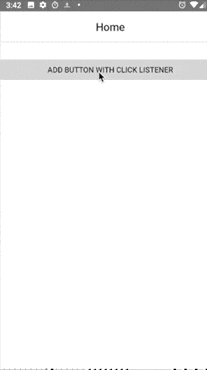

# markingMode:none is Official - Boost Android Performance while Avoiding Memory Issues

## The Current State

As we know it today, in terms of memory management, NativeScript has been using a special routine in its Android runtime: `MarkReachableObjects`. Its main purpose is to make sure no Java objects are collected by the garbage collector as long as they are needed by their JavaScript representations (in V8), and vice versa. However, while this mechanism ensures stability, it comes at a price - in some cases the time for a V8 GC pass can get as high as a second, which leads to blocking the UI thread and hurint the overall performance of the app.

## Some History

### Introducing markingMode: none

Starting with [NativeScript 3.2](https://www.nativescript.org/blog/announcing-the-release-of-nativescript-3.2), a new and **experimental** (at the time) mode for garbage collection was added to the Android runtime - the `markingMode: none` flag. What it does is turn off the previously mentioned routine and use alternative memory management in the Android runtime. The result is much better app performance. Drawbacks? Yes, though avoidable, some unpredictable errors/crashes may occur during runtime due to premature collection of Java/Javascript objects. 

### Making all Core Plugins Compatible with markingMode: none

To ensure correct execution using this mode, the code needs to be written in such a way that no Java object is ever released while its JavaScript counterpart is still alive, and vice versa. In fact the `tns-core-modules` are written with `markingMode: none` in mind since launch, and should not be the reason for app crashes due to memory issues (of course bugs are possible, so please, log an issue in the [NativeScript Android runtime](https://github.com/NativeScript/android-runtime) or in a suspected plugin's repo).

Later, with [NativeScript 5.1](https://www.nativescript.org/blog/just-in-time-for-nativescript-5.1), the {N} team announced that all core plugins (the ones provided by the NativeScript Team) support `markingMode:none` as well. 

Recently, we went on and tested some of the [NativeScript Marketplace's](https://market.nativescript.org) most popular plugins using their own demo apps (with some tweaks to raise the probability of failure). Here is a list of some:

- nativescript-cardview
- nativescript-pager
- NativeScript-Drop-Down
- NativeScript-Grid-View
- nativescript-bottom-navigation
- nativescript-carousel
- nativescript-mapbox
- nativescript-photo-editor
- nativescript-socketio

...and found no issues running them with `markingMode:none`. If you find any issues with any of these, we'd be happy to assist.

## Official Support of markingMode: none and Future Plans

Already having been around for a while, and reaching a stable state, we are announcing that **`markingMode: none` is now officially supported by the team!** Feel free to report any issues that come up in your app using that mode. The NativeScript team will make its best effort to address them.

**As for future plans we are going to:**

- Convert all [NativeScript app templates](https://docs.nativescript.org/app-and-screen-templates/app-templates) to generate `markingMode: none` - enabled apps.
- After validation of the stability of the ecosystem, the `markingMode: none` option will become the default mode.

## In Practice

Why should we be cautious using `markingMode: none` today? Let's dig into an example:

### Example

Consider a NativeScript page with the following layout:

	<StackLayout id="root">
		<Label class="t-20" text="{{ fileName }}"></Label>
		<Button text="add button with click listener" tap="{{ onAddClickListener }}"></Button>
	</StackLayout>

As viewed, this page is bound to several members of its `bindingContext`. Let's focus on the `onAddClickListener` event handler:

	public onAddClickListener() {
		let root = <StackLayout>currentPage.getViewById('root');
		let btn = new android.widget.Button(root._context);
		btn.setText("ta-daa, now click!");
		root.android.addView(btn);

		let file = new java.io.File('real file'); // create Android native instance of a File

		// create native click listener implementation
		btn.setOnClickListener(new android.view.View.OnClickListener(
			{
				onClick: () => {
					// call some method on the Android native instance 
					this.fileName = `${file.getName()} exists at ${new Date().toTimeString()}`;
				}
			}
		));
	}

What this handler does is:

1. Creates native Android `android.widget.Button` and adds it to the page. 
2. Instantiates native Android `java.io.File`.
3. Sets `OnClickListener` interface implementation to the button, and inside calls `file.getName()` on the `java.io.File` instance.

In terms of TypeScript syntax and logic, all this looks fine, and without `markingMode: none` enabled it really behaves as so. However, let's set the flag (in `app/package.json`):

	"android": {
	"markingMode": "none",
	}

...and run the app. Then:

1. Click the `ADD BUTTON WITH CLICK LISTENER` button - `onAddClickListener` is called and an additional button is added (as expected).
2. Click the generated button intermittently...at some time (within 1-3 minutes) the app crashes with either of the following errors:
   - `Error: com.tns.NativeScriptException: Attempt to use cleared object reference id=<some-object-id-number>`
   - `The JavaScript instance no longer has available Java instance counterpart`.

So, if we look back to the `onAddClickListener` method, the `java.io.File` instance is enclosed by the native button's `onClick` callback implementation, but **with `markingMode: none` enabled the framework no longer takes care of finding that connection**. When GC happens in V8 (JavaScript) or in Android (Java) the `java.io.File` instance (or its native representation) is GC'ed. This can result in either the Java or JavaScript instance missing. Thus, when calling `onClick` and in an effort to use the already collected object, the app crashes with any of the errors.

### How Do We Fix It?

Logically, we should make sure the `java.io.File` instance is alive as long as we need it in the app execution (it was the JavaScript or Java representation that was collected and caused the crash, right?). In our case, we need it as long as the page is alive, as we don't expect to handle clicks when the page is dead 😀. So, in our case, it would be enough to store the instance in a property of the `ViewModel`, to which the page is bound:

	export class ViewModel extends Observable {
	...
		private myFile: java.io.File;
	...

...and use it in the callback implementation like:

btn.setOnClickListener(new android.view.View.OnClickListener(
    {
        onClick: () => {
            this.fileName =`${this.myFile.getName()} exists at ${new Date().toTimeString()}`;
        }
    }
));

This will ensure that the GC will not collect the `java.io.File` instance unless the object that holds it (the `ViewModel` instance) is collected.

> **NOTE:** Because in a real world app such error may appear unpredictably, a handy way to test apps for issues is to use the adb's "monkey" to simulate random clicks and gestures. Read more on that in the [`markingMode: none` documentation](https://docs.nativescript.org/core-concepts/android-runtime/advanced-topics/marking-mode-none).

## Resources

-  The source code of [the example app](https://github.com/NativeScript/marking-mode-example)
-  Docs on [`markingMode: none`](https://docs.nativescript.org/core-concepts/android-runtime/advanced-topics/marking-mode-none) and [Android memory management in {N}](https://docs.nativescript.org/core-concepts/android-runtime/advanced-topics/memory-management)
- Panayot Cankov's [article on memory management](https://panayotcankov.github.io/nativescript-3.2.0-memory-management/)