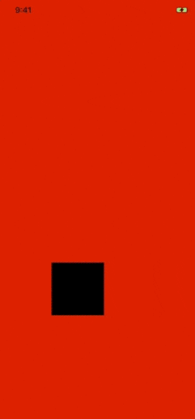
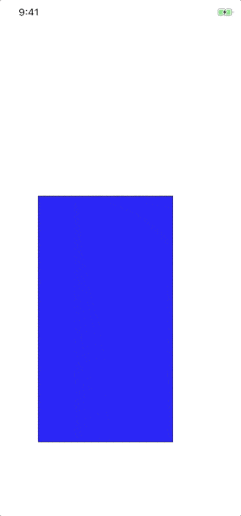

# Adding Objective-C Code to a NativeScript App

Up until NativeScript 5.1, you would've had to create a framework and wrap it in a plugin in order to use your custom Objective-C/Swift code. As this might be a lot of unnecessary work (especially if you wanted to add a small feature), we tried to make it possible to add your Objective-C files directly as app resources. 

## How To

There are three things you have to do in order to have your Objective-C files added to the NativeScript CLI Xcode project:

### 1. Create the *src* directory in *App_Resources/iOS*

The CLI will look for this folder in order to add its content to the Xcode project and compile and link the source files.

### 2. Add the source files in the *src* folder

### 3. Create a module map

The `module.modulemap` file is necessary so the meta data generator is able to find the declarations and add them to the generated AST so they are accessible from your JavaScript code. If you are not familiar with the concept of the module map [here is a good place to start](https://clang.llvm.org/docs/Modules.html).

> **Note:** Of course you can organize your code in separate directories and they will be added as such in the `.xcodeproj` file tree.
 
## Demo

For this demo I chose a great tutorial on `UIViewPropertyAnimator` by [Daniel Larsson](https://medium.com/@daniel_larsson/interactive-animations-with-uiviewpropertyanimator-284580951c62). One of the reasons I am using native code tutorials is to serve as an example of how you can look for the native implementations and then use them in your NativeScript app.

Now, if we were to implement this in JavaScript, we might need to either wrap large blocks of code in a `if (platform.ios)`-block or create a plugin. The alternative approach I am about to show you adds platform-specific features in platform-specific (native) code. Furthermore, in some cases it might be better in terms of performance as well - e.g. when a native call should be executed at each frame when animating views, so the bridge isn't called 60 times per second (in the best case).

***BTW NativeScript performs really well even in this scenario:***

Let's start by creating our `NativeAnimator` class. As we are writing Objective-C code, now we need two files. 

Don't forget that the source files need to reside in `App_Resources/iOS/src`. Most of the time you will have to create that `src` directory yourself.

**NativeAnimator.h**

	#import <Foundation/Foundation.h>
	
	@interface NativeAnimator : NSObject
	
	-(id)initWithView:(UIView*)view andParent:(UIView*)parent;
	-(void)setup;
	
	@end

We want to hide as much as possible from the implementation and this is why these are the only methods `NativeAnimator` exposes. I prefer to have a separate method for attaching the `panGestureRecognizer` in order to keep the initializer responsible for only what it should be. 

	-(id)initWithView:(UIView*)view andParent:(UIView*)parent {
		self = [super init];
		if (self) {
			self.playerView = view;
	        self.parentView = parent;
		}
	
		return self;
	}

The `view` and `parent` parameters are the views we are going to pass from our JavaScript code. The `NativeAnimator` needs to keep reference to them in order to do its job. Now we are ready to create our `panGestureRecognizer`:

	-(void)setup {
		self.panGestureRecognizer = [[UIPanGestureRecognizer alloc] initWithTarget:self action:@selector(handlePan:)];
	    [self.parentView addGestureRecognizer:self.panGestureRecognizer];
	}

This is how the implementation should look at the end:

**NativeAnimator.m**

	#import "NativeAnimator.h"
	
	typedef NS_ENUM(NSInteger, PlayerState) {
	    PlayerStateThumbnail,
	    PlayerStateFullscreen,
	};
	
	@interface NativeAnimator ()
	
	@property (weak, nonatomic) UIView *parentView;
	@property (weak, nonatomic) UIView *playerView;
	@property (nonatomic) UIViewPropertyAnimator *playerViewAnimator;
	@property (nonatomic) CGRect originalPlayerViewFrame;
	@property (nonatomic) PlayerState playerState;
	@property (nonatomic) UIPanGestureRecognizer *panGestureRecognizer;
	@property (nonatomic) UIView* b;
	
	@end
	
	@implementation NativeAnimator
	
	-(id)initWithView:(UIView*)view andParent:(UIView*)parent {
		self = [super init];
		if (self) {
			self.playerView = view;
	        self.parentView = parent;
		}
	
		return self;
	}
	
	-(void)setup {
		self.panGestureRecognizer = [[UIPanGestureRecognizer alloc] initWithTarget:self action:@selector(handlePan:)];
	    [self.parentView addGestureRecognizer:self.panGestureRecognizer];
	}
	
	- (void)handlePan:(UIPanGestureRecognizer *)recognizer
	{
	    CGPoint translation = [recognizer translationInView:self.parentView.superview];
	
	    if (recognizer.state == UIGestureRecognizerStateBegan)
	    {
	        [self panningBegan];
	    }
	    if (recognizer.state == UIGestureRecognizerStateEnded)
	    {
	        CGPoint velocity = [recognizer velocityInView:self.parentView];
	        [self panningEndedWithTranslation:translation velocity:velocity];
	    }
	    else
	    {
	        CGPoint translation = [recognizer translationInView:self.parentView.superview];
	        [self panningChangedWithTranslation:translation];
	    }
	}
	
	- (void)panningBegan
	{
	    if (self.playerViewAnimator.isRunning)
	    {
	        return;
	    }
	
	    CGRect targetFrame;
	
	    switch (self.playerState) {
	        case PlayerStateThumbnail:
	            self.originalPlayerViewFrame = self.playerView.frame;
	            targetFrame = self.parentView.frame;
	            break;
	        case PlayerStateFullscreen:
	            targetFrame = self.originalPlayerViewFrame;
	    }
	
	    self.playerViewAnimator = [[UIViewPropertyAnimator alloc] initWithDuration:0.5 dampingRatio:0.8 animations:^{
	        self.playerView.frame = targetFrame;
	    }];
	}
	
	- (void)panningChangedWithTranslation:(CGPoint)translation
	{
	    if (self.playerViewAnimator.isRunning)
	    {
	        return;
	    }
	
	    CGFloat translatedY = self.parentView.center.y + translation.y;
	
	    CGFloat progress;
	    switch (self.playerState) {
	        case PlayerStateThumbnail:
	            progress = 1 - (translatedY / self.parentView.center.y);
	            break;
	        case PlayerStateFullscreen:
	            progress = (translatedY / self.parentView.center.y) - 1;
	    }
	
	    progress = MAX(0.001, MIN(0.999, progress));
	
	    self.playerViewAnimator.fractionComplete = progress;
	}
	
	- (void)panningEndedWithTranslation:(CGPoint)translation velocity:(CGPoint)velocity
	{
	    self.panGestureRecognizer.enabled = NO;
	
	    CGFloat screenHeight = [[UIScreen mainScreen] bounds].size.height;
	    __weak NativeAnimator *weakSelf = self;
	
	    switch (self.playerState) {
	        case PlayerStateThumbnail:
	            if (translation.y <= -screenHeight / 3 || velocity.y <= -100)
	            {
	                self.playerViewAnimator.reversed = NO;
	                [self.playerViewAnimator addCompletion:^(UIViewAnimatingPosition finalPosition) {
	                    weakSelf.playerState = PlayerStateFullscreen;
	                    weakSelf.panGestureRecognizer.enabled = YES;
	                }];
	            }
	            else
	            {
	                self.playerViewAnimator.reversed = YES;
	                [self.playerViewAnimator addCompletion:^(UIViewAnimatingPosition finalPosition) {
	                    weakSelf.playerState = PlayerStateThumbnail;
	                    weakSelf.panGestureRecognizer.enabled = YES;
	                }];
	            }
	            break;
	        case PlayerStateFullscreen:
	            if (translation.y >= screenHeight / 3 || velocity.y >= 100)
	            {
	                self.playerViewAnimator.reversed = NO;
	                [self.playerViewAnimator addCompletion:^(UIViewAnimatingPosition finalPosition) {
	                    weakSelf.playerState = PlayerStateThumbnail;
	                    weakSelf.panGestureRecognizer.enabled = YES;
	                }];
	            }
	            else
	            {
	                self.playerViewAnimator.reversed = YES;
	                [self.playerViewAnimator addCompletion:^(UIViewAnimatingPosition finalPosition) {
	                    weakSelf.playerState = PlayerStateFullscreen;
	                    weakSelf.panGestureRecognizer.enabled = YES;
	                }];
	            }
	    }
	
	    CGVector velocityVector = CGVectorMake(velocity.x / 100, velocity.y / 100);
	    UISpringTimingParameters *springParameters = [[UISpringTimingParameters alloc] initWithDampingRatio:0.8 initialVelocity:velocityVector];
	
	    [self.playerViewAnimator continueAnimationWithTimingParameters:springParameters durationFactor:1.0];
	}
	
	@end

The only file missing is the `modulemap`. Here it is:

**module.modulemap**

	module NativeAnimator {
	    header "NativeAnimator.h"
	    export *
	}

If you run `tns prepare ios` you will see that the `NativeAnimator` files are now part of the project. Good job!

In order to see our newly created `NativeAnimator` actually working we need to create the view it is going to work with.

*I assume you've created a vanilla js Hello World app!*

A good place to do it is in the `onNavigatingTo` function as we may get the native `UIViewController` there.

	function onNavigatingTo(args) {
	    const page = args.object;
	
	    page.ios.playerView = UIView.alloc().initWithFrame(CGRectMake(100, 500, 100, 100));
	    page.ios.playerView.backgroundColor = UIColor.blackColor;
	    page.ios.view.addSubview(page.ios.playerView);
	    page.ios.animator = NativeAnimator.alloc().initWithViewAndParent(page.ios.playerView, page.ios.view);
	    page.ios.animator.setup();
		...
	}

Here is the result:

## Summary

The possibility of adding Objective-C source code directly to your NativeScript app removes the hustle for creating a plugin every time you need to create Objective-C classes and access them from JavaScript. Of course, [creating plugins](https://docs.nativescript.org/plugins/building-plugins) remains the best option when you want to abstract some logic and make it reusable, so choose wisely.

