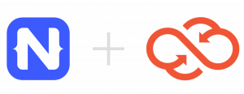

# Kinvey Releases NativeScript SDK

*This article originally appeared on the [Kinvey website](https://www.kinvey.com/kinvey-nativescript-sdk/).*

Over the last 6 years, [Kinvey's Backend as a Service platform](https://www.kinvey.com/) has been used by 100's of 1000's of developers to build rich, engaging apps using the various features we offer, including data and file storage, user authentication and authorization, engagement (push notifications, email, etc.), custom functions and triggers, 3rd-party data connectivity, analytics, operational intelligence, and compliance.  Every Kinvey backend service is exposed to front-end developers via SDKs so that they can write their apps without having to think about API protocols, and instead just call methods in the programming language of their choice.  The newest addition to this set is our NativeScript SDK.

The front-end developers that use Kinvey with the JavaScript ecosystem often tell us that it is very challenging for them to build consumer-grade experiences using hybrid JS frameworks.

**To help developers get over this hurdle, Kinvey has released a new SDK for NativeScript.**

NativeScript has become widely popular with developers in the JavaScript ecosystem because:

- You can write and deploy native mobile apps for iOS and Android from a single JavaScript code base;
- You can deliver beautiful, accessible, platform-native UIs – no webviews;
- You can easily reuse existing plugins from npm, CocoaPods (iOS), and Gradle (Android) directly in NativeScript projects, [plus hundreds of NativeScript specific plugins](http://plugins.nativescript.org/);
- It's Open Source, delivered under an Apache 2 license (just like Kinvey's SDKs).

**Here are a few links to get you started:**

1. NativeScript SDK Download — [http://devcenter.kinvey.com/nativescript/downloads](http://devcenter.kinvey.com/nativescript/downloads)
1. Getting Started — [http://devcenter.kinvey.com/nativescript/guides/getting-started](http://devcenter.kinvey.com/nativescript/guides/getting-started)
1. Kinvey NativeScript OSS SDK source code — [https://github.com/Kinvey/js-sdk](https://github.com/Kinvey/js-sdk)

Watch a short video on using Kinvey's NativeScript SDK to build incredible native mobile experiences:

<iframe class="wistia_embed" src="//fast.wistia.net/embed/iframe/x7xzhxttui?videoFoam=true" name="wistia_embed" width="100%" height="100%" frameborder="0" scrolling="no" allowfullscreen="allowfullscreen" data-mce-fragment="1"></iframe>

We'd love your feedback. You can submit pull requests to the SDK directly, or tell us about anything we can improve on via the [Kinvey developer forum](https://support.kinvey.com/support/home). And to learn more about [Kinvey's Backend as a Service](https://www.kinvey.com/) today!