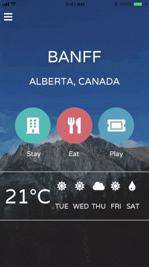
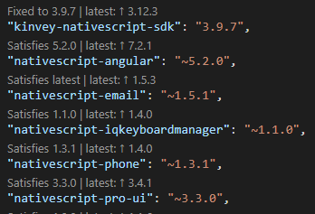
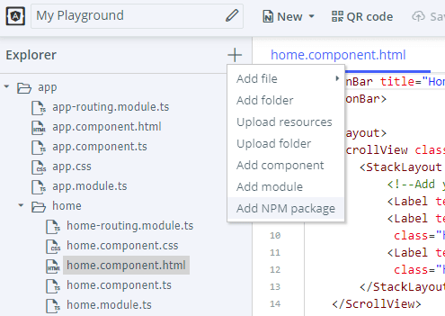

# NativeScript Tips and Tricks from the {N} Squad

We asked the wider NativeScript team here at Progress if they could provide some useful and/or little known tips and tricks that might aid the NativeScript developer on their path to the next great app. Here is what they had to say!

<table><tr><td></td><td><h2>Alex Vaklirov</h2></td></tr></table>

### Enable Router Tracing

This isn't really NativeScript-specific, but it helps a lot when debugging router issues and figuring out what's wrong with your routing config!

It's accomplished by passing an option when calling `NativeScriptRouterModule.forRoot`:

	NativeScriptRouterModule.forRoot(routes, { enableTracing: true})

The result is that all router events are logged in your console (including error in resolving routes):

	JS: Router Event: NavigationStart
	JS: NavigationStart(id: 2, url: '/home')
	JS: Router Event: RoutesRecognized
	JS: RoutesRecognized(id: 2, url: '/home', urlAfterRedirects: '/home', state: Route(url:'', path:'') { Route(url:'home', path:'home') } )
	JS: Router Event: GuardsCheckStart
	JS: GuardsCheckStart(id: 2, url: '/home', urlAfterRedirects: '/home', state: Route(url:'', path:'') { Route(url:'home', path:'home') } )

### Enable Tracing

There are a bunch of built-in tracing categories that we use in `tns-core-modules` and `ns-angular` for logging. Enabling them can provide insights on what is happening inside the framework when debugging a problem in a specific area. Here are some useful categories to enable:

	import * as trace from "tns-core-modules/trace";
	
	// Logs info on measure and layout passes
	trace.addCategories(trace.categories.Layout); 
	
	// Logs info when modifying the view tree (adding views, removing views, etc.)
	trace.addCategories(trace.categories.ViewHierarchy);
	
	// Logs info related to navigation
	trace.addCategories(trace.categories.Navigation);
	
	// Don't forget to enable tracing
	trace.enable();

There are more core-module categories in `trace.categories.XXX`. For Angular projects there are also angular-specific tracing categories in the `nativescript-angular/trace` module.

### Profiling Module

There are a bunch of interesting utilities in the profiling modules of `tns-core-modules/profiling`. Some useful methods:

- `time()`: The most accurate (and fastest) way of getting time in NativeScript
- `start("my-timer-name")` / `stop("my-timer-name")`: The stop method will return a `TimerInfo` object with some useful information like how many start/stop iterations were executed, total time, time of the last measurement, etc.
- `@profile` decorator: You can add it on methods and it will automatically track how many times the execution goes through this method and the total time it took. You can dump all the info collected by profile decorators with `dumpProfiles()`. You should call `enable()` to use the decorator though.

<table><tr><td></td><td><h2>Todd Anglin</h2></td></tr></table>

- USE [TYPESCRIPT](https://www.nativescript.org/using-typescript-with-nativescript-when-developing-mobile-apps)!!!
- USE [VISUAL STUDIO CODE](https://code.visualstudio.com/)!!!
- Use Visual Studio Code (with the [{N} plugin](https://www.nativescript.org/nativescript-for-visual-studio-code)) to **set breakpoints** in JavaScript code and inspect variable values as your app runs on a device/simulator
	- Once you hit a breakpoint, you can start running arbitrary commands via the VS Code command line
	- Good for testing code you think should work, or exploring available APIs
- When in doubt, delete your `node_modules`, `platform`, and `hooks` folders and rebuild/rerun your app to start “clean”
- When building for iOS, you can always use XCode to build and deploy your app
	- Just be sure to open the `*.xcworkspace` and NOT the `*.xcodeproj` file
- You can find the **raw build assets** for iOS and Android in `platforms > [ios/android] > build`
- Use **font icons** for most of the small images you in need in an app (don’t create images at 1x, 2x, 3x for everything)
- Use **custom data binding converters** to translate data into images (like weather icons or images for specific model numbers, etc)
- Make sure you have links to a **privacy policy**, terms of use, etc in your app if you plan to submit via iOS AppStore
	- AND if you don’t have these assets, there are tools to help you quickly generate them. Examples:
		- [termly.io/privacy-policy/privacy-policy-generator](https://termly.io/privacy-policy/privacy-policy-generator)
		- [privacypolicies.com](https://privacypolicies.com/)
		- [getterms.io](https://getterms.io/)
- iOS AppStore tracks app **VERSION** and **BUILD NUMBER**:
	- New **VERSIONS** trigger a manual review by the AppStore (even during beta testing)...which can take some time
	- New **BUILD NUMBERS** are usually approved INSTANTLY during beta testing
	- If you want to get a new beta out via [TestFlight](https://developer.apple.com/testflight/) quickly, ONLY increment the build number (dirty, but works)
- Think about how you’re going to **monitor/triage app crashes/bugs** when you’re ready to ship your app
	- If you don’t add some kind of logging, it’s a black box once you ship your app!

<table><tr><td></td><td><h2>TJ VanToll</h2></td></tr></table>

Take advantage of the time-saving capabilities provided by the `tns resources generate` command! You can [create your icons and splashscreens](https://docs.nativescript.org/tooling/docs-cli/project/configuration/resources/resources-generate-icons) from one master source in minutes.

As many of you already know, the [sample apps in the NativeScript Marketplace](https://market.nativescript.org/?tab=samples&framework=all_frameworks&category=all_samples) are a fountain of ready "copy-and-pasteable" code. Plus, they already work in the NativeScript Playground, so they are super easy to experiment with.

*Developing a new NativeScript plugin?* [Use the plugin seed!](https://www.nativescript.org/blog/introducing-the-official-nativescript-plugin-seed) It takes away so much of the pain.

*Dealing with large images on Android?* That can be a struggle, so look at our docs on [Android image optimization](https://docs.nativescript.org/performance-optimizations/images-optimisations) (and the other performance-focused articles on [webpack](https://docs.nativescript.org/performance-optimizations/bundling-with-webpack) and [improving start up times](https://docs.nativescript.org/performance-optimizations/startup-times) we have while you are at it!).

Adding a new font to your app *might* be the easiest way to improve the look and feel. [Consult this blog post](https://www.nativescript.org/blog/using-custom-fonts-in-a-nativescript-app) on how to properly identify your custom fonts so your NativeScript app can use them properly.

<table><tr><td></td><td><h2>Sebastian Witalec</h2></td></tr></table>

- Take a look at the [Visual Studio Code snippets](https://marketplace.visualstudio.com/items?itemName=tsvetan-ganev.nativescript-xml-snippets) for NativeScript!
- Using the Angular CLI `generate` commands with `nativescript/schematics` (more info on [web/mobile code sharing with Angular](https://blog.angular.io/apps-that-work-natively-on-the-web-and-mobile-9b26852495e7)).

<table><tr><td></td><td><h2>Rob Lauer</h2></td></tr></table>

Be careful of nesting a `<ScrollView>` or `<ListView>` inside of a `<StackLayout>`. Due to rendering issues on Android (which I do not completely understand 😅), you should generally use a `<GridLayout>` instead, like so:

	<GridLayout rows="auto, *">
		<ListView row="1" ...

**Don't reinvent the wheel!** If you're trying to interface with a device API or third-party SDK, chances are someone else has already fought that battle. [Consult the NativeScript Marketplace](https://market.nativescript.org/) for a comprehensive list of plugins to save you some serious time.

Once you **upgrade to the latest version** of the NativeScript CLI with `npm install -g nativescript`, be sure to *also* update your apps with [these detailed instructions](https://docs.nativescript.org/releases/upgrade-instructions).

Oh, and while we are talking about updates, if you're using Visual Studio Code, install the [Version Lens extension](https://marketplace.visualstudio.com/items?itemName=pflannery.vscode-versionlens)! This extension displays the latest version for each package in your `package.json` using code lens (with one-click updating):

> Note that once you update a package version in your `package.json`, you'll want to delete your `platforms` and `node_modules` directories before you re-build your app. 

<table><tr><td></td><td><h2>Todor Totev</h2></td></tr></table>

Just one 😀: You can add NativeScript plugins that don't have native components while using the [NativeScript Playground](https://play.nativescript.org/). It’s "hidden" behind the "Add NPM package" menu:

## And You?

Do you have your own tip or trick to share? Sound off in the comments!