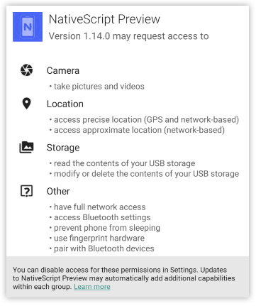
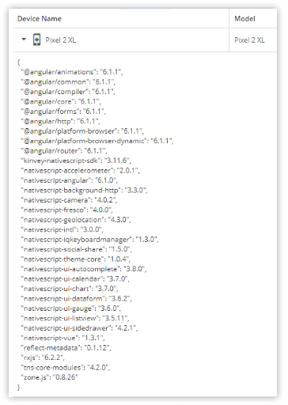
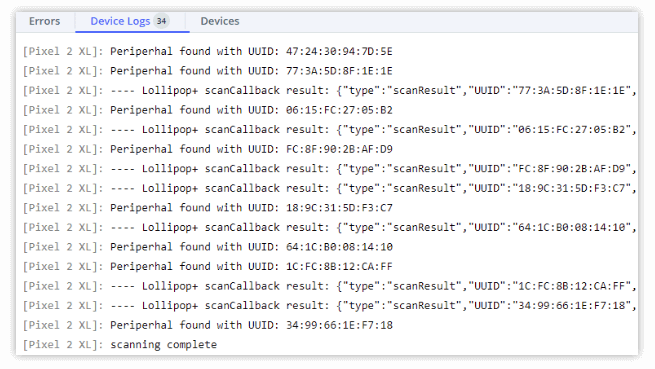

# The Power(s) of NativeScript and the NativeScript Playground

It all started innocently enough with a simple question a customer asked: "*Can I use Bluetooth with the [NativeScript Playground](https://play.nativescript.org/)?*"

My immediate reaction was: "*No way! Bluetooth requires app permissions and interacting with an arcane part of the platform APIs, it should be impossible...or at least extremely difficult!*".

Let me give you some context why I reacted in such a way. The Playground magic is due to the fact that it uses a companion app, which we publish to the [iOS App Store](https://itunes.apple.com/us/app/nativescript-playground/id1263543946?mt=8) and [Google Play](https://play.google.com/store/apps/details?id=org.nativescript.play&hl=en_US). This app must abide to all the rules of both stores, and as such, it is not as malleable as the code you develop and test on your own devices. However, **it contains some of the most useful NativeScript plugins**, and as such, covers a wide range of tasks you need to perform while developing apps.

So the **first power of NativeScript** is that with Playground and its companion apps you can code and experiment quickly with near zero effort on the real tasks you need done today.

However, I still needed to answer the original question. I started by looking at the companion app permissions. These are encoded at build time in `AndroidManifest.xml` and `info.plist` and once the app is published cannot be changed. To my excitement, the Playground app already had the required Bluetooth permissions:

This was a good sign. It meant that it should be possible to interact with the Bluetooth APIs of the operating system.

## NativeScript plugins to the rescue!

The recommended way for a developer to use platform APIs is by using [NativeScript plugins](https://market.nativescript.org/). 

The **second power of NativeScript** is the breadth of its plugin ecosystem.

There is a [plugin available for Bluetooth](https://market.nativescript.org/plugins/nativescript-bluetooth) already. I checked and discovered that it was not included by default in the Playground app. You can see the plugins available in the Playground app when you scan the QR code of your project on the device and open the "Devices" pane in the Playground:

To my delight, there is a nifty feature of Playground, allowing me to add NPM modules. And every NativeScript plugin is an NPM module, so I can add plugins as well! To do this, I clicked on the "+" sign in the Explorer pane and selected **Add NPM package**. There's an important limitation though, and it was spelled right away in the dialog:

*Adding {N} plugins that depend on CocoaPods or Android libraries or require changes to the App_Resources is not currently supported and might not work as expected.*

> Remember, the Playground app is published in the stores and no native code inside it can be changed!

Usually, a NativeScript plugin contains some native code, written in Objective-C/Swift and Java/Kotlin, and JavaScript part, which exposes common API to the NativeScript code you write in your app. However, this is not always required.

Using the **third power of NativeScript**, you can access platform code straight from JavaScript, without using any intermediates! This works best if you are interfacing with the Android and iOS platform APIs, which was exactly my case! 

So I looked at the Bluetooth plugin source code and was happy to find that there is no native code in it. It was straightforward, boring (*and boring code is beautiful code!*) TypeScript, like this:

	/**
	* Bluetooth LE scan callbacks. Scan results are reported using these callbacks.
	* https://developer.android.com/reference/android/bluetooth/le/ScanCallback.html
	*/
	
	@JavaProxy('com.nativescript.TNS_ScanCallback')

	// tslint:disable-next-line:class-name
	
	export class TNS_ScanCallback extends android.bluetooth.le.ScanCallback {

It looked like I would be able to use Bluetooth **while testing code on the web**!

## Time to write code!

I quickly created a simple app which scans for nearby devices. Its essence was copy-pasted from the plugin's documentation:

	onButtonTap(): void {
	   console.log("Start scanning");
	   bluetooth.startScanning({
	       serviceUUIDs: [],
	       seconds: 2,
	       onDiscovered: (peripheral) => console.log("Peripheral found with UUID: " + peripheral.UUID)
	   }).then(
	       () => console.log("scanning complete"),
	       (err) => console.log("error while scanning: " + err)
	   );
	}

I ran it, and was astonished to discover how many devices are in my office:

## Final Words

That was everything! I was very happy that I can answer positively to the customer's question. In the process I discovered how I can use the powerful platform APIs with NativeScript effortlessly.

All this without installing any platform SDKs or tools and getting straight to the problem I needed to solve. I did it just reading the documentation and writing some TypeScript, straight in my browser.

If you are interested in the full app, you can see it in [my NativeScript Playground project](https://play.nativescript.org/?template=play-tsc&id=0j06jP&v=3).
