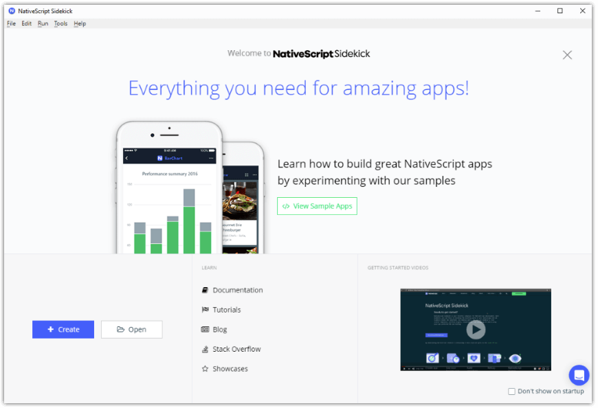
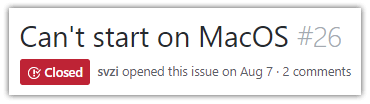
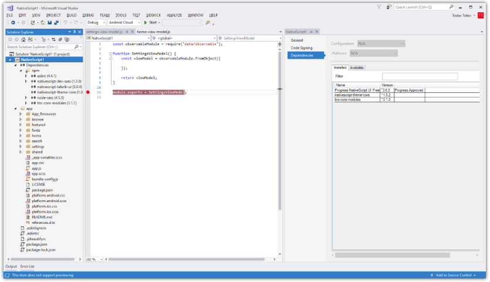

# Announcing the Release of NativeScript Sidekick 1.0

It is an exciting time for web and mobile developers – by using powerful libraries like Angular and Vue together with NativeScript, they can quickly create beautiful web and mobile apps sharing a single code base and developer skills.

To help developers become more productive with NativeScript, Progress today introduces [NativeScript Sidekick](https://www.nativescript.org/nativescript-sidekick) 1.0!

## What is NativeScript Sidekick?

NativeScript Sidekick is a GUI desktop app and set of cloud services aimed to remove the tedious part of cross-platform mobile development, and let developers concentrate on what's important: their apps.

When we asked NativeScript users, *"How can we improve? What impedes you the most often?"*, we heard a lot about:

- Mobile apps need the right structure and this is hard to get correct without experience;
- Setting up and maintaining the tool chains of two different mobile platforms takes time, effort, and needs to be done often at inconvenient times;
- Instead of creating apps, people are forced to hunt clues online how to install and configure arcane software on their machines; 
- Buying Macs for iOS development is very expensive for students who are just starting to program, or inconvenient for teams who already invested in Linux or Windows; 
- Command line tools are too complex.

## A Bit of History

Here at Progress, we started thinking about how best to resolve these problems more than a year ago – our first commit for NativeScript Sidekick was on Oct 14, 2016! Using our experience creating UI components, developer tooling, and cloud services, we drafted the first iteration of the tool and released it publicly as a preview on July 31st, 2017. Since then, we have received great feedback from the NativeScript community – be it praise, a feature request, or sometimes, a bug report. And what feedback we got! It ranged from the happy:

...to the not-so-happy:

During the preview cycle, we added features, refined the UI, and fixed the bugs (thank you again for telling us how to improve!) Looking at the [Preview release](https://www.nativescript.org/blog/announcing-the-nativescript-sidekick-public-preview), we started with the essentials. Since then, we added new app templates, fully enabled creating and managing iOS certificates on Windows and Linux machines, and even **allowed publishing on iTunes Connect without using a Mac**! The UX went through multiple changes, driven by the feedback we received.

And now we feel the product is ready to take off!

## How Do I Start Using Sidekick?

So, how do you try out Sidekick? It’s simple: [download NativeScript Sidekick here](https://www.nativescript.org/nativescript-sidekick), create a free account, and start building! If you are a first-time user, we offer a comprehensive tutorial to guide you in creating a moderately complex app. If you already have an existing NativeScript project, just open it in Sidekick. It is fully supported, as Sidekick shares its code with the NativeScript CLI.

## The Future

The NativeScript core framework is, and will remain, free and open source. Sidekick is also completely free if you are using it with SDKs installed on your machine (i.e. if you have Xcode and/or Android SDK installed). If you choose to do so, Sidekick is no more than an easy-to-use tool that supplements the NativeScript CLI.

However, we will introduce paid subscriptions for more extensive usage of our cloud services. As time goes on, we plan on enabling additional development scenarios to improve upon our support for developing for iOS from Windows and Linux. While currently we offer cloud builds, we have plans to gradually introduce other cloud services to make development even easier. Our [pricing for these cloud services](https://www.nativescript.org/nativescript-sidekick/purchase) aims to be very reasonable.

## What's Next for Sidekick

While we are releasing our v1 today, we all know software is never really done! We already have a big bucket of feature requests and improvements to work on. One of the first post-v1 features will be **supporting Webpack in cloud builds**.

And, as a sneak peak, we are working on our extension for Visual Studio 2017!

Of course, we will continue to support and expand our [NativeScript extension for Visual Studio Code](https://www.nativescript.org/nativescript-for-visual-studio-code).

And finally, please get in touch with us. You can always talk to me directly, by using the built-in Intercom chat in Sidekick, [post a forum topic](https://discourse.nativescript.org/c/Sidekick), or [open a GitHub issue](https://github.com/NativeScript/sidekick-feedback). We want to make Sidekick the best productivity tool for mobile development and you can help us do it!