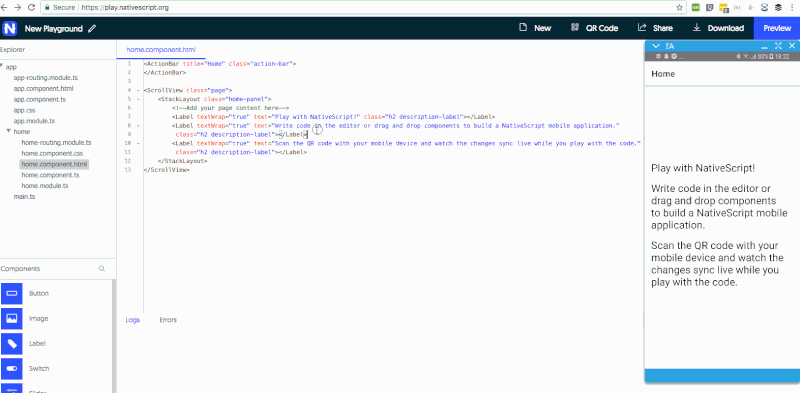

# Architecture of the NativeScript Playground

Over the past year, the [NativeScript Playground](https://play.nativescript.org) has become the preferred tool for [getting started with NativeScript](https://www.nativescript.org/getting-started-with-nativescript). This happened mostly because of the ease of use of the Playground and zero machine setup required. Another great advantage is the fast propagation of project changes to the device. In this post we’ll describe the technical decisions we’ve made when creating the NativeScript Playground and how all of its parts communicate with each other.

Here’s a basic overview of the NativeScript Playground architecture:

*Now let’s go into details for the different components:*

## Web Server

The webserver is written in [Go](https://golang.org/) and it has some basic functionality such as:

- Serving the application HTML files 
- Loading the selected template/project from [Amazon S3](https://aws.amazon.com/s3/) storage
- Managing project metadata ([Amazon DynamoDB](https://aws.amazon.com/dynamodb/))
- Sending project files to the Preview App through [PubNub](https://www.pubnub.com/) when a saved project is opened in a mobile device’s browser 

A docker image is created from the Web Server and it is hosted on a couple of EC2 instances on AWS behind an ELB.

## Resources

We have several types of resources: 

- **Templates** – The template is a NativeScript application that is used as a starting point when a new session in the NativeScript Playground is opened. The content of the templates is stored in S3. 
- **Tutorials** – The tutorials content is in markdown and can be found in the [playground-tutorials repo](https://github.com/NativeScript/playground-tutorials). We use the [Github API for translating markdown to HTML](https://developer.github.com/v3/markdown/) with several tweaks after that. Then the resulting HTML is stored also in S3.
- **Project Metadata** – The metadata for the saved projects is stored in DynamoDB
- **Changed File Contents** – Every project has a reference to a given template version and the content of all the files that are changed for a given project is stored in S3.
- **Static Files** – The static files required by the website are also stored in S3 with a CloudFront CDN.

## SPA Application

The front-end part of the website is built using Angular. The main idea of the whole application is to move everything possible to the client, so that the server can stay very lightweight and be able to scale and serve many users. To achieve it we use the [Monaco Editor](https://microsoft.github.io/monaco-editor/)’s ability to compile TypeScript, so when a change is made to a TypeScript file it creates the corresponding JavaScript file which is used in the app.

## Messaging

To transfer the files between the browser and the mobile app we use PubNub. We've chosen it because it has SDKs for all the languages that we use (Golang, JavaScript, Java, Objective C), as well as the speed and reliability. We haven’t had any major issues with the service so far and it is one of the main parts making the NativeScript Playground work so fast.

## Mobile Applications

To achieve the needed functionality for previewing your code on a mobile device we needed to create two separate applications: 

### Playground Application

This is a QR scanner app, which can read any QR code. You can scan the NativeScript Playground QR code with any other QR scanner app as well and it will open the Preview App. Some changes cannot be applied at runtime and that’s why the Preview App restarts itself whenever it detects such incoming changes. Unfortunately in iOS an application cannot restart itself, so we are using the Playground App to do it.

### Preview Application 

The Preview App is a container app used to execute your application code and instantly apply changes on the device. It gets the files from the browser through PubNub and replaces the content in the app folder.

There are some limitations of what changes and applications are supported by Playground. The Preview app comes with a predefined list of built-in NativeScript plugins (see below). This means that apps using plugins with native code and/or resources which are not included, are not supported and cannot be run in the Playground’s Preview app. Moreover only application content files can be changed. Changes in `App_Resources` or the native parts of the plugins will not be applied.

## The Magic

So how does the magic happen?

1. When you [open a NativeScript Playground session](https://play.nativescript.org), you select your template and its files are loaded in the Monaco Editor. 
2. Then you can make changes if you want and if your changes are in a TypeScript file, the editor produces a corresponding JavaScript file which is used in the app by compilation in the browser. 
3. When you press the "Preview" button for the first time, a QR code is shown which contains a uniquely generated communication id used for communication between the browser and the mobile application, creating a dedicated PubNub channel. 
4. When scanning the QR code with the Playground app, that information is read and passed to the Preview app through its custom scheme. 
5. When the Preview app is started it reads the communication id and use it to post a device connected message to the PubNub channel. 
6. The browser receives the device connected message and sends all the files to the PubNub channel. 
7. The Preview app reads the files and replaces the files in its directory with the incoming files content. 
8. If there’s a change in a script file a restart is triggered. 
9. If another change is made in the browser, only the changed files are sent to the device. 
10. The same channel is used for sending logs from the device to the browser. 

So if you haven't checked the [NativeScript Playground](https://play.nativescript.org) out yet, go ahead and try it. We promise it will be the fastest way for you to get started with NativeScript!

*As of today the list of the built-in NativeScript plugins in the Playground is:*

- @progress-nativechat/nativescript-nativechat
- kinvey-nativescript-sdk
- nativescript-accelerometer
- nativescript-background-http
- nativescript-camera
- nativescript-fresco
- nativescript-geolocation
- nativescript-imagepicker
- nativescript-intl
- nativescript-iqkeyboardmanager
- nativescript-social-share
- nativescript-ui-autocomplete
- nativescript-ui-calendar
- nativescript-ui-chart
- nativescript-ui-dataform
- nativescript-ui-gauge
- nativescript-ui-listview
- nativescript-ui-sidedrawer
- nativescript-background-http
- nativescript-accelerometer