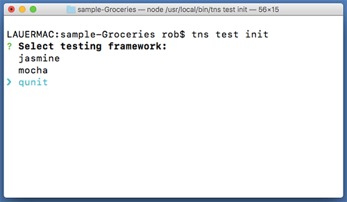
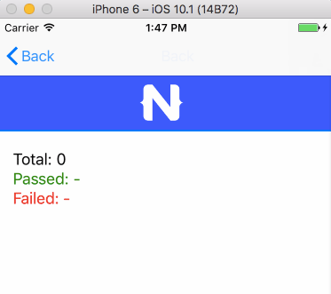
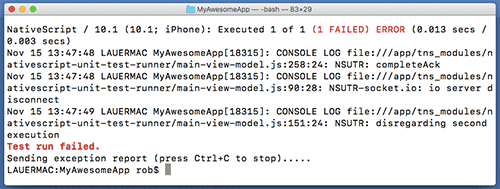

# Adding Unit Tests to Your NativeScript App

The bane of many a developer's existence, writing unit tests is about as popular as seat belts in the 80's. We know it's a good idea, but how can you reach your six-pack of PBR with a strap across your shoulder?

What if it were actually easy to write and execute unit tests? What if the open source framework you know and love (and use to create cross-platform mobile apps) included support for the most popular unit testing frameworks?

Let's take a look at how you can unit test your [NativeScript](https://www.nativescript.org/) apps with some of the most popular unit testing frameworks available.

## Why Unit Test?

First, for anyone new to unit testing, we should briefly talk about the *why*.

I used to hate testing. I'd rather code --> refresh browser --> ship it! This all changed when I started relying more on things outside of my control - like remote data sources and libraries with breaking changes. It only takes a single 4 hour session of tracking down a bug (which turns out to be a change to some remote API) to realize that adding simple automated tests to your code is a valuable and worthwhile time commitment.

Enter the [unit test](https://en.wikipedia.org/wiki/Unit_testing). Unit testing has us write tests, in code, to test the smallest pieces of our apps. In theory, as we write code, we should write corresponding unit tests. This way we end up with virtually 100% test coverage in our apps.

By regularly running these tests (see the Continuous Integration section below), we can automatically make sure that our app functions as expected.

## Unit Testing Frameworks

Now of course, like anything else in the JavaScript utopia we live in, there are unit testing frameworks that make our lives considerably easier, such as:

- [Jasmine](https://jasmine.github.io/)
- [Mocha](https://mochajs.org/)
- [QUnit](https://qunitjs.com/)

And what a coincidence! It just so happens that NativeScript includes support for all of these frameworks out of the box! So let's take a look at how we write some unit tests and how we execute them to test our apps.

## Setting Up Our Tests

I'm going to assume you already know the basics of NativeScript. It's an open source framework for creating cross-platform native iOS and Android apps. If you haven't already, make sure you go through the [getting started tutorial](http://docs.nativescript.org/angular/start/introduction.html).

Done? Great. Ok, so you've already run `npm install -g nativescript` to [install NativeScript](https://docs.nativescript.org/start/quick-setup) and `tns create MyAwesomeApp` to initialize your first app.

Next, let's `cd MyAwesomeApp` to navigate to this newly created app directory.

And then, `tns test init` to initialize our project for unit testing. Finally, make a choice from the list of unit testing frameworks provided:

What happens next? A few things:

- An `app/tests` directory is created, which is where all of your tests will be stored.
	- This directory also contains an `examples.js` file with some sample tests.
- The appropriate nativescript-unit-test-runner npm module for the selected framework (and its dependencies) is installed.
- A `karma.conf.js` file is created in the root of your project. More on Karma in a bit.

## Writing Our Tests

The `examples.js` file created will have some sample tests using the framework you selected. Since all three of these frameworks are *fairly* similar in terms of syntax, I've chosen [QUnit](https://qunitjs.com/) as my framework of choice:

	// A sample QUnit test
	QUnit.test("equal test", function (assert) {
		assert.equal( 0, 0, "Zero, Zero; equal succeeds" );
		assert.equal( "", 0, "Empty, Zero; equal succeeds" );
		assert.equal( "", "", "Empty, Empty; equal succeeds" );
		assert.equal( 0, false, "Zero, false; equal succeeds" );
	});

While the explanation of *how* to write individual tests is outside the scope of this article, I can point you to some great getting started resources for each framework:

- [Jasmine](https://jasmine.github.io/pages/getting_started.html)
- [Mocha](https://mochajs.org/#getting-started)
- [QUnit](https://qunitjs.com/cookbook/)

Since I'm focusing on QUnit here, you should know that the core of QUnit is the idea of **assertions**. These are functions built into QUnit that allow us to test the result of a certain statement or function. The simplest assertion is probably `ok()` which requires only one argument. If said argument is true, we pass the test, otherwise we fail:

	QUnit.test("My first QUnit test", function () {
	    ok(1 == 1, "Does 1 always = 1?");
	});

There are a few things I want you to notice in this test function. First is that `QUnit.test` is what QUnit uses to construct a test case. We are then passing in `"My first QUnit test"` as the name of the test. We are utilizing the `ok()` assertion to test if 1 = 1. Finally we are passing a string of `"Does 1 always = 1?"` which allows us to describe the individual assertion (you can have multiple assertions in one test).

Now in the real world, your NativeScript tests will look a little more like this:

	// require the view model to expose the functionality inside it
	var mainViewModel = require("../main-view-model");

	QUnit.test("Hello World Sample Test:", function (assert) {
		//Assert that the counter equals 42.	    
		assert.equal( mainViewModel.mainViewModel.counter, 42, "Counter, 42; equal succeeds." );

		//Assert that the message is "42 taps left".
	    assert.equal( mainViewModel.mainViewModel.message, "42 taps left", "Message, 42 taps left; equal succeeds." );
	});

> Note that you need to [require the module](https://docs.nativescript.org/runtimes/require) which exposes the functionality that you want to test.

## Executing Our Tests

You can run your tests on any connected iOS or Android device, as well as any Android emulator or iOS Simulator:

- Run on device with `tns test android` or `tns test ios`
- Run on emulator by adding the `--emulator` flag to the above commands

For example, if I run the `examples.js` tests on my iOS Simulator, you'll see the app built in the command line and then a very brief display in the simulator:

Wait, the app quit before I could see the results! How do I know if my tests ran? **What just happened!?!**

In brief:

- The CLI started a [Karma](https://karma-runner.github.io/1.0/index.html) server and built/deployed the project to the device.
- Instead of starting the main module of your app, it started the main module of the test runner.
- The test runner executed the tests, reported back to Karma, and Karma reported the results to the command line, like so:

In this case my test failed, which you can see by the big bold red text.

> Add the `--watch` flag if you'd like to automate the execution of your tests for whenever code changes are made, as in `tns test ios --emulator --watch`

There now, don't you feel better? For more information on unit testing in NativeScript, [consult our extensive documentation](https://docs.nativescript.org/tooling/testing). Good luck and happy NativeScripting!

