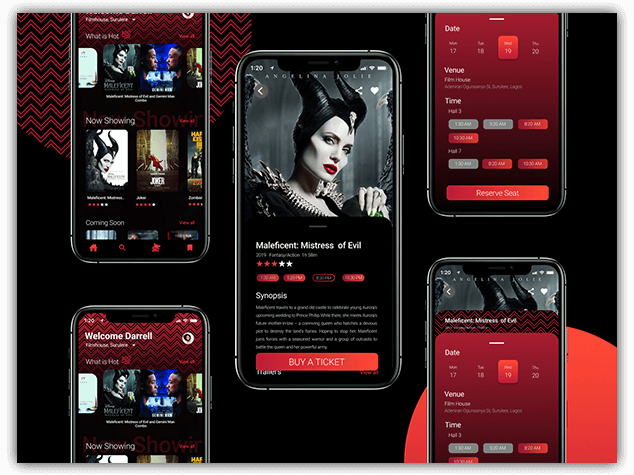
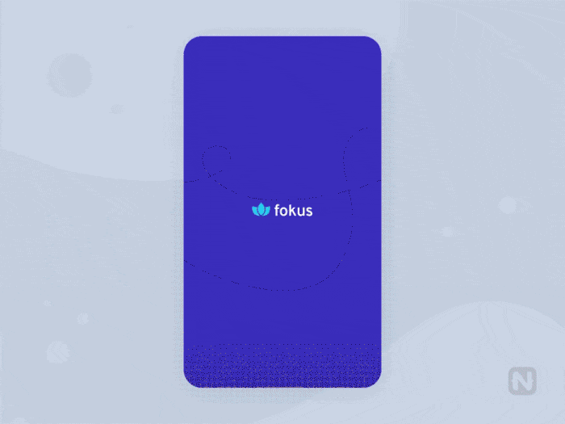
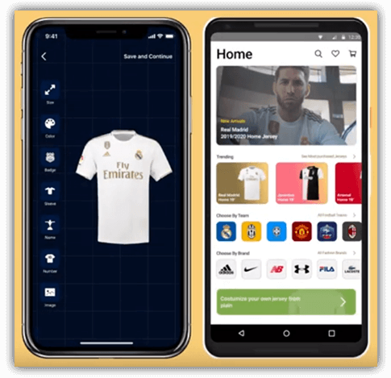

# Your NativeScript UpLabs Challenge Winners

Recently NativeScript and UpLabs [collaborated on a "challenge"](https://www.uplabs.com/challenges/nativescript-uplabs-challenge-ac5fdcca-4e29-4e12-aa3d-0924424bdae7) to inspire designers and developers to collaborate on building engaging apps with NativeScript (and the [NativeScript Playground](https://play.nativescript.org/)).

We received some great submissions, the community voted, and now it's time to award some prizes! 🎁

## $2,000 NativeScript Team Prizes

The first prize was awarded via an internal vote of folks on the NativeScript team. **And once again this year we ended with a split decision!**

*We are pleased to award a $1,000 prize to each of the two following challengers:*

[Aderounmu Bamgbose](https://www.uplabs.com/aderounmubamgbose) built a fantastic [Cinema Concept App](https://www.uplabs.com/posts/cinema-concept-app) using NativeScript and Vue.js:

> You can view the Cinema Concept App [right here on the NativeScript Playground](https://play.nativescript.org/?template=play-vue&id=8nBJxu&v=43).

Next, [Harsimran](https://www.uplabs.com/mrblade) created a fantastic stress-relief app called [Fokus: Meditation & Habit Building](https://www.uplabs.com/posts/fokus-meditation-habit-building-nativescript) using NativeScript Core.

> Find Fokus [here on the NativeScript Playground](https://play.nativescript.org/?template=play-js&id=vWB31o&v=2995).

## $1,000 Community Prize

Finally, congratulations goes to [Oghenekaro](https://twitter.com/differentkaro) and [Ryan Pendergast](https://twitter.com/rynop) for their app, [Custom Kits](https://www.uplabs.com/posts/custom-kits-entry-for-nativescript-challenge), which allows you to customize your own football/soccer ⚽ kits:

Written with NativeScript and Angular, you can find a fully-functional version of the app [on the NativeScript Playground](https://play.nativescript.org/?template=play-ng&id=BOqlDi&v=23).

**Thanks to all of our participants!** 📱❤️