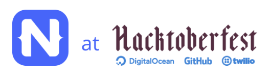

# Hacktoberfest is Here!

This year is the 5th annual [Hacktoberfest](https://hacktoberfest.digitalocean.com/)! The purpose of Hacktoberfest is to encourage meaningful contributions to the open-source ecosystem by providing guidelines and starting points to help beginners and veterans alike. All you need to do to receive a limited-edition T-shirt is post five pull requests to any open-source project (and yes that includes [NativeScript](https://github.com/nativescript)!).

If you want to participate in the Hacktober fest but don't know where to start, the recently-announced [NativeScript First-Time Contributors Contest](https://www.nativescript.org/blog/nativescript-first-time-contributors-contest) can help. It's a great opportunity to kill two birds with one stone, and apply for both the NativeScript contest and the Hacktober fest with PRs to [NativeScript repos](https://github.com/search?p=3&q=label%3Ahacktoberfest+state%3Aopen+type%3Aissue+nativescript&type=Issues).

> As a bonus, the {N} core team and our community are here to give you a hand in your contribution journey and will even help you win the prizes!

Don't miss your chance and get started now! How?

👉 Review the rules of the [NativeScript First-Time Contributors Contest](https://www.nativescript.org/blog/nativescript-first-time-contributors-contest)

👉 Review the rules of [Hacktoberfest](https://hacktoberfest.digitalocean.com/details)

👉 Register in the [NativeScript Community Slack](https://www.nativescript.org/slack-invitation-form) and join the **#contributor-squad** channel to get help on the spot!

👉 Start contributing!

On behalf of the whole NativeScript team I would like to wish you "Happy NativeScripting"!