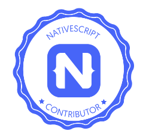

# What is it like being the NativeScript Product Manager?

Being part of the NativeScript team for 18 months before becoming a Product Manager (PM) has given me some ideas for what we can do better as an organization. [When I became a PM](https://www.nativescript.org/blog/one-on-one-with-veselina-radeva-nativescript's-new-product-manager), my first task was to sit in a room with the team managers (my ex-peers), and make sure we're all aligned and focused on the most important development tasks. How did we identify what's 👉"most-important"👈? We listed all the current projects and initiatives and cross-checked them with the community voice from the NativeScript Community Survey and GitHub. This helped us identify the priorities and the biggest pain points our developers experience.

> NOTE: Make sure you fill out the [NativeScript Community Survey](https://progress.co1.qualtrics.com/jfe/form/SV_eJOutHRaMH4klcV). This is one of the main sources of information for the NativeScript team and influences the future roadmap of the framework. Make sure your voice is heard! 📣 

We next made sure the roadmap for the next few months is aligned to these priorities and we have buy-in from all stakeholders: core team, marketing, developer relations, and top management.

💡 **TIP:** Receiving an early buy-in from all stakeholders keeps the team focused and helps you say NO to anything not relevant to the goals you all agreed on.

While doing the exercise above once more we saw that we need to change something in order to cover some critical parts of the framework and address one of the biggest pain points – the development experience. So, we did it 💪. We performed some re-organization and spun off a new team. Its main focus is now the CLI and the development experience.

As a result, the NativeScript team managed to deliver significant improvements in our [4.2 release](https://www.nativescript.org/blog/nativescript-4.2-is-here) like a faster development experience with LiveSync on Android, easier generation of Android typings, debugging with Webpack, etc. And more of the most requested features and enhancements is expected to come in [NativeScript 5.0](https://www.nativescript.org/roadmap-and-releases#releases) at the end of October!

> NOTE: For an early preview of 5.0 you can [use the @next versions](https://docs.nativescript.org/angular/releases/running-latest#getting-the-latest-development-version-via-npm) of all core NativeScript packages.

## What's Next?

The latest challenge I'm facing is the organization of the 🥇 [NativeScript First-Time Contributors Contest](https://www.nativescript.org/blog/nativescript-first-time-contributors-contest). I realize that using a product and contributing to it are two different things but with a development framework like NativeScript it doesn't make much difference. I really hope that this initiative will lower the barrier for contributions to NativeScript and will prove to NativeScript developers that contributions can be fun and easy. We're doing this for the first time, but our goal is to continue the effort in the future with more initiatives and create conditions for a more engaged community and a thriving ecosystem.

Building the roadmap for 2019 is also something that's on my plate, so make sure you fill out the [NativeScript Community Survey](https://progress.co1.qualtrics.com/jfe/form/SV_eJOutHRaMH4klcV) which plays a significant role in the priorities for next year. So, take your time, fill it in and share all your thoughts there. We'll be more than happy to read them all 📖!

I hope you now know better what being the NativeScript Product Manager is like!

Stay tuned for more posts from the *PM Confessions Series* revealing the life of the NativeScript Product Manager 😉