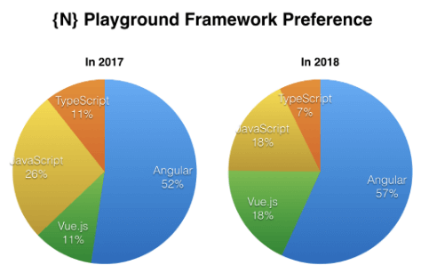
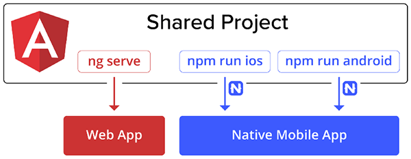
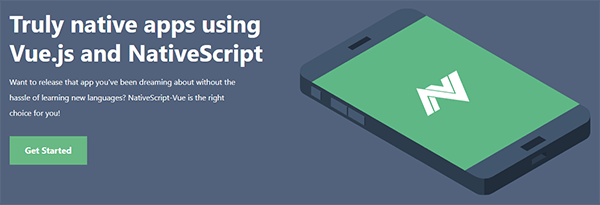
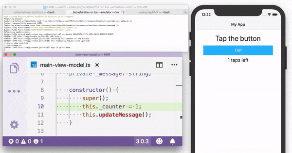

# The State of NativeScript in 2018

Recently we shared with you our [roadmap plans for 2019](https://www.nativescript.org/blog/whats-on-the-nativescript-roadmap-for-2019). But now let’s look back and pat ourselves on the back for the good work done during the past year! Let's reflect on all the improvements in the framework that have happened during 2018 and see about how they affected NativeScript’s stats.

## {N} by the Numbers

Below are some numbers that show how NativeScript adoption evolved during 2018: 

- The {N} CLI **user base increased by 80%**.
- The {N} Playground user base grew **7x**! 
- According to [npm stats](https://npm-stat.com/charts.html?package=nativescript&from=2016-12-01&to=2018-11-30) the **number of NativeScript downloads has more than doubled** – from ~1.1M in 2017 to ~2.4M (and counting!) in 2018. 
- Our website is getting **35% more organic traffic**.
- The NativeScript community developed **300 new plugins** in 2018.
- The **usage of Vue.js in NativeScript has doubled** compared to 2017. The same is also confirmed by the NativeScript Community Survey.

## Angular CLI + Web & Mobile Code-Sharing

The collaboration with the Angular core team resulted in achieving two big milestones:

The implementation of [nativescript-schematics](https://github.com/NativeScript/nativescript-schematics) enabled us to integrate with the [Angular CLI](https://docs.nativescript.org/angular/tooling/angular-cli), so now you can use the Angular CLI to generate important blocks of code. 

The NativeScript Schematics implementation also enabled all Angular web developers to easily build mobile apps with {N} and [share common code between web and mobile](https://docs.nativescript.org/angular/code-sharing/intro) from a single project. According to the {N} community survey we run twice a year, almost 70% of our users intend to or are already sharing the code between web and mobile. So, the team will continue investing effort in providing seamless code-sharing between web and mobile.

## NativeScript-Vue

A huge addition to the framework for all NativeScript lovers was the creation of [NativeScript-Vue](https://nativescript-vue.org/), allowing NativeScript developers access to build mobile apps with Vue.js thanks to our community member and close friend [Igor Randjelovic](https://twitter.com/igor_randj?lang=en). He started the integration in 2017 and released two major versions in 2018.

During this time, we at [Progress](https://www.progress.com/) and [Jen Looper](https://twitter.com/jenlooper?lang=en) in particular – one of our {N} DevRel Advocates and the [Vue Vixens](https://vuevixens.org/) founder - supported the initiative in all possible ways. Considering the strong interest in the Vue.js integration, we will all continue to support this initiative going forward.

## Developer Experience

The year brought a lot of improvements in **developer experience** – we started in [4.0](https://www.nativescript.org/blog/nativescript-4.0-is-out) with better Webpack integration to make LiveSync with Webpack available, continued in [4.1](https://www.nativescript.org/blog/announcing-the-nativescript-4.1-release) with more improvements in *debugging* with Webpack, and reached the top of 2018 by [introducing Hot Module Replacement](https://www.nativescript.org/blog/nativescript-hot-module-replacement) (aka. HMR) in [5.0](https://www.nativescript.org/blog/nativescript-5.0-is-hot-out-of-the-oven).

At the beginning of the year a single development cycle of: code change -> test could take a minute depending on what is changed and how much of the state of the application is lost. **Now, in most cases this takes seconds**, giving you back those precious minutes throughout the whole day.

In addition, the team released the new interactive `tns create` command to guide you through the most common options for project creation and the new `tns plugin create` to ease the process of creating a new {N} plugin.

## More Navigation Scenarios

Previously the {N} application relied on a single top frame that contained the whole app. Now, you can use multiple frames, which allows **broader set of navigation scenarios** to be implemented and to have clear and better organized code for `SideDrawer` and `TabView` navigation in your app. The effort started in 4.0 with enabling the scenarios for pure JavaScript and TypeScript, continued in 4.1 with enablement of the same scenarios in Angular, and reached its latest update in 5.0 where [more navigation options were made possible](https://github.com/NativeScript/nativescript-angular/issues/1351).

## Performance

During 2018 the team managed to catch up with the V8 updates and stayed on top of all new versions of Webpack, which led to **up to 50% performance improvement** (depending on the device and the OS) in the application startup time.

## Getting Started

Let’s not forget all the newbies that evaluate and try the framework every day! For all of them we tried to improve our **getting started experience** by:

- revamping the documentation, so that the content is more organized;
- enhancing the [NativeScript Playground](https://play.nativescript.org/); 
- adding [Samples in the Marketplace](https://market.nativescript.org/?tab=samples&framework=all_frameworks&category=all_samples);  
- providing the brand new `tns preview` command in CLI for all of you who prefer command-line tools.

As a result, you can now **run your first app in just a few minutes** through the CLI without the need to install the whole NativeScript tool chain. A year ago, running a simple `hello world` via the CLI required you to have all NativeScript dependencies installed and configured (which usually took a while). With `tns preview` all a new user needs to do is:

- Run `npm I nativescript -g` to install the CLI 
- Create a new project with `tns create`
- Install the Playground and Preview apps on the phone and 
- Run `tns preview` to preview the app on the device!

It’s THAT easy to start with {N} in the CLI and it takes 5 minutes! Read more about `tns preview` [in this blog post](https://www.nativescript.org/blog/nativescript-preview).

## Community

And last but not least, **THANKS** to our community for all the plugins, blog posts, contributions to the framework, and everything else you do to make {N} better and spread the word about the framework you ♥. To mention just some of the achievements:

- More than 300 new plugins built by you 
- Rich set of [samples in the marketplace](https://market.nativescript.org/?tab=samples&framework=all_frameworks&category=all_samples)
- Code contributions like  
	- [YARN support](https://github.com/NativeScript/nativescript-cli/pull/4050) in the CLI
	- [CSS gradients](https://github.com/NativeScript/NativeScript/pull/5534) 
	- [3D rotation of View](https://github.com/NativeScript/NativeScript/pull/5950)   
	- ...and many more bug fixes, smaller features, and documentation improvements. 
- All the contributions during the [NativeScript Contributors Contest](https://www.nativescript.org/blog/nativescript-first-time-contributors-contest-the-winners)  
- All the nice-looking apps submitted to the [NativeScript Uplabs Challenge](https://www.uplabs.com/challenges/nativescript-uplabs-challenge/vote).

> Check out the [winners of the challenge](https://www.nativescript.org/blog/so-who-won-the-nativescript-uplabs-challenge)!

Keep contributing in 2019 and let us know if you need any help – be it in featuring a blog post on nativescript.org or organizing a local meetup/workshop. **We will be happy to support your initiatives!**  

All this being said, we believe that NativeScript more than ever is in position to help you build the next great app. For those of you already invested in Angular or Vue.js, those frameworks are first-class citizens. The constantly-growing community is always available to support you, while you are pushing the boundaries of what is possible on mobile devices. The development experience is optimized for seamless iteration cycles and helps you deliver your app without delay.