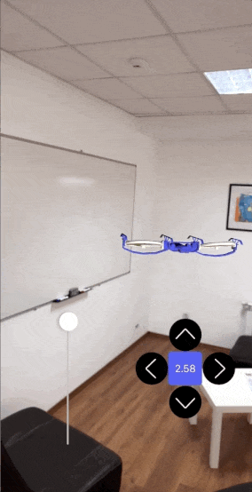
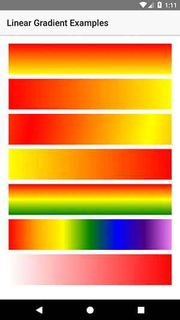
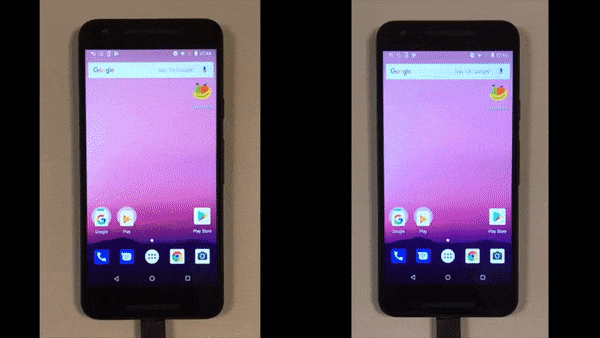
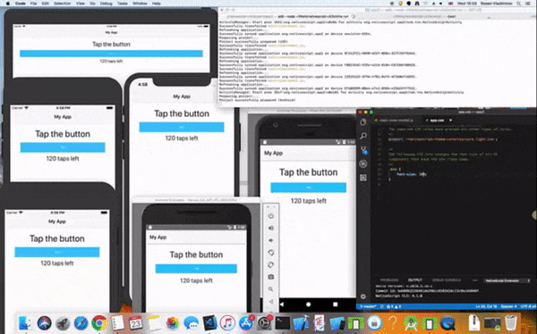
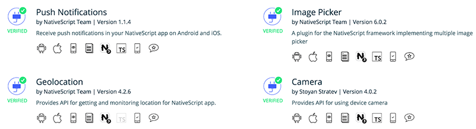

# Announcing the NativeScript 4.1 Release

The 4.1 release of NativeScript is here! 🎉 This version comes with impressive performance improvements and much-awaited features.

*Some of the highlights include...*

- a 50% faster app launch time on Android,
- support for Angular 6,
- awesome new UI scenarios: ARKit for iOS, modal navigation in Angular, and CSS gradients,
- and **A LOT MORE** (see below for the details!).

Thanks to our community we have received a tremendous number of external pull requests during this release! You can find the full list of contributors [here](#contributors).

> Interested in learning more about what's new in 4.1 (and get a glimpse of web/mobile code sharing opportunities for Angular and Vue.js)? [Join us at the next NativeScript webinar](https://attendee.gotowebinar.com/register/5221651479657103362?source=blog) coming up on June 12th!

## New User Interface Scenarios 📱

### Improved Augmented Reality Support

Using ARKit for iOS relies heavily on using the `vector` type. Because of this, we are adding support for this built-in type. Now go and make your apps stand out (and up/down/left/right) from the crowd! Take a look at this *legendARy* demo built with NativeScript:

> **TIP:** Read more about NativeScript's AR support in [this blog post](https://www.nativescript.org/blog/getting-started-with-augmented-reality-in-nativescript).

### CSS Gradients Support

Thanks to the [great work](https://github.com/NativeScript/NativeScript/pull/5534) of our community member [vultix](https://github.com/vultix), now {N} supports linear gradient backgrounds. Read more in [our documentation](https://docs.nativescript.org/angular/cookbook/ui/styling#gradients).

### Modal Navigation in Angular

Read more about the [modal navigation options](#modal-angular) in our full section on Angular below!

## Performance Improvements 🚀

### V8 Engine Upgraded to 6.6

The version of V8 used in NativeScript prior to this release was v5.5 and was more than 1.5 years old. With this update we are bringing tons of improvements in the V8 engine, with the most distinct one being the performance boost you will get! 🚀

Other important V8 updates can be found on the [V8 blog](https://v8project.blogspot.com/2018/03/v8-release-66.html).

### Startup Performance Improvements

Thanks to the upgrade to V8 6.6 and webpack 4, the startup time on Android is now on par with iOS - comfortably below the 2 second threshold. Depending on the device and the specific app, Android app startup time is now between 800ms on the high-end devices like Pixel 2, to 1.8s on older devices like Nexus 5X. This is an **improvement of ~50%** compared to the startup time in 4.0!

Here is an example of the same app running on NativeScript 4.0 🐢 (on the left) and 4.1 🚀 (on the right): 

## Improved Tooling and Dependency Support 🔨

### Work with Multiple iOS Simulators 

Prior to Xcode 9, only a single iOS simulator could be used at a time. With Xcode 9 and later, this has changed and now you can run multiple simulators on macOS. With 4.1, we are adding full support for **working simultaneously with all of your currently running iOS Simulators**.

This means that you can LiveSync your change on iPhone X, iPhone 8, iPad 2, etc. and immediately see how your application looks and behaves on all of them. You can also run your application simultaneously on multiple iOS Simulators, iOS devices, Android emulators, and Android devices - the NativeScript CLI will deploy and LiveSync all your changes automatically.

### Gradle Upgraded to 4.4 and Support for Java 10

Due to popular demand, we are adding support for [Java 10](http://www.oracle.com/technetwork/java/javase/downloads/jre10-downloads-4417026.html). This should make the local setup a little bit easier by not being picky about using Java 8. Also, you will now be able to use libraries compiled against newer versions of Java.

### Supported Node.js Versions 

With the latest LTS version for [Node.js](https://nodejs.org/en/) at 8.11.2, we are starting the deprecation of older versions. Node.js v4 has been deprecated for several months and now we are stopping support for it. This means that you may have to update your Node.js in order to use NativeScript CLI.

We also deprecating support for Node.js v6 - you will still be able to build and run your applications, though a warning ⚠️ message will be shown in the output. *Future issues and support requests will not be handled for these versions.*

We've **added support for Node.js v10**, so you can get access to all the latest features and improvements while working with the NativeScript CLI.

### Webpack Updates

The next version of [nativescript-dev-webpack](https://www.npmjs.com/package/nativescript-dev-webpack) comes with simplified setup and launch time **improvement of up to 30% for Android**. Highlights of the release are the support for webpack 4 and Angular 6. Here's a list of some of the other features:

- Automatic page, module and component registration for non-Angular apps;
- Unified setup for custom Android components with and without snapshot;
- Improved minification for Android: enabled UglifyJS compress option and bundling with ES modules;
- Improved snapshot generation: all external node packages are now part of the snapshot chunk. The user also has control over which should be executed and which should not.

> You can find more details about the webpack updates in [this blog post](https://www.nativescript.org/blog/upgrading-to-nativescript-webpack-0.12.0).

## Angular 🆖

NativeScript's Angular integration has been updated with support for [Angular 6](https://blog.angular.io/version-6-of-angular-now-available-cc56b0efa7a4)! This is a major version and contains feature changes that may affect the behavior of your app.

Angular 6 requires webpack 4. That's why you will have to update to [nativescript-dev-webpack 0.12.0](https://www.npmjs.com/package/nativescript-dev-webpack) as well.

### Unit testing with Angular TestBed

You can now use the de facto unit testing tooling for Angular - [TestBed](https://angular.io/api/core/testing/TestBed), to writing tests for NativeScript! Kudos to our community members [Justin DuJardin](https://github.com/justindujardin) and [Martin Reinhardt](https://github.com/hypery2k), who implemented this very popular feature. You will be able to learn all about it in a dedicated blog post very soon.

### Angular Flexible Root Composition

**Application Root Changes** - we provided a new bootstrapping method `run` in 4.0 that removed the default root `Frame` wrapper of the app. This allowed you to specify a different root view of the app like a `Drawer` or a `TabView`. To provide the same functionality in Angular apps we implemented a new bootstrap mechanism that removes the implicit root `Frame`. This means that the root element of your `app.component.html` file will become the root of your application. This provides much more flexibility when it comes to deciding your app navigation pattern. Unfortunately, this means we have to introduce some *potential* breaking changes. **Most apps shouldn't be affected.**

*Potential Breaking Change #1:* Because of the implicit root `Frame`, previously it was possible to have an `ActionBar` element in your `app.component.html` file. This won't be possible with the new bootstrap. To achieve the same effect and have an `ActionBar` on your root page, you must now set a `<page-router-outlet>` element in your `app.component.html` and move your page to a default route. The page router outlet will create an underlying `Frame` element for you and the initial navigation will create a `Page` which will enable the `ActionBar` component.

*Potential Breaking Change #2:* Now that the root element of the `app.component.html` file becomes the root element of the app, you can't apply layout properties to it, like margins, width, height etc.

> **NOTE:** Currently there is no way to change the root view of your app. If the root view of your app is a `TabView`, you cannot navigate to a page in your app where the `TabView` is not present. In the scenario where you want both a login page and `TabView` as a root view, it is advisable to have the login functionality in a modal view (see below).

**Page Router Outlet Changes** - With {N} 4.0 we introduced the ability to have multiple `Frame` element instances (navigation containers) at the root level of your app. The {N} Angular implementation didn't rely on `Frame` components for navigation, so we had to do some additional work to make the same feature possible. The equivalent of multiple `Frames` in Angular is named *router outlets*. Angular allows you to specify multiple sibling outlets as long as they are named, so this makes a very good match for the feature. However, there is also a big difference in how history is handled. The core {N} framework and mobile apps in general keep history *per Frame*, meaning you can go back a page in one `Frame`, while keeping the same page in another. Angular, being a browser first technology, handles history as a *linear stack*. In order to achieve feature parity in both worlds, we made the following changes:

- The `<page-router-outlet>` now adds a `Frame` element where it's used. The previous behavior was the page router outlet controlled the single root `Frame` element of your app.
- The Angular location history is now kept separately for each named router outlet in your app component file. This means that you can navigate separately in two sibling router outlets and then navigate back in each individually. This is most visible in the scenario where you have a `TabView` as the root of your application and page router outlets in each tab. It is possible to navigate forward in several tabs and then to navigate back in a different order.

Together these two changes bring the {N} Angular implementation closer to the {N} core framework implementation. **For examples, refer to the angular templates:**

- [Master Detail](https://github.com/NativeScript/template-master-detail-ng) - Demonstrates a linear hierarchical navigation pattern where the page router outlet is the root of the application.
- [Drawer Navigation](https://github.com/NativeScript/template-drawer-navigation-ng) - Demonstrates a lateral navigation pattern where `RadSideDrawer` is the root of the application.
- [TabView Navigation](https://github.com/NativeScript/template-tab-navigation-ng) - Demonstrates a lateral navigation pattern where a `TabView` is the root of the application.

### Navigation in a Modal View

Another major feature in {N} 4.0 was the ability to open a modal page and navigate inside it. The idea was to allow wizard-like modals. Up until now the Angular modal pages contents were always implicitly wrapped inside a `Page` element. To allow navigation inside a modal view, we had to remove this implicit wrapper and let you specify the root element of the modal view. With the new changes, the first element of the modal view becomes its root view and you can safely place a page router outlet there, so that you can have proper navigation in it.

*Potential Breaking Change:* Now that the root element of the modal view file becomes the root element of the modal view, you can't apply layout properties to it, like margins, width, height etc.
	
> **Note:** You can still use the old single page modal views, but they won't be automatically wrapped in a `Page` element.

## LayoutChanged Event 🍱

With 4.1 we have introduced the [highly requested](https://github.com/NativeScript/NativeScript/issues/5687) `layoutChanged` event that will be fired when the layout bounds of a view changes due to layout processing. One of the main use cases is to obtain the correct view sizes with `getActualSize()`. Proper view sizes could be useful when dealing with size-dependent animations. Note that `layoutChanged` won't be triggered when doing transformations over the view (i.e. modifying translateX, translateY or rotate).

## NativeScript Marketplace 🏪

### Code Samples

[NativeScript Playground](https://play.nativescript.org/)-compatible [code samples](https://market.nativescript.org/?tab=samples) are now available in the Marketplace to ease development of simple but specific scenarios. This includes the [Header Animation](https://play.nativescript.org/?template=play-ng&id=iDY4kF&v=11) (below) - a nice master/detail scenario with rich animated transitions built by our teammate [Todor Petrov](https://github.com/tgpetrov).

Thanks to all the community members for adding new samples to the list! Do you have a playground sample worth to be shown in the Marketplace? It’s as easy as doing a PR to the [code samples repo](https://github.com/NativeScript/code-samples). We 💓 community samples!

### Plugins

In addition to the [verified label](https://github.com/NativeScript/marketplace-feedback/blob/master/docs/verified-plugins.md), each plugin’s quality can be assessed thanks to its badges. Have you ever asked yourself if a plugin supports both iOS and Android, what is the minimum supported {N} version, is there a regular Travis build to check for plugin quality? You can now answer all these questions by yourself just by taking a quick look at the plugin’s available badges. Expect more badges soon!

### App Templates

The new "Find a Doctor" template is here to demonstrate how [Kinvey](https://www.progress.com/kinvey) and {N} combine efforts to provide an easy way for health providers to bootstrap their patient-centric apps:

## Bug Fixes 🐛

A lot of bugs have been squashed with this release. Read more in the [full changelog](https://github.com/NativeScript/NativeScript/blob/master/CHANGELOG.md). Here are some of the highlights:

### Core Modules

- [5831](https://github.com/NativeScript/NativeScript/pull/5831) Crash at application launch on Android P
- [5693](https://github.com/NativeScript/NativeScript/pull/5693) Fix rowHeight property to apply proper item size for iOS
- [5693](https://github.com/NativeScript/NativeScript/pull/5693) flexbox-ios: resolve text size issue for ListView with flexbox layout template

### CLI

- [1398](https://github.com/NativeScript/nativescript-cli/issues/1398) CLI detects iOS devices connected over Wi-fi and fails to work with them
- [3404](https://github.com/NativeScript/nativescript-cli/issues/3404) Start LiveSync watcher earlier during run
- [3570](https://github.com/NativeScript/nativescript-cli/issues/3570) Add deprecation message for macOS versions under High Sierra

### Android Runtime

- [739](https://github.com/NativeScript/android-runtime/issues/739) Checking if Java class implements Java interface
- [961](https://github.com/NativeScript/android-runtime/issues/961) `new Date()` does not work as expected after time zone change
- [1026](https://github.com/NativeScript/android-runtime/issues/1026) tns-android 4.0.1: undefined objects are dumped with console.log making the log unreadable
- [1046](https://github.com/NativeScript/android-runtime/issues/1046) Accessing Native Packages starting with "in"

### iOS Runtime

- [906](https://github.com/NativeScript/ios-runtime/issues/906) In Chrome DevTools console `console.dir()` prints only [object Object]
- [888](https://github.com/NativeScript/ios-runtime/issues/888) `console.time()` doesn't print anything in Chrome DevTools console

## Thanks to Our Community 🤗

We could do what we do without the support of our community. Here are just some of the community members that helped make this release a reality!

