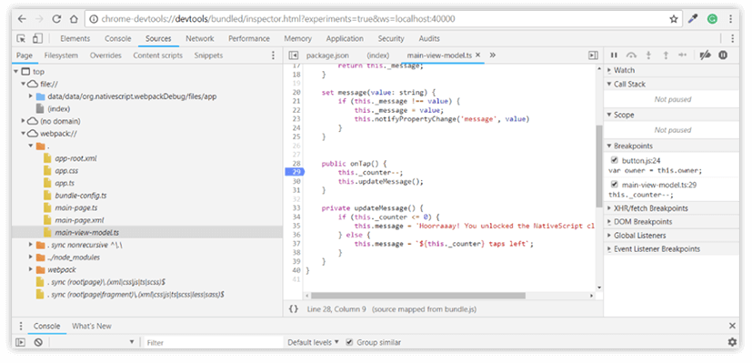
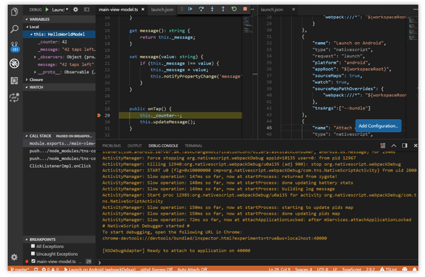
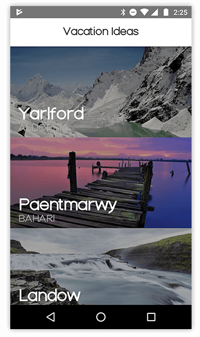

# NativeScript 4.2 is Here! 

While 42 might be the answer to everything, we are here with the hot-off-the-press NativeScript 4.2 release which answers at least some of your *NativeScript* questions: 

* Faster developer experience with LiveSync on Android;
* Debugging with Webpack;
* Flexible error handling;
* Easier generation of Android typings;
* Brand new look and feed of our [documentation](https://docs.nativescript.org/);
* Vue SFC support in the [NativeScript Playground](https://play.nativescript.org/);
* New plugin badges in the [NativeScript Marketplace](https://market.nativescript.org/);
* ...and much more! 

> For details, continue reading this blog post, but also review NativeScript’s [CHANGELOG](https://github.com/NativeScript/NativeScript/blob/master/CHANGELOG.md). 

Thanks to our community for all the effort and collaboration during this release! The full list of contributors is [available below](#community). Would you like to learn how to contribute to NativeScript? [See how!](#contribute)

Get started with NativeScript 4.2 now with `npm install -g nativescript` and learn how to [update your existing NativeScript apps](https://docs.nativescript.org/releases/upgrade-instructions).

## LiveSync Performance and Stability Improvements 

With this release we have **rewritten LiveSync for Android**. The old solution was not stable enough and it had many performance issues. It relied on creating temp files on the device and copying them once the app started. This solution led to many issues, especially with latest Android version. For example, you may have hit an issue where you deploy a new version of your app to a device, but once it starts, you see some old version instead.

Now, all of this is in the past! **LiveSync for Android now uses sockets instead of temp files.** This solution allows us to reliably send files to your device without using some "forbidden" location and taking up additional storage on the device. Once LiveSync is working and you apply a change, it will be sent to the device much faster, as the CLI no longer spawns additional `adb` processes.

Please note that the new LiveSync requires the latest CLI and latest Android runtime to be used (learn how to update your runtimes [here](https://docs.nativescript.org/releases/upgrade-instructions)). In case you have an older version of the runtime, the CLI will fall back to the old behavior. 

We have also applied several performance improvements to project creation and adding the runtimes to the project. For example, we have sped up `tns platform add android` from more than 2 minutes to just 6 seconds! 

## Debugging with Webpack 

The latest [nativescript-dev-webpack@0.15.0](https://github.com/NativeScript/nativescript-dev-webpack) now enables debugging a NativeScript application bundled with Webpack. This highly desirable functionality brings a full developer experience for bundled NativeScript applications and now you can develop and debug your mobile app faster through the Webpack builds. You can debug bundled applications with **Chrome Dev Tools** or via the **Visual Studio Code extension**. 

### Chrome Dev Tools debugging of bundled applications 

Follow these easy steps to enable and start debugging your bundled application: 

1) Make sure the 0.15.0 version of nativescript-dev-webpack is installed. 

	npm i nativescript-dev-webpack@latest --save-dev 

2) Start the debugging process while passing the `--bundle` flag to the `debug` command:

	tns debug android --bundle 
	// or 
	tns debug ios --bundle 

3) The `debug` command builds and deploys a new package on a connected device or emulator. After the project is built and deployed, the debugger is started, and a Chrome DevTools URL will be generated similar to the following: 

	To start debugging, open the following URL in Chrome: 
	
	chrome-devtools://devtools/bundled/inspector.html?experiments=true&ws=localhost:40000 

> For security reasons, the debugging agent can't be started automatically from the command-line. That's why the NativeScript CLI generates a URL which is printed on the screen instead. You need to manually copy it in Google Chrome's address bar to start debugging. 

4) In Chrome DevTools, choose the **Source** tab and you will see a project structure with a folder named "webpack://". Expand the folder and you will find the application source files in the dot folder (" . "). You can start debugging the application by applying a breakpoint on your behalf (more in the detailed [Chrome Dev Tools article](https://docs.nativescript.org/tooling/debugging/chrome-devtools)). The source files of the plugins are located in the **node_modules** folder and can also be debugged on the fly.

### VS Code debugging of bundled applications 

The latest version of the [NativeScript Visual Studio Code extension](https://www.nativescript.org/nativescript-for-visual-studio-code) also supports debugging of bundled NativeScript applications. To enable the Webpack debugging via VSCode follow these steps: 

1) Update the VS Code extension to the latest version. 

2) Make sure the 0.15.0 version of nativescript-dev-webpack is installed. 

	npm i nativescript-dev-webpack@latest --save-dev 

3) Open the `launch.json` file in VS Code and add the `--bundle` flag to the `tnsArgs` key for the desired debug option. 

For example: 

	{ 
	    "name": "Launch on Android", 
	    "type": "nativescript", 
	    "request": "launch", 
	    "platform": "android", 
	    "appRoot": "${workspaceRoot}", 
	    "sourceMaps": true, 
	    "watch": true, 
	    "sourceMapPathOverrides": { 
	        "webpack:///*": "${workspaceRoot}/app/*" 
	    }, 
	    "tnsArgs":["--bundle"] 
	}, 

> Note that VS Code will autogenerate the `sourceMapPathOverrides` key.

4) Set breakpoints and start debugging with VS Code!

## Flexible Error Handling with Trace Module 

Error and exception handling have been a hot topic within the NativeScript community lately. Mainly because unhandled JS exceptions cause NativeScript apps to crash, while in the browsers these are just reported on the console. Generally, crashes are not something you want in your production app and you would want to have a control over those even during development. That's why we've added some additions to the trаce APIs that will help you do this. You can now add your custom `ErrorHandler` and decide whether to throw, ignore, report, or do something else with the error. For more info you can [check the github issue](https://github.com/NativeScript/NativeScript/issues/5914) and the [error handling guide](https://github.com/NativeScript/NativeScript/blob/master/HandlingErrors.md) for NativeScript. 

> Kudos go to the NativeScript masters from [nstudio](https://nstudio.io/) for the help and to all the folks involved in defining the requirements and helping with feedback on this issue. 

## Discard Uncaught JavaScript Exceptions Mode 

By default, in both the iOS and Android NativeScript runtimes, if an exception is thrown when executing JavaScript code which is called from a native API it will crash the application showing the stack trace. If you want the exception stack trace to be logged, but the app *not* to crash you can enable the `discardUncaughtJsExceptions` flag in the `app/package.json` file: 

	{ 
		"discardUncaughtJsExceptions": true 
	} 

This mode can be useful for production if you want to minimize the application crashes.

## Updates in Android Typings Generation 

We have improved the [android-dts-generator](https://github.com/NativeScript/android-dts-generator) tool for easier generation of typings for native dependencies. Now it is quite easy to create `.d.ts` files for your plugins! More details can be found in [this article](https://docs.nativescript.org/core-concepts/android-runtime/metadata/generating-typescript-declarations). 

In addition, the [tns-platform-declarations](https://www.npmjs.com/package/tns-platform-declarations) package now includes Android typings for all the platforms from 17 to 27, so if you target android platform 24 or above, for example, you can use the following `.d.ts`: 

	<reference path="./node_modules/tns-platform-declarations/android-24.d.ts" /> 

## New NativeScript Docs

The [NativeScript documentation](https://docs.nativescript.org/) recently went through a major overhaul. We dramatically changed the look and feel by implementing a much lighter and pleasant color scheme and fonts. The *Table of Contents* was restructured to group topics in meaningful categories and organized them in a logical manner.  

We also added some new functional elements, like the right sidebar which aims to provide you with easy access to the most relevant actions and information: subsections, links to the API reference, link to GitHub. We also made sure to acknowledge all the feedback received by you during the past 2+ years.  

Our next steps in terms of documentation will aim to improve the SEO, so that you can spend less time in searching for content and more time in actually building your applications.

## NativeScript Marketplace Update 

### Code Sample Preview in Playground 

With the [NativeScript Playground](https://play.nativescript.org/) being one of the easiest ways to interact with NativeScript and having the [Code Samples in the Marketplace](https://market.nativescript.org/?tab=samples&framework=all_frameworks&category=all_samples) as a curated list of building blocks for your next killer app – we decided to combine the best of these two worlds and give you the opportunity to play easily with every Code Sample in the Playground. **With just one click you can bring to life every example that we've prepared** – deploy it to a device, change it, and tweak or twist it until it fit your needs.

### More Plugin Badges 

In an effort to further strengthen our plugins ecosystem we are constantly enhancing the Marketplace to provide meaningful meta information about the NativeScript plugins and provide transparency and reliability in terms of support, documentation, and feature richness. In this release we are adding what we call *dynamic badges*.

At first glance they look like the badges you already are familiar with. We call them "dynamic" because under the hood we are running automatic regular checks to **validate the state** of every plugin presented in the Marketplace. A good example is the **Webpack badge** that we recently introduced. We recognize that webpack is a critical piece of the development workflow and plugin compatibility is something that may bring a surprise to the table. We added the Webpack badge to certify that the given plugin can be successfully built with webpack enabled. To provide you with this tiny piece of very useful information, our tireless build machines are downloading every single NativeScript plugin and crunching the numbers for 6 hours every night to add the plugin to a blank application and ensure that the application can be successfully run.  

A low price to pay for the peace of mind when you execute `tns plugin add ...`! 

## NativeScript Pro UI 

During the timeframe of the 4.2 release, we released several new versions of [RadListView](https://docs.nativescript.org/ui/rich-components#listview) and [RadSideDrawer](https://docs.nativescript.org/ui/rich-components#sidedrawer). As these are the two most used NativeScript Pro UI plugins, we put dedicated effort in fixing bugs, adding new capabilities and improving the performance.

Your help is invaluable in this effort – reporting the problems you are experiencing is helping us to work on the most valuable work items. 

## Vue.js Single File Component Support in the Playground 

The number of NativeScript users who prefer [Vue.js](https://nativescript-vue.org/) as a framework is rising every day - in fact, they more than doubled over the past 6 months!

This is mainly a community-driven effort and the {N} engineering teams provide a lot of assistance to the effort. With this release, we decided to add [Single File Component (SFC) support in the {N} Playground](https://play.nativescript.org/?template=play-vue). We know from your feedback that the Playground provides the the best "getting started" experience to the NativeScript ecosystem. At the same time, the concept of Single File Components in Vue.js is unique and a pretty distinctive paradigm. We hope that with this feature will make our Vue.js ninjas feel at home in the Playground. 

## Thanks to Our Community! ❤️ 

We couldn't do what we do without the support of our community. Here are just some of the community members that helped make this release a reality! 

         

### Would You Like to Contribute? 

Do you want to become a contributor and have your avatar included in our next blog post? [Check the NativeScript contribution guide](https://github.com/NativeScript/NativeScript/blob/master/CONTRIBUTING.md) and start with any of the [good first issues](https://github.com/NativeScript/NativeScript/labels/good%20first%20issue).

If writing documentation is more appealing to you than writing code, go and [check how you can help the team](https://github.com/NativeScript/docs/issues?q=is%3Aopen+is%3Aissue+label%3A%22good+first+issue%22) filling the gaps in our documentation.

Thanks (in advance) for any and all help you provide!

## What’s Next from NativeScript? 

We are already at full speed for the next release. Our focus will continue to be on providing a supreme development experience and top-notch performance. Also, it’s going to be a busy autumn with the latest releases of Android and iOS – luckily, NativeScript has your back and we will put dedicated effort to ensure a smooth transition for you to the latest version of both mobile platforms.

If you are eager as we are for the vNext release – be sure to book a seat at our [jsMobileConf](https://jsmobileconf.com/) event coming up in October in Boston, MA. You will be able to touch and play with the latest NativeScript features we are bringing to the table and learn more about some cutting-edge technology in the extended JavaScript ecosystem! 