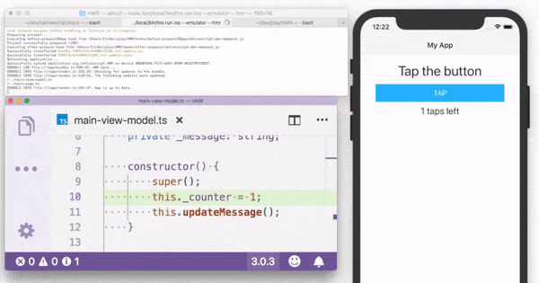
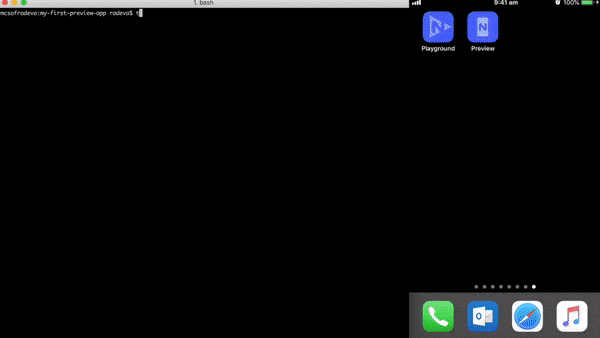
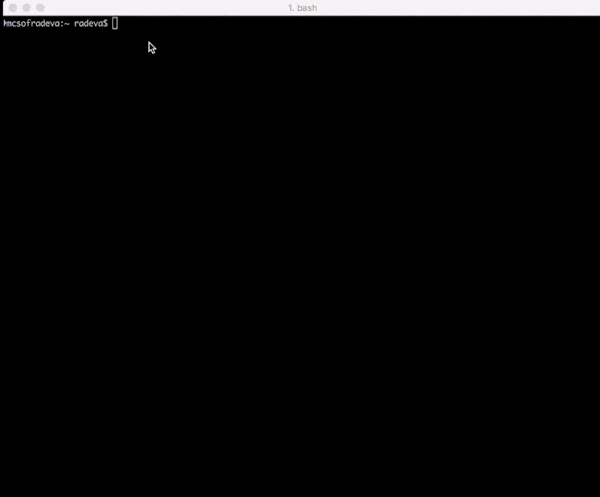
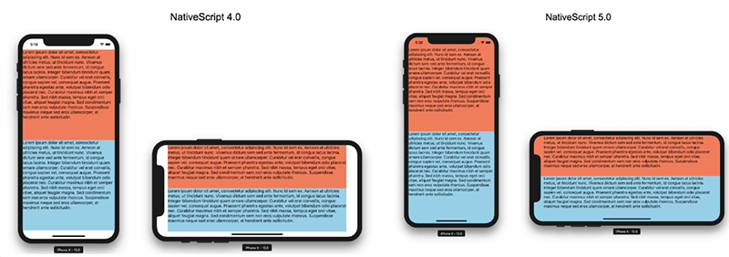

# NativeScript 5.0 is hot 🔥 out of the oven!

It took us a month more than usual to bake NativeScript 5.0, but what a release it is! It comes out 🔥, with many improvements in the developer experience, improved Vue.js support, and enablement of more native features:

- 🔥📦🔃 Hot Module Replacement aka HMR (Beta) 
- Enabled `tns preview` in the Playground Preview app via the CLI 
- Interactive `tns create` 
- Completed "Safe Area" support in iOS 
- Migration to support Android library APIs v28 
- Support for different app IDs for iOS and Android 
- Vue.js support for all [NativeScript UI](https://www.nativescript.org/ui-for-nativescript) components (thanks to our community!) 
- ...and much more!

Let's take a look at the details:

## Hot Module Replacement 

One of the hottest commands in this release is `tns run ios|android --hmr`! You can get the benefit of extremely fast development cycles with minimized application restarts and no lost state. This feature is part of our continuing effort to provide a stellar development experience and we are proud of what we have delivered so far. Additionally, we have more ideas to push this even further, documented in [this GitHub Issue](https://github.com/NativeScript/NativeScript/issues/6398). 

More details on the technical implementation and how all this works behind the curtains will be shared in a dedicated blog post in the following weeks. 

## Preview in the Playground Preview App from the CLI 

We know you love [NativeScript Playground](https://play.nativescript.org) and the experience it provides with its Preview app. That's why we decided to bring this same experience to the CLI. You're now able to use the same workflow along with your editor of choice and preview your app directly on a physical device with the Playground & Preview companion apps.

The usage from the CLI is easy: 

- Run the `tns preview` command
- Scan the provided QR code using the NativeScript Playground app, just as you do in the Playground 
- Preview your app on your device!

And that's not all! Using `tns preview` allows **Windows users to preview apps on iOS**. Isn't that cool?! 

 

> To view more details on the usage and the limitations, [read our documentation](https://docs.nativescript.org/start/quick-setup). 

## Enhanced tns create Command 

Before 5.0, running the `tns create` created an empty JavaScript app by default. For Angular or TypeScript the user was required to explicitly use options like `--ng` and `--tsc`.

Now, with 5.0, we guide the user through project creation by asking them for their preferred NativeScript app style - Pure JavaScript or TypeScript, Angular, or Vue.js - and their preferred NativeScript template - Blank, Hello World, SideDrawer, or Tabs. You no longer need to explicitly use the additional options or to know the exact name of every basic template such as SideDrawer and Tabs. The command will guide you through the process. 

 

## Complete Safe Area Support for iOS 

Following our commitment to support our users in their effort to create stunning-looking apps, we are now providing full support for Safe Areas for iOS devices. You can now literally push the boundaries of your devices and create immersive UX in your apps.

More details covering various scenarios will be provided soon in a dedicated blog post - and [here is the dedicated documentation](https://docs.nativescript.org/angular/ui/layouts/layouts#ios-safe-area-support).

## Migration to Support Library APIs v28 

You will now be able to make use of the latest features available in the [Android Support Library v28](https://developer.android.com/topic/libraries/support-library/revisions#28-0-0). Up to now, the supported version was `v26-alpha`. After upgrading to {N} 5.0 you will need Support Library APIs v28 installed on your developer machine to be able to successfully build your applications. Instructions are [provided in the upgrade steps](https://github.com/NativeScript/NativeScript/wiki/Early-Testing-of-NativeScript-5.0-RC#update-android-sdk). 

## Support for Different App IDs for iOS and Android 

Before 5.0, iOS and Android applications had to have the same `applicationId`. This could cause issues if you were migrating old applications that have different identifiers. Now you have the flexibility to set different `appIds` on both platforms, following the [provided documentation](https://docs.nativescript.org/angular/tooling/changing-appid).

## Improved Vue.js Support for NativeScript UI Components 

When you talk and write – we listen and execute. Based on the last community survey, one of the top-voted features by [NativeScript-Vue](https://nativescript-vue.org/) lovers was better support for the [NativeScript UI components](https://www.nativescript.org/ui-for-nativescript). We spent the last two months improving the Vue.js wrappers of all components and adding more demos and examples to the documentation. 

## Create Plugins Directly from the CLI 🔌

Up until now, plugin authors had to clone the [NativeScript plugin seed](https://github.com/NativeScript/nativescript-plugin-seed) and run some commands in order to start building a new plugin. With 5.0 we introduced a new command `tns plugin create` which will do this out of the box and guide the plugin author to through the process.

## LiveSync & Debug Improvements 

As developers we spend most of our time in the cycle of write code -> test it -> debug it. And our time is precious, probably the most precious resource we have! Our team spent a great deal of time optimizing this cycle in the context of NativeScript development. With the latest changes you can expect significant improvement (around 20-30% ) in the initial time it takes for a LiveSync operation (times may vary depending on the development workstation and the application). 

## Other Notable Changes 

- 5 new verified plugins were added to the Marketplace – [nativescript-photo-editor](https://market.nativescript.org/plugins/nativescript-photo-editor), [nativescript-socketio](https://market.nativescript.org/plugins/nativescript-socketio), [nativescript-rating-dialog](https://market.nativescript.org/plugins/nativescript-rating-dialog), [nativescript-webrtc-plugin](https://market.nativescript.org/plugins/nativescript-webrtc-plugin). Be sure to thank the authors – [Peter Staev](https://market.nativescript.org/author/pstaev), [Osei Fortune](https://market.nativescript.org/author/triniwiz) and [Jonathan Mayunga](https://market.nativescript.org/author/skhye05) for delivering high quality components to the community. 
- Dropped support for macOS Sierra – our analytics show that the usage of this version of macOS is less than 2% of the overall usage. We decided to drop the support for macOS Sierra and to focus our attention and resources to newer versions. 
- Removed support for XCode 8 
- More than 10 issues with high and critical severity were addressed in the NativeScript UI components. Special attention was dedicated to improving complex scenarios like using both "Pull To Refresh" and "Load On Demand" features in `RadListView`.

## What's Next? 

And since we don’t stop for a minute, here is what you can expect soon after 5.0: 

- Angular 7 support 
- More scenarios on flexible root composition with Angular 
- Fixes and improvements on Hot Module Replacement 

Stay tuned for more info on 5.1 - our Christmas release! 🎅🎄

Details will be available soon [in the release notes](https://www.nativescript.org/roadmap-and-releases#releases). 

## Thank You! 🤗

None of this would be possible without all of you who contributed your time to the open source NativeScript framework. Give yourselves a nice pat on the back!

