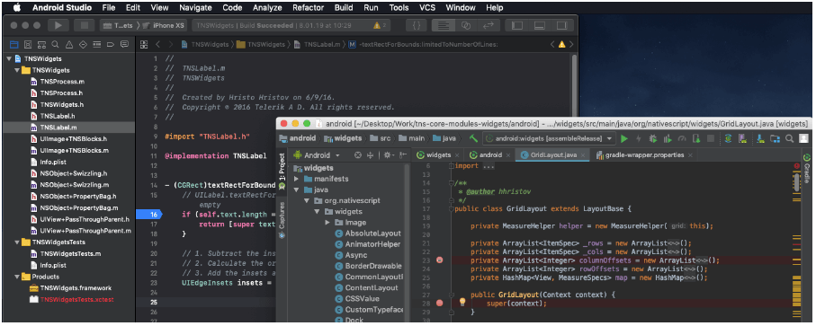
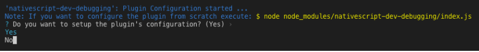
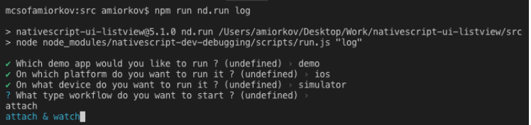
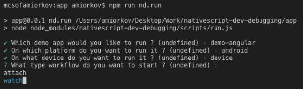
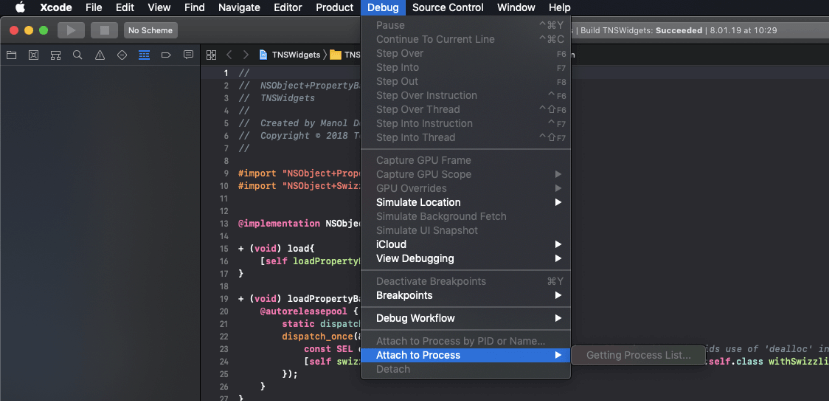
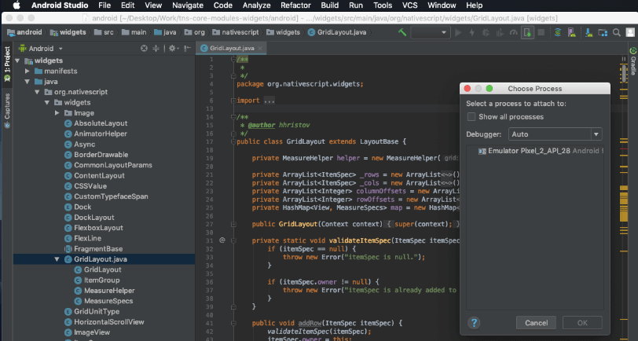

# A Guide to Debugging Your NativeScript Plugins

Have you ever wondered, "To what extent will I be able to develop the *complete source* of my NativeScript app and plugins?". You likely already know that the NativeScript framework provides you **full native platform (iOS/Android) API access**. That is all fine and good, but what does that mean for the inescapable future situation where you will be tasked with debugging that "corner case" bug, and you have to take a look under the hood and dig into the native Objective-C/Java code of your plugin code? The answer to this question is a resounding, **"Yes, you can!"**. But what about the next question, "How?". 

This is the question I will try to answer - and introduce you to a brand new approach for debugging the native source code of your plugin’s code.

## Introducing nativescript-dev-debugging

Today I want to introduce you to `nativescript-dev-debugging`, an npm package you can download:

	npm i nativescript-dev-debugging --save-dev

This package is not like any other NativeScript npm package in the way that it does not provide any UI, behaviors, or code compile/bundle for your app. But it does provide something that is best described as a *workflow*. Ok, you may ask "What is a workflow?".

> A **workflow** consists of an orchestrated and repeatable pattern of business activity enabled by the [systematic](https://en.wikipedia.org/wiki/System) organization of [resources](https://en.wikipedia.org/wiki/Resource) into processes that transform materials, provide services, or process information. ([wikipedia](https://en.wikipedia.org/wiki/Workflow))

This is absolutely what the `nativescript-dev-debugging` provides, specifically for the task of **debugging a NativeScript Plugin**. In its core functionality, the package basically does the following five steps for you:

1. **Builds your NativeScript’s plugin’s native source code.** Imagine that your plugin is consuming an `.aar` file and a `.framework` file and you have their source code (that a different native iOS and Android team created)
1. **Opens that source code in the IDE** that is specific for the platform you are debugging - Xcode for iOS or Android Studio for Android
1. **Moves the output of the build processes** from step 1 to your NativeScript plugin’s structure
1. **Rebuilds your “test” application** which has been set up to use a symlink of the NS plugin
1. **Triggers custom “file watchers”** that will repeat step 1-3 when any of the NativeScript app code itself or the plugin’s native libraries change

The final product of the above sequence is a “workflow” that you can use to improve your development experience while working on a NativeScript plugin. A simple example of such plugin is the `tns-core-modules` plugin that consumes the `tns-core-modules-widgets` plugin, which simply holds the pre-built `.aar` and `.framework` files.

Ok, if you have made it this far you must be asking yourself “Ok I get it, ‘things’ need to rebuild, but how is that a 'workflow'?”. Well this is the best time to describe how - and why the idea of a package like `nativescript-dev-debugging` was created.

## How and Why (behind the scenes of the {N} office)

Internally in the NativeScript team, one of the things that 99% of the people have been doing is change the native code of a library used in a plugin (remember in NativeScript everything is a plugin), manually rebuild that code, manually move the product of that build to the plugins platforms directory, and manually trigger a build of the NS application that is used to test a new or fixed functionality. As you can see there is a lot of “manually” in this workflow, so the idea was “What if we can automate this ‘manually’ so that the entire NativeScript team uses the same approach while doing their day to day work on the framework”. This would mean that all of the teams will be more productive and will allow for easier collaboration because everyone will know the steps of how things are done.

Naturally after we have decided to do something about unifying and automating this workflow we immediately decided to make this output available to the entire NativeScript community, so that we can help anyone that faces such tasks to do their work faster and easier, and even showcase that changing the native code of a library is not that hard.

You must be thinking “Ohh wow this is way too much information” just give me the workflow and be done with it!". You are in luck - the `nativescript-dev-debugging` dev plugin is relatively easy to use once you understand what it does.

First, you will need to install (`npm install nativescript-dev-debugging`) and configure the package so that all of its internal build/watch scripts can do their work on your source code. After installing the package, simply follow the interactive configuration steps that will ask you for the locations of all of the “parts” that will be be used to build all of the source code that you want to debug/develop.

Here is the configuration that will be generated after installing the package:

	{
		"pluginSrcFolder": "/Users/USER/plugin_repo/src",
		"pluginPlatformFolder": "/Users/USER/plugin_repo/src/platforms",
		"pluginIosSrcFolder": "/Users/USER/plugin_repo/src-native/ios",
		"iosLibraryName": "LibraryName",
		"pluginAndroidSrcFolder": "/Users/USER/plugin_repo/src-native/android",
		"androidLibraryName": "LibraryName",
		"demoFolder": "/Users/USER/plugin_repo/demo",
		"demoAngularFolder": "/Users/USER/plugin_repo/demo-angular",
	"demoVueFolder": "/Users/USER/plugin_repo/demo-vue",
		"provisioningProfile": ""
	}

This is the content of a file named `.debug.config.json` that holds all of the configurations after the initial plugin setup. This can be used to enable CI testing of your NS plugin, but more on this later.

After you have installed the package you will note that your plugin’s `package.json` has a few new npm script commands. This is where all of the magic of the `nativescript-dev-debugging` package lives. Do not worry about updating those commands now or in the future, they will be automatically maintained when we update the plugin with fixes and new functionality. You can look at these commands as the bits in the workflow that are maintained by the plugin so that you don't have to worry about how to build your native library.

Here is what executing the main `nd.run` command looks like:

After you have successfully installed and configured the package, the main npm script command that you will use is `nd.run`. This command provides all of the functionality in a interactive way so that you can easily choose what workflow you want to start for a specific moment in your work. Here are the current workflows that are provided, *two for iOS and two for Android*:

- **demo ios simulator attach** - Rebuild your iOS test app, rebuild the plugin’s native source code and prepare for debugging it in Xcode (useful when you want to simply hit breakpoints in the native code and change the source of the NS app itself)
- **demo ios simulator attach & watch** - Rebuild your iOS test app, rebuild the plugin’s native source code, WATCH it for changes and prepare for debugging it in Xcode (useful when you want to develop new functionality in the native source code of your plugin’s code)
- **demo android simulator attach** - Rebuild your Android test app, rebuild the plugin’s native source code and prepare for debugging it in Android Studio (useful when you want to simply hit breakpoints in the native code and change the source of the NS app itself)
- **demo android simulator attach & watch** - Rebuild your Android test app, rebuild the plugin’s native source code, WATCH it for changes and prepare for debugging it in Android Studio (useful when you want to develop new functionality in the native source code of your plugin’s code)

Do not worry about remembering all of the specific commands, there is a better more “interactive” way you can trigger the right workflow, more details later on.

## How to Use nativescript-dev-debugging

Let’s see how the `nativescript-dev-debugging` plugin can be used in a real use case. In my example I have decided to use the `tns-core-modules` package, which is developed and maintained by the NativeScript team and by our community. Before we begin, let’s set an imaginary goal and what challenges we have:

**Our goal:** *Investigate an issue that we think is located in the native iOS and Android code of the tns-core-modules.*

**The challenges:**

- How do we build the tns-core-modules native code?
- How and where can we view and debug it?
- How can we sync our local changes to that code in an efficient and fluent way so that our work does not get interrupted?

Let’s start by preparing the local version of the `tns-core-modules`, `tns-core-modules-widgets` source code, and our test application. Note this is not a requirement of the `nativescript-dev-debugging` plugin, and can be avoided if you have already prepared your test app to by using a symlink of your plugin’s source code like the NS plugin seed suggests:

1. First we need to download the respective repositories of the `tns-core-modules` and the `tns-core-modules-widgets`. you can do so from [here](https://github.com/NativeScript/NativeScript) and [here](https://github.com/NativeScript/tns-core-modules-widgets). Make sure to download both of them to the same directory on your desktop in a directory called **ns-dev-debugging** so the below commands work best. Both repositories provide a “Developer Workflow” and it is recommended but not required to read them before proceeding.
1. After downloading the main NativeScript repository, navigate to its `tns-core-modules` directory, open it in a terminal and execute the TypeScript compiler. From the root of the NativeScript repository execute: `cd NativeScript/tns-core-modules/ && tsc`
2. Go to the `apps` directory and npm install the previously compiled local tns-core-modules: `cd ../apps/ && npm i ../tns-core-modules/`
3. Go to the root of the `tns-core-modules-widgets` repository and execute its `build.sh` script. This will build all of the necessary assets and create a dist directory that contains a local copy of the plugin: `cd ../../tns-core-modules-widgets && bash build.sh`
4. Go back to the `tns-core-modules` source directory (the apps directory in tns-core-modules) and again npm install the previously build tns-core-modules-widgets: `cd ../NativeScript/tns-core-modules/ && npm i ../../tns-core-modules-widgets/dist/package`

Now that all of the local source code is prepared and our test app is setup all that we need to do is install and configure the `nativescript-dev-debugging` plugin:

Go to `tns-core-modules` directory (this is the plugin which we are going to be debugging) and create a `n.debug.config.json` file with the following  contents (by default this file will be auto generated during the initial plugin configuration but for this example we are going to use the pre-defined configuration option):

	{
		"pluginSrcFolder": "/Users/‘UserNamePlaceHolder’/Desktop/ns-dev-debugging/NativeScript/tns-core-modules",
		"pluginPlatformFolder": "/Users/‘UserNamePlaceHolder’/Desktop/ns-dev-debugging/tns-core-modules-widgets/dist/package/platforms",
		"pluginIosSrcFolder": "/Users/‘UserNamePlaceHolder’/Desktop/ns-dev-debugging/tns-core-modules-widgets/ios/TNSWidgets",
		"iosLibraryName": "TNSWidgets",
		"pluginAndroidSrcFolder": "/Users/‘UserNamePlaceHolder’/Desktop/ns-dev-debugging/tns-core-modules-widgets/android",
		"androidLibraryName": "widgets",
		"demoFolder": "/Users/‘UserNamePlaceHolder’/Desktop/ns-dev-debugging/NativeScript/apps",
		"demoAngularFolder": "/Users/‘UserNamePlaceHolder’/Desktop/ns-dev-debugging/NativeScript/apps",
		"demoVueFolder": "/Users/‘UserNamePlaceHolder’/Desktop/ns-dev-debugging/NativeScript/apps",
		"provisioningProfile": ""
	}

> Note that you have to change the above directory paths to the actual paths from your environment (change the `UserNamePlaceHolder`)

Next, install the `nativescript-dev-debugging` plugin:

	npm i nativescript-dev-debugging --save-dev

**And that’s it! You’re done.** The dev plugin should have installed using the local `n.debug.config.json` file, and you should now see all of the `nd.*` npm script commands in the tns-core-modules `package.json` file.

Let’s see what commands are available by running `$ npm run nd.help` and choosing `main`. This will list a couple of the script commands that will trigger a workflow for the specific situation that you may want to work in. For example `$ npm run nd.demo.ios` can be used when you want to simply view the native code of your plugin but do not expect to make changes to it. Otherwise it is recommended to use the “`$ npm run nd.run` command because it provides a guided workflow for easier picking of scenario and ability to trigger “file watchers” to rebuild your native source code.

To get a better picture of what the above example will lead to you can see this video here that shows the result when running for iOS and for Android in these videos:

*Using "nativescript-dev-debugging" with iOS*

<iframe width="560" height="315" src="https://www.youtube.com/embed/pIfeFa8zzuk" frameborder="0" allow="accelerometer; autoplay; encrypted-media; gyroscope; picture-in-picture" allowfullscreen></iframe>

*Using "nativescript-dev-debugging" with Android*

<iframe width="560" height="315" src="https://www.youtube.com/embed/gvFl4Kzefl8" frameborder="0" allow="accelerometer; autoplay; encrypted-media; gyroscope; picture-in-picture" allowfullscreen></iframe>

**But there is even an easier way** to use the `nativescript-dev-debugging` commands without remembering the above long script commands! You can simply remember the shortest command `npm run nd.run` that will guide you with prompts on what workflow you want to start.

After you execute any of the commands that will run your “test app”, either Xcode or Android Studio will be opened automatically with the native source code of your plugin. To start your debug session you will have to attach to the process of your test app.

**For iOS**, after Xcode is opened, simply go to the menu **Debug > Attach to process**, find the ID of your test app (to find the ID look for the “id” tag in the `package.json` of the NativeScript app) and select it:

**For Android**, after Android Studio is opened, click the **Attach debugger to Android Process** icon located on the right of the top tab strip menus. Make sure to enable the **Show all processes** checkbox so that your app’s process is shown:

## Wrapping Up

If you have made it this far, thank you for reading this extended blog post! I hope you find it useful and that it will help you with all of the cool NativeScript plugins you are developing (and will be developing in the future).

You can find the source code of the plugin in the [nativescript-dev-debugging repository](https://github.com/NativeScript/nativescript-dev-debugging) and as always we welcome your contributions!

> **Disclaimer:** This blog post was written when the `nativescript-dev-debugging` plugin was at version 1.0.0. If you are reading this after that version you can find any significant changes in the [changelog](https://github.com/NativeScript/nativescript-dev-debugging/blob/master/CHANGELOG.md).
