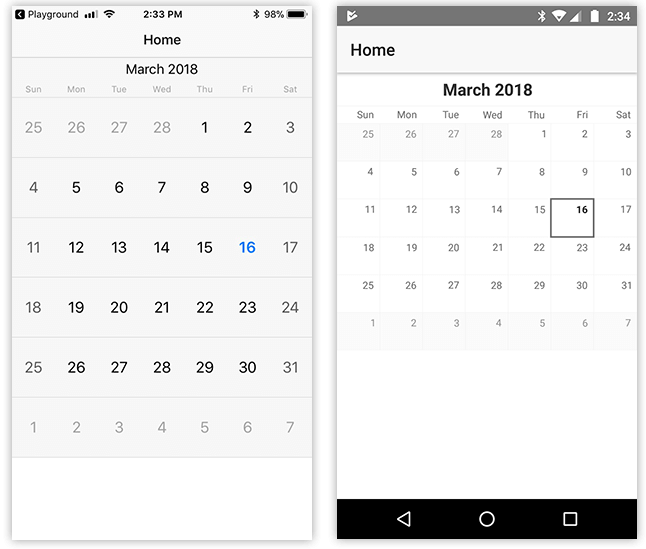
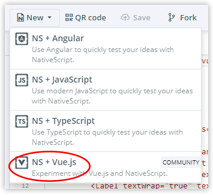
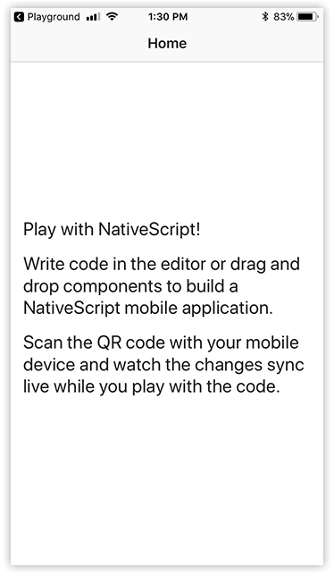
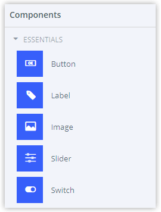
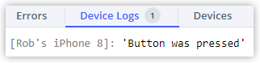

# A Brief Intro to Using Vue.js with NativeScript

Welcome to a week of [Vue.js](https://vuejs.org/) on the NativeScript blog! This week we are bringing you loads of Vue-related content, focusing on the [NativeScript-Vue](https://nativescript-vue.org/) plugin that brings the world of Vue.js to native mobile app development.

*Coming up this week you'll find topics such as:*

- A Brief Intro to Using Vue.js with NativeScript (wait...that's today)
- Setting Up a Robust NativeScript-Vue Development Environment (Tuesday)
- The Making and Remaking of Elocute (Wednesday)
- The NativeScript-Vue Roadmap: Where we are, where we want to go (Thursday)

Today we are going to focus on NativeScript-Vue for n00bs. Think along the lines of: *Why might I want to use Vue (versus Angular or plain JavaScript)? How do I get started with NativeScript-Vue? And where do I go next?*

**On that note, let's get started!**

> Be sure to sign up for the upcoming [NativeScript-Vue webinar](https://attendee.gotowebinar.com/register/9059771692589680643?source=week-of-vue) on April 5th, 2018!

## Why Vue.js?

The Vue.js framework was first released in 2014 by former Googler [Evan You](https://twitter.com/youyuxi). While at Google, Evan was a heavy user of [AngularJS](https://angularjs.org/) (not to be confused with [Angular](https://angular.io/) 😀), which makes a lot of sense as we start drawing the lines between these two frameworks.

Evan's experience with AngularJS inspired him to write a new framework that has a lighter touch, or at least less a complex feel, than Angular. This effort became what we know today as Vue.js.

Today Vue stands as [one of the most popular JavaScript frameworks](https://stateofjs.com/2017/front-end/results/), behind Angular(JS) and React. Why? At 20KB the core library is tiny, but contains enough powerful capabilities to make it an engaging alternative to Angular or React. Vue contains features such as:

- Virtual DOM;
- Templating;
- Event handling;
- Reactive and composable view components;
- CSS-based transitions and animations;
- Computed properties;
- [Performant](http://www.stefankrause.net/js-frameworks-benchmark7/table.html) and focused core library;
- And [much more](https://vuejs.org/v2/guide/index.html)...

*Sound a bit like AngularJS?*

Fast forward ➡️ to 2017. NativeScript is taking off with its [Angular integration](https://www.nativescript.org/nativescript-is-how-you-build-native-mobile-apps-with-angular). But Angular is admittedly not for everyone, and the NativeScript Core (a.k.a. vanilla JavaScript) option doesn't provide enough structure for others. Due to the extensible nature of the NativeScript framework, it became obvious that a Vue.js integration was achievable. Enter [Igor Randjelovic](https://twitter.com/igor_randj) and NativeScript-Vue:

EMBED TWEET: https://twitter.com/igor_randj/status/854501034697383936

## What's this NativeScript-Vue Thing?

The beauty of open source is watching anyone justly inspired and skilled build on top of a foundation you've provided. Igor's NativeScript-Vue concept was latched onto immediately by the NativeScript Developer Relations team and some prominent community members. We all realized we had something special in our hands.

**So what is [NativeScript-Vue](https://nativescript-vue.org/)?** Quite simply it's a plugin that enables the usage of Vue.js with NativeScript. It's not a fork of Vue nor is it a fork of NativeScript. It builds on those frameworks' capabilities to provide you with the means to create truly native, cross-platform, apps with this shiny new tool everyone is raving about.

Since Vue.js doesn't (directly) interact with the browser's DOM (similar to React and Angular), code you might have thought was only meant for the web works just fine in a NativeScript app (save for different template syntax):

	const Vue = require("nativescript-vue");
	
	new Vue({
	  methods: {
	    onButtonTap() {
	      console.log("You tapped the button!");
	    },
	  },
	
	  template: `
	    <Page class="page">
	      <ActionBar title="Home" class="action-bar" />
	      <ScrollView>
	        <StackLayout>
	          <Label text="Hello World!" />
	          <Button text="Tap Me" @tap="onButtonTap" />
	        </StackLayout>
	      </ScrollView>
	    </Page>
	  `,
	
	}).$start();

Now if you're here, you probably:

- Want to create a native iOS and/or Android app (hybrid solutions just don't cut it);
- Want to keep using JavaScript;
- Want to keep using (or start using!) Vue.js.

**So what's the catch?**

Transitioning from the web to native mobile isn't without *some* learning curve. When learning to Vue.js the NativeScript way, you have to consider:

- You'll want to learn the in's and out's of the [NativeScript CLI](https://docs.nativescript.org/docs-cli/start) or [NativeScript Sidekick](https://www.nativescript.org/nativescript-sidekick);
- You'll have to grok the concept of [NativeScript UI elements](https://docs.nativescript.org/ui/components) (think about it like a better version of the DOM 😉).

## How Do I Get Started?

If you're new to [NativeScript](https://www.nativescript.org/), I apologize as I've gotten a bit ahead of myself. NativeScript is an open source (Apache 2 licensed) framework for building native, cross-platform mobile apps from one codebase. Think along the lines of JavaScript + CSS + XML-flavored markup with a bit of [NativeScript UI](https://www.nativescript.org/ui-for-nativescript) magic turns this:

	<Page class="page" xmlns="http://www.nativescript.org/tns.xsd" xmlns:calendar="nativescript-ui-calendar">
		<ActionBar title="Home" class="action-bar"></ActionBar>
		<StackLayout>
			<calendar:RadCalendar />
		</StackLayout>
	</Page>

...into this:

> For more information on getting started with NativeScript, [take a look at our tutorials](https://docs.nativescript.org/).

With the pleasantries out of the way, let's take a quick look at using NativeScript-Vue to create a quick app that will work equally well on iOS and Android.

## NativeScript Playground

There are a few different ways to really dig in with NativeScript:

- [NativeScript CLI](https://www.npmjs.com/package/nativescript)
- [NativeScript Sidekick](https://www.nativescript.org/nativescript-sidekick)
- [NativeScript Playground](https://play.nativescript.org/?template=play-vue)

They each have their advantages, but today we want the most friction-free route, which I think is the Playground.

The [NativeScript Playground](https://play.nativescript.org/?template=play-vue) provides a web-based environment for quickly scaffolding sample apps. Whether you are experimenting with NativeScript or want to share a code sample with someone, the Playground is an ideal way for you to write code and run it on a physical device with minimal interference.

To really see the power of the NativeScript Playground, you're going to want to download a couple of free apps from the App Store or Google Play:

- **iOS:** [Playground](https://itunes.apple.com/us/app/nativescript-playground/id1263543946?mt=8) and [Preview](https://itunes.apple.com/us/app/nativescript-preview/id1264484702?mt=8)
- **Android:** [Playground](https://play.google.com/store/apps/details?id=org.nativescript.play) and [Preview](https://play.google.com/store/apps/details?id=org.nativescript.preview)

Two apps? What gives!? One app (Playground) let's you scan a Playground-provided QR code and load your code into the other app (Preview). You can think of Preview as a kind of a dummy container that your app runs inside.

## Getting Started

With the [NativeScript Playground](https://play.nativescript.org/?template=play-vue) open, click the **New** menu and choose to create a new Vue.js instance (if you're not already using a Vue template):

Next, click the **QR Code** menu option and scan that code using the previously downloaded **NativeScript Playground app** on your device. You should see something like this:

Ok, that's not the *coolest* example of a native mobile app. But it *is* a native app, using native UI. **Let's pretty it up a bit!**

Go ahead and delete everything inside of your `<StackLayout>` tag. Then, add an `<Image>` and a `<Button>` element by dragging and dropping them from the **Components** menu:

...into your code (within the `<StackLayout>` tag).

Your resulting template should look like this:

	<Page class="page">
		<ActionBar title="Home" class="action-bar" />
		<ScrollView>
			<StackLayout class="home-panel">
				<Image src="https://play.nativescript.org/dist/assets/img/NativeScript_logo.png" />
				<Button text="Button" @tap="onButtonTap" />
			</StackLayout>
		</ScrollView>
	</Page>

When you hit the **Save** button (or just cmd/ctrl-S), you should see the app *automatically* refresh on your device.

We can now pretty it up a little bit by using the [NativeScript Core Theme](https://docs.nativescript.org/ui/theme). This theme ships with every new NativeScript app and is applied to individual UI elements with classes. Go ahead and add `class="btn btn-primary"` to your `<Button>` element. You should end up with a nicer looking (but still native) button:

You also may have noticed that the Playground populated your `methods` object for you with an `onButtonTap` method:

	methods: {
		onButtonTap() {
			console.log("Button was pressed");
		},
	},

Go ahead and tap on the button. Back in the Playground you should see an entry in the **Device Logs**, a great way to perform basic debugging:

At this point, you should consider logging in to save (and share) your Playground with others.

**Hey, you're a NativeScript AND Vue developer now! Without writing any code! 😜**

## What's Next?

The world is your oyster, but for now, stay tuned to the NativeScript blog all week and you'll learn a lot more from some folks who are a lot smarter than I.

But if you're itching for some more NativeScript-Vue content, take a look at the [quick start available at nativescript-vue.org](https://nativescript-vue.org/en/docs/getting-started/quick-start/) and don't forget to [sign up for the NativeScript-Vue webinar](https://attendee.gotowebinar.com/register/9059771692589680643?source=week-of-vue)!

