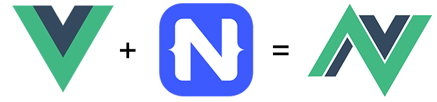

# Looking Back at the NativeScript-Vue Webinar and What's Next

Last week the NativeScript Developer Relations team joined forces with [NativeScript-Vue](https://nativescript-vue.org/) creator [Igor Randjelovic](https://twitter.com/igor_randj) to provide 48 minutes of gushing love 😍 for Vue.js and the NativeScript-Vue integration.

**In case you missed the webinar, no worries!** We recorded the entire presentation and have made it available on the [NativeScript channel](https://www.youtube.com/channel/UCORcUyJOXjF4PbwCP6R6dGw) on YouTube:

iframe width="853" height="480" src="https://www.youtube.com/embed/LDqsuLQqLrQ" frameborder="0" allow="autoplay; encrypted-media" allowfullscreen></iframe>

*Included in the webinar is commentary on Vue.js, instructions on setting up your own development environment, a sneak peak on sharing code between an existing Vue.js web app and NativeScript, and a look at the NativeScript-Vue roadmap.*

## Quick Start

After the webinar, many of you are probably wondering where to go to get started. And quickly.

👉 Your best bet for a super easy startup experience is the [NativeScript Playground](https://play.nativescript.org/?template=play-vue). The NativeScript Playground is where you can play around with NativeScript and Vue.js in your browser. Use the Playground to drag-and-drop components, write code, and preview your app on a physical device.

👉 If you're interested in diving deeper, you need to [install NativeScript tools locally](https://nativescript-vue.org/en/docs/getting-started/installation) and then [pick a Vue-based template](https://nativescript-vue.org/en/docs/getting-started/templates) to start developing app.

## Week of Vue Articles

Additionally, you might be interested to know the NativeScript blog recently hosted a "week of NativeScript-Vue" series. The content provided includes:

- [A Brief Intro to Using Vue.js with NativeScript](https://www.nativescript.org/blog/a-brief-intro-to-using-vue-with-nativescript)
- [Using Plugins in a NativeScript-Vue App](https://www.nativescript.org/blog/using-plugins-in-a-nativescript-vue-app)
- [Setting Up a Robust NativeScript-Vue Development Environment](https://www.nativescript.org/blog/setting-up-a-robust-nativescript-vue-development-environment)
- [The Writing and Rewriting of EloCute: A NativeScript-Vue Story](https://www.nativescript.org/blog/the-writing-and-rewriting-of-elocute-a-nativescript-vue-story)

Keep your eyes on [nativescript-vue.org](https://nativescript-vue.org/) 👀 as Igor and other community members introduce new and better ways to continue to use Vue.js with NativeScript to create truly native, cross-platform, mobile apps for iOS and Android.