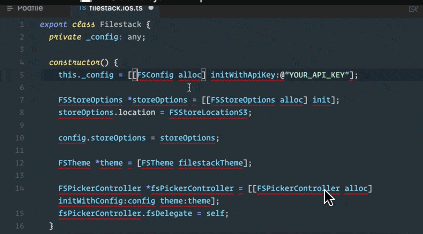
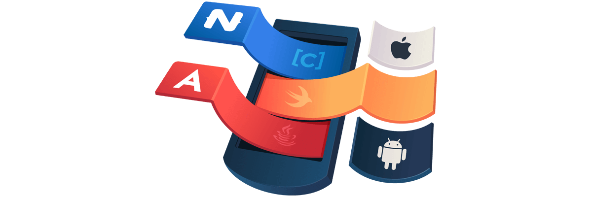

# Video Course: Use Objective-C, Swift, and Java APIs in NativeScript for Angular

A lot of powerful libraries are written in Objective-C/Swift for iOS and Java for Android. With NativeScript you have direct access to these APIs from JavaScript/TypeScript, relieving you as a developer from needing to rely on a potential third party bridge. This also gives you the power to harness your entire native mobile project within a single codebase and IDE of your choice, which is rather unprecedented.

Previously, integrating with a third party Objective-C library for iOS might have required working with XCode and then another bridge layer often written in JavaScript to open up access to that library. With Android, you might have needed to open Android Studio to work with a gradle plugin and then back to the bridge layer, then on to integrate with your codebase. This process has the potential to be error prone because, as time marches onward, you are often making blind calls to a higher level *bridge api* hoping that the underlying native API call is not only correct but up to date as well.

**With NativeScript you just make the change and keep developing with no disruption.** The result is a very elegant development experience and delightfully fun to work with.

To demonstrate these unique and powerful capabilities of NativeScript, you can view a video course highlighting how to include these native libraries internally to your project as well as building public plugins to share with the community. How to write custom view components based on native libs for iOS and Android is also covered.

[**Enjoy the video course here on egghead.io!**](https://egghead.io/courses/use-objective-c-swift-and-java-api-s-in-nativescript-for-angular-ios-and-android-apps?utm_source=twitter&utm_medium=social&utm_campaign=nativescript-swift-java)

