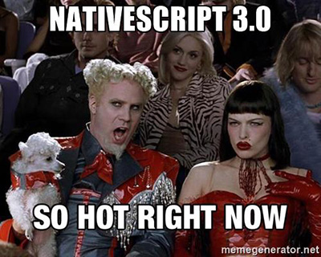

# Register for the NativeScript 3.0 Webinar

**NativeScript 3.0 is almost here!**

If I had to describe NativeScript 3.0 in two words, I would say **"FASTER APPS"** and say it loud! :loudspeaker:

But that's not all that is coming with 3.0. While the cat is (mostly) out of the bag with the [3.0 release candidate](https://www.nativescript.org/blog/nativescript-3.0-release-candidate-available-today), the final bits are coming soon. And what better way to learn about everything new and exciting in 3.0 than to attend our free online webinar!?

**On [Wednesday, May 17th, at 10 AM EDT](https://attendee.gotowebinar.com/register/3898733374227656450), the NativeScript team will show you how to build faster apps in less time with NativeScript 3.0.**

Not only will we be doing a deep dive into all of the performance improvements, we will also be covering enhancements to your development experience (think devtools and CLI updates), recent updates to [UI for NativeScript](http://www.telerik.com/nativescript-ui), and Angular 4 support (it's just "Angular" now :smile:).

We may also have "just one more thing" to show you! The NativeScript team has been working on a new tool to help make your NativeScript development easier than ever before (for both Mac and Windows developers). By attending the webinar, you can get a sneak peek of this new tool and sign up for the public beta.

Don't forget, during the webinar, we will be answering your questions live via Twitter by using **#AskNativeScript** to tag your questions.

**Seats really are limited, so [register now](https://attendee.gotowebinar.com/register/3898733374227656450)!**

*You can learn more about NativeScript 3.0 today with these resources:*

- [Sneak Preview of NativeScript 3.0](https://www.nativescript.org/blog/sneak-preview-of-nativescript-3.0)
- [NativeScript 3.0 Release Candidate](https://www.nativescript.org/blog/nativescript-3.0-release-candidate-available-today)
- [UI for NativeScript 1.7 RC with {N} 3.0 Support](https://www.nativescript.org/blog/telerik-ui-for-nativescript-1.7-rc-is-available)