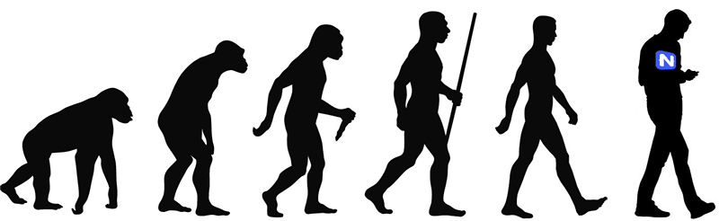

# Did You Miss the Evolution of NativeScript Webinar?

Last week hundreds of NativeScript developers tuned in to hear about the **Evolution of NativeScript**. But what *exactly* did that entail?

- [Jen Looper](https://twitter.com/jenlooper) showed off the latest in NativeScript tooling: from the [Marketplace](https://market.nativescript.org/), to the [Playground](https://play.nativescript.org/), to [NativeScript Sidekick](https://www.nativescript.org/nativescript-sidekick);
- [Sebastian Witalec](https://twitter.com/sebawita) gave a primer on sharing code between an Angular web app and a native mobile app;
- [TJ VanToll](https://twitter.com/tjvantoll) told us about the next release of NativeScript and gave a quick run down of squeezing more performance out of your apps;
- [Eddy Verbruggen](https://twitter.com/eddyverbruggen) gave a demo of his latest work around [Augmented Reality in NativeScript](https://www.nativescript.org/blog/preview-of-augmented-reality-in-nativescript);
- [Rob Lauer](https://twitter.com/RobLauer) had the arduous duty of emceeing and gave a brief demo of the new Sidekick extension for Visual Studio.

## Watch it Now

If you missed the webinar presentation last week, no problem, it's up on YouTube for you to view:

iframe width="560" height="315" src="https://www.youtube.com/embed/Z0wZs8JSf-k" frameborder="0" allowfullscreen></iframe>

## Best of the Questions

We love having the opportunity to answer questions live during the event. If you're curious, you can take a look at the Q&A by checking out [#AskNativeScript](https://twitter.com/search?f=tweets&vertical=default&q=%23asknativescript&src=typd) on Twitter.

We had some great questions, but this one stood out:

<blockquote class="twitter-tweet" data-lang="en">
<a href="https://twitter.com/hashtag/AskNativescript?src=hash&amp;ref_src=twsrc%5Etfw">#AskNativescript</a> Will SideKick support webpack?
&mdash; Josh Comley (@joshcomley) <a href="https://twitter.com/joshcomley/status/921026044748025856?ref_src=twsrc%5Etfw">October 19, 2017</a></blockquote>

And yes, **[it is planned](https://github.com/NativeScript/sidekick-feedback/issues/10)**. Improving Sidekick is an ongoing effort and this feature is a perfect example of that process!

## Thank You!

A big thanks to everyone who attended, asked questions, and continue to download and support our free and open source framework. We are already looking forward to (and planning) an exciting 2018!