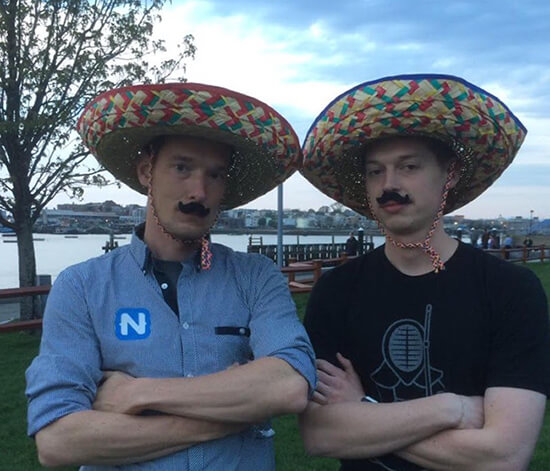

# The Evolution of NativeScript - Register for the Free Webinar

This spring and summer have been full of new NativeScript features, tooling options, and improvements. NativeScript is evolving into something more than just an open source framework.

If you're new to NativeScript (or just getting back from a *very* extended Pokemon Go outing), there are some things you may have missed:

- [NativeScript UI](https://www.nativescript.org/ui-for-nativescript) is now completely free;
- Quickly experiment with the [NativeScript Playground](https://play.nativescript.org/);
- Discover verified plugins in the [NativeScript Marketplace](http://market.nativescript.org/);
- Preview our support for [Augmented Reality](https://www.nativescript.org/blog/preview-of-augmented-reality-in-nativescript);
- Bootstrap your app development with [NativeScript Sidekick](https://www.nativescript.org/nativescript-sidekick).

> You also may have missed the 2nd annual NativeScript Developer Day, which took place on September 18th and 19th in NYC, where we first announced many of these offerings. You can [read the full recap here](https://www.nativescript.org/blog/nativescript-developer-day-2017-recap).

And we continue to move forward, improving the core NativeScript framework, adding valuable features, and boosting support for your favorite tools.

**On [Thursday, October 19th, at 10 AM EDT](https://attendee.gotowebinar.com/register/2558904791825604611), the NativeScript team will demonstrate to you the very latest in the evolution of the NativeScript stack.**

Not only will we cover some of the highlights of recent releases, but we will also be covering NativeScript 3.3, diving into web + mobile code sharing, and even have a special guest appearance by NativeScript plugin developer extraordinaire, [Eddy "the plugin" Verbruggen](https://twitter.com/eddyverbruggen)!

> Eddy and TJ VanToll may or may not appear in sombreros. You'll just have to tune in to find out.

During the webinar you'll be able to interact directly with the NativeScript team as we will be answering your questions live via Twitter. Just use **#AskNativeScript** to tag your questions when the webinar starts.

**Seats really are limited, so [register for the free NativeScript webinar now](https://attendee.gotowebinar.com/register/2558904791825604611)!**