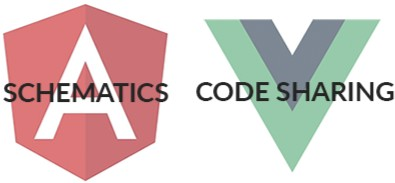

# Angular and Vue.js Web to Mobile Code Sharing Webinar

The next major version of NativeScript is here! 🎉

With the [4.0 release](https://www.nativescript.org/blog/nativescript-4.0-is-out) we've seen a host of significant features and improvements. And [NativeScript 4.1 just came out last week](https://www.nativescript.org/blog/announcing-the-nativescript-4.1-release), providing even *more* enhancements such as:

- **50% faster launch times** on Android (for real 😀)
- Full support for **Angular 6**
- **Augmented Reality** support, CSS gradients, and improved tooling

Since the next major version of NativeScript is here, it's time to take a closer look 🧐 at the latest and greatest.

It's *also* time for updates on our ever-popular **web and mobile code sharing opportunities with both the Angular and Vue.js frameworks**. What better way for us all to get together than an online webinar!?

[Register for the NativeScript Code Sharing Webinar](https://attendee.gotowebinar.com/register/5221651479657103362?source=blog) (button)

On Tuesday, June 12th at 10AM ET, Google Developer Advocate [Stephen Fluin](https://twitter.com/stephenfluin) will be joining the NativeScript Developer Relations team as we dive into:

- What's new with NativeScript 4.0 (and 4.1!) and Angular 6
- Taking advantage of NativeScript's support for Angular Schematics
- The latest on web/mobile code sharing in both Angular and Vue.js

[Reserve your spot today](https://attendee.gotowebinar.com/register/5221651479657103362?source=blog) and we will see you next week!