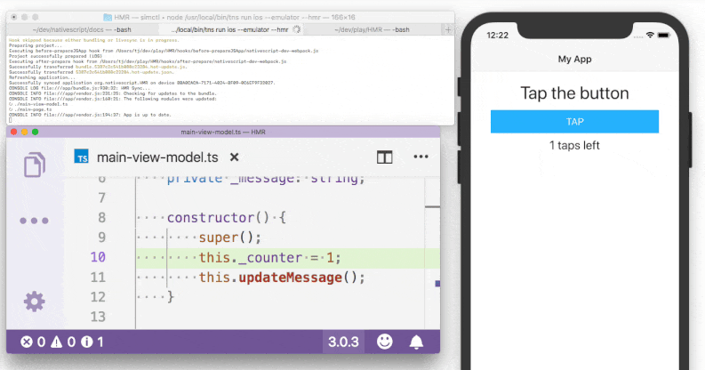

# Join the NativeScript 5.0 Launch Webinar 🚀

Unless you've been hiding under a rock, you're probably aware that NativeScript 5.0 is due out at the end of October!

Here on the NativeScript team, we are extremely excited about this release, to say the least. From **Hot Module Replacement** to **tns preview**, this release is all about dramatically improving the developer experience.

So the best way for us to share this excitement is to invite you to a free online webinar during which we will cover everything you need to know about NativeScript 5.0:

**[Join us on Thursday, November 8th at 11:00 AM ET](https://attendee.gotowebinar.com/register/4127364734673378051?source=blog-announce) as we do a deep dive into {N} 5.0.**

During this webinar event you'll hear from the NativeScript Developer Relations team as we cover new features such as:

- 🔥📦🔃 [Hot Module Replacement](https://www.nativescript.org/blog/nativescript-hot-module-replacement) (worth attending just to learn more about this feature!);
- ⛑️ Support for the iOS Safe Area;
- 🧐 The new *interactive* CLI;
- 🤸 `tns preview` and how you can start using the NativeScript Playground preview capabilities from your local desktop.

> **TIP:** Get ahead of the pack with `npm install -g nativescript@next` to get a look at what's coming in 5.0!

We will also spend a little time making sure you're all caught up on the very latest with our [Vue.js](https://www.nativescript.org/vue) and [Angular](https://www.nativescript.org/nativescript-is-how-you-build-native-mobile-apps-with-angular) integrations. And if you missed the recent [NativeScript-Vue 2.0](https://www.youtube.com/watch?v=QtGBCj6gCLY) or [Angular code sharing](https://www.youtube.com/watch?v=WdhJZ8kGXvw) webinars, they are both up on YouTube now!

[Sign Up for the NativeScript 5.0 Webinar](https://attendee.gotowebinar.com/register/4127364734673378051?source=blog-announce)

