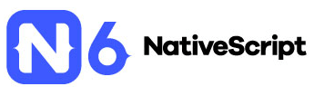

# Join the NativeScript 6.0 Launch Webinar

NativeScript 6.0 represents a quantum leap for JavaScript-native app development. For years we’ve seen how web developers can become native mobile app developers overnight, using skills honed over the years to create increasingly more engaging mobile experiences for iOS and Android.

But "mobility" as we once knew it is evolving. Today we’re adding new mobile experiences like [chatbots](https://www.progress.com/kinvey/chat) and [augmented reality](https://www.nativescript.org/blog/getting-started-with-augmented-reality-in-nativescript) and new platforms like Apple Watch and Android Wear, using your framework of choice - Angular or Vue.js (and even [React](https://github.com/shirakaba/react-nativescript) or [Svelte](https://svelte-native.technology/) 🤯).

**NativeScript 6.0 is where it all comes together.**

[Join us on Thursday, July 18th at 11:00 ET](https://attendee.gotowebinar.com/register/5579493045301682178?source=blog) for a webinar where we’ll dive into what’s coming in NativeScript 6.0, including:

- NativeScript AppSync
- Material design support
- Improved developer experience with Webpack and HMR, plus improved debugging
- The latest from Angular and Vue.js
- Upcoming support for wearables like Apple Watch and Wear OS
- Preview of NativeScript running on macOS
- ...and plenty more

> **Webinar Pro Tip:** Even if you can't make the live webinar, register anyway and we'll send you a link to the recording.

[Register for the Webinar](https://attendee.gotowebinar.com/register/5579493045301682178?source=blog)