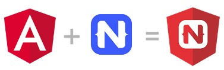

# Upcoming NativeScript Webinars on Angular and Vue.js

Yes, you read that title right! In the next few weeks we are delivering **two unique webinars** for your viewing pleasure 📺💓.

Our integrations with [Angular](https://www.nativescript.org/nativescript-is-how-you-build-native-mobile-apps-with-angular) and [Vue.js](https://www.nativescript.org/vue) are arguably the two main reasons people consider NativeScript. Not the truly native performance, not the ability to access 100% of device APIs, and not the ability to reuse your web skills. **It's all about the frameworks!** But yes, those other things are nice 😀.

> Skip my rambling and register for [NativeScript-Vue 2.0: Back to the Vueture](https://attendee.gotowebinar.com/register/1758384468554226433?source=blog) and [Add Native Mobile to Your Angular Projects: The Migration Story](https://attendee.gotowebinar.com/register/2763645959595670529?source=blog) 

## NativeScript-Vue 2.0

Did you know that Vue.js developers are the fastest growing segment of all NativeScript developers? It makes sense when you see how easy it can be to build fast and reliable apps using the framework you know and love on the web!

**Join us on [Thursday, October 4th at 11AM ET](https://attendee.gotowebinar.com/register/1758384468554226433?source=blog) as cover NativeScript-Vue 2.0!**

> Get a sneak peak at NativeScript-Vue 2.0 in [this article by Jen Looper](https://dev.to/vuevixens/a-sneak-peek-of-nativescript-vue-20-k7j)

In this free online webinar we will cover all of the 2.0 updates including:

- A completely overhauled app template;
- Updates to the professional [NativeScript UI components](https://www.nativescript.org/ui-for-nativescript);
- Full compatibility with the latest version of NativeScript;
- A preview of the integration with the Vue.js CLI devtools;
- An early look at NativeScript 5.0 features like Hot Module Reload!

[Register for the Vue.js Webinar](https://attendee.gotowebinar.com/register/1758384468554226433?source=blog)

## Web and Mobile Code Sharing with Angular

This tweet from the Angular team speaks for itself:

<blockquote class="twitter-tweet" data-lang="en">
It&#39;s now possible to build a single app for Web AND Native by adding <a href="https://twitter.com/NativeScript?ref_src=twsrc%5Etfw">@NativeScript</a> to an existing <a href="https://twitter.com/hashtag/Angular?src=hash&amp;ref_src=twsrc%5Etfw">#Angular</a> app <a href="https://t.co/FxTsVrfSIg">https://t.co/FxTsVrfSIg</a>
&mdash; Angular (@angular) <a href="https://twitter.com/angular/status/1032459746287136769?ref_src=twsrc%5Etfw">August 23, 2018</a></blockquote>

[Sharing code between your Angular web app and native mobile apps](https://blog.angular.io/apps-that-work-natively-on-the-web-and-mobile-9b26852495e7) has never been easier. So come learn with us as we dive into an updated way of sharing 70-80% of your code between web and mobile.

**Join us on [Thursday, October 11th at 11AM ET](https://attendee.gotowebinar.com/register/2763645959595670529?source=blog) as we examine the very latest in web to mobile code sharing with Angular and NativeScript!**

We will show you how you can take an existing Angular Web project and add NativeScript to it, by converting it to a code-sharing project. The result will be an Angular web app, a native iOS app, and a native Android app. Three for the price of one! 🤑

During the webinar, we will show off the simple steps:

1. Convert your project with the [Angular CLI](https://cli.angular.io/) and [NativeScript Schematics](https://github.com/NativeScript/nativescript-schematics)
2. Use Angular and NativeScript to build for web and native iOS + Android

[Register for the Angular Webinar](https://attendee.gotowebinar.com/register/2763645959595670529?source=blog)