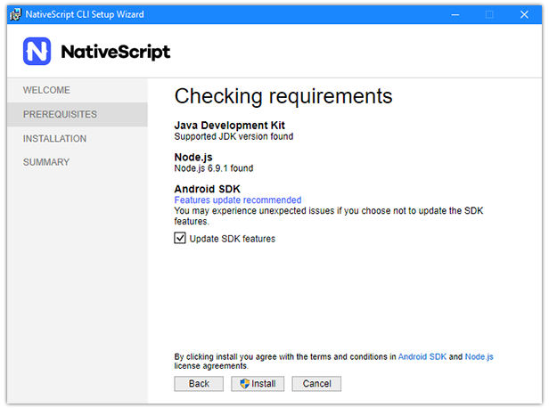
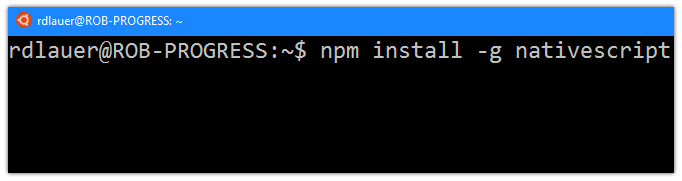

# Installing NativeScript on Windows

Windows developers, we have not forsaken you! While you've been able to install the NativeScript framework on Windows for a long time now, the process has always been focused on the command line. We fully realize that the Windows command line experience isn't quite up to par with macOS, and therefore isn't comfortable for many Windows developers. That has changed now with the release of our new [Windows installer](https://docs.nativescript.org/start/ns-setup-installer)!

Command-line tools are all the rage, and *nix-based operating systems like macOS make CLI development very comfortable. But the fact remains that a narrow majority of developers are on some form of Windows:

*In this chart (from the most recent [Stack Overflow Developer Survey](http://stackoverflow.com/research/developer-survey-2016#technology-desktop-operating-system)) we see the sum of Windows holding strong at about 52%.*

Let's take a look at the different ways you can get up and running developing NativeScript apps on Windows.

- [Installing NativeScript](#installing)
- [Tooling and Emulators](#tooling)
- [Building for iOS](#ios)
- [Updating NativeScript](#updating)

## Installing NativeScript

### Using the Windows Installer

This is where most of us should start, for good reason. Pure simplicity:

1. [Download the Windows installer](https://docs.nativescript.org/start/ns-setup-installer).
1. Run the installer.

It's important to note that this installer package is more than just the NativeScript framework. We also check for (and install when possible) required dependencies like [JDK](http://www.oracle.com/technetwork/java/javase/downloads/jdk8-downloads-2133151.html) and [Node.js](https://nodejs.org/en/). This is purposefully meant to be an extremely easy way to get started with NativeScript on Windows.

> Note: Since Xcode is macOS-only, you can only use the NativeScript CLI to develop Android apps on Windows. If you want to build iOS apps, you may want to try out [Telerik AppBuilder](http://www.telerik.com/platform/appbuilder). AppBuilder (part of [Telerik Platform](http://www.telerik.com/platform)) provides robust tooling for NativeScript, including a service that builds for iOS and Android in the cloud, removing the need to install any dependencies!

If the installer doesn't work for you for some reason [please let us know](https://github.com/nativescript/nativescript-cli/issues)!

If you *prefer* command-line tooling, there are other options for you:

### Using the Command Prompt

After you have installed [Node.js](https://nodejs.org/en/), you can open an *administrator* command prompt and run `npm install -g nativescript`.

You'll then want to install some required dependencies with this PowerShell command:

	@powershell -NoProfile -ExecutionPolicy Bypass -Command "iex ((new-object net.webclient).DownloadString('https://www.nativescript.org/setup/win'))"

> You may want to consult our [detailed setup instructions for Windows](http://docs.nativescript.org/start/ns-setup-win).

When installation is complete, be sure to verify your installation by running the `tns doctor` command.

### Using Ubuntu on Windows 10

If you are running Windows 10, you [now have the option](http://www.zdnet.com/article/ubuntu-and-bash-arrive-on-windows-10/) of installing the [Windows Subsystem for Linux](https://msdn.microsoft.com/en-us/commandline/wsl/about) (WSL). With WSL and the Bash shell, you can try installing NativeScript using a combination of the [Linux installation instructions](http://docs.nativescript.org/start/ns-setup-linux) and [these supplemental commands](https://gist.github.com/wenzhixin/43cf3ce909c24948c6e7) to perform a headless installation of the Android SDK.

**I caution that your mileage may vary, as the Linux instructions provided will not map perfectly to Ubuntu on Windows.** However, if you are a linux person trapped on a Windows PC, you may find this a more palatable route!

## Tooling and Emulators

With the framework installed, your next step will be to make sure you have your development tooling and device emulators set up and functioning properly.

### Development Tooling

In terms of tooling, there is nothing stopping you from using any IDE or text editor! However, we generally recommend these IDEs/editors as they have built-in functionality for improving the development and debugging experience of NativeScript apps:

- Visual Studio Code and the [NativeScript extension for VS Code](https://www.nativescript.org/nativescript-for-visual-studio-code)
- WebStorm and the [NativeScript WebStorm plugin](https://plugins.jetbrains.com/webstorm/plugin/8588-nativescript)
- Visual Studio and Telerik AppBuilder's [extension for Visual Studio](http://www.telerik.com/platform/appbuilder/visual-studio-extension)

### Simulators and Emulators

While developing and debugging on real devices is a perfectly reasonable route to take, many of us want to use the Android emulators to quickly test our apps on a myriad of devices. The easiest way to get started is to follow our documentation on [setting up the Android emulators](https://docs.nativescript.org/tooling/android-virtual-devices).

What's that? You want to build and test on iOS? Read on!

## Building for iOS

A natural limitation of developing cross-platform apps on Windows is the fact that the Xcode build tools are only available for macOS. There are plenty of ways to work around this though!

1. Try the aforementioned [Telerik AppBuilder](http://www.telerik.com/platform/appbuilder) (with its optional [extension for Visual Studio](http://www.telerik.com/platform/appbuilder/visual-studio-extension)) to build your apps for iOS in the cloud.
2. Standalone build services like [BuddyBuild](https://www.buddybuild.com/) let you add cloud builds to your continuous integration/continuous delivery workflow.
3. If you have a Mac available, use it! By using a network share or code repository you can easily share code between Windows and Mac to perform builds and use the iOS Simulator.

## Updating NativeScript

After a successful NativeScript installation, your next question might be how to **update** the NativeScript framework. There is a great [guide for upgrading NativeScript](http://docs.nativescript.org/releases/upgrade-instructions), which boils down to simply running `npm install -g nativescript` to get the latest bits (regardless of how you initially installed NativeScript).

*Be sure to follow that same guide to also quickly upgrade all of your individual NativeScript projects!*

## Get Started!

Once NativeScript is installed, you should start with our [comprehensive getting started tutorial](http://docs.nativescript.org/) to develop a cross-platform app using plain JavaScript or TypeScript + Angular!