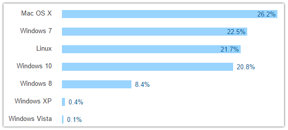

# Developing NativeScript Apps on Windows

These days if you attend any tech conference or watch any online presentation it feels like *everyone* is on a Mac. And for good reason - command-line tools are all the rage, and *nix-based operating systems like macOS make CLI-based development very comfortable. But the fact remains that a clear majority of total developers are on some form of Windows:

In this chart (from the most recent [Stack Overflow Developer Survey](http://stackoverflow.com/research/developer-survey-2016#technology-desktop-operating-system)) we see the sum of Windows holding strong at about 52%.

Windows developers, we have not forgotten you! And while you've been able to install the NativeScript framework on Windows for a long time now, since it has always been focused on the command line, it hasn't been quite as comfortable for many Windows devs. That has now changed with the release of our new Windows installer.

Let's take a look at the different ways you can get up and running developing NativeScript apps on Windows.

## Use the Windows Installer

## Use the Command Line

## Use Ubuntu on Windows 10

## Updating NativeScript

## Setting up Emulators

## Building for iOS