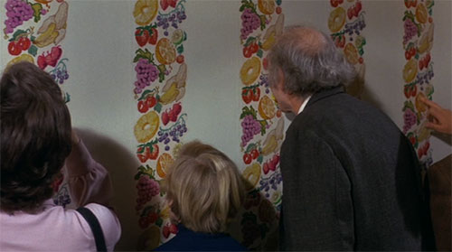

# Willy Wonka Was Actually Talking about NativeScript

One of the most endearing films of all time, [Willy Wonka & the Chocolate Factory](https://www.rottentomatoes.com/m/willy_wonka_and_the_chocolate_factory) is that rare flick that has maintained a certain relevance for both children and adults alike.

Wonka displayed a relentless, almost manic, pursuit of his vision of what a candy factory should be. Ignoring the fact that his Oompa Loompa employees were effectively slave labor, our dear Willy was able to build a successful business and create insane product demand during an economic depression.

Similar to Steve Jobs and his sabbatical with NeXT (yeah yeah, grant me *some* artistic license here!), Willy took a break from the public's prying eye to re-form and re-shape what was already a successful business. And turned it into something quite grand.

How does this relate to [NativeScript](https://www.nativescript.org/) you ask? What I'm going to propose here is that during the infamous tour of his factory, Wonka's quotes are as pertinent to NativeScript as they are to a Wonka Bar or an Everlasting Gobstopper.

Am I crazy? Most probably.

### "So much time and so little to do. Wait a minute. Strike that. Reverse it. Thank you."

Modern mobile app development means supporting multiple platforms. What better way to accomplish this than to build multiple apps from one code base? NativeScript provides true 100% code re-use between iOS and Android. With day-zero support for the latest iOS and Android APIs, NativeScript doesn't get in your way either. **It quite literally saves you time and helps to make you a more productive developer.**

And I'm not talking about *just* iOS and Android either. NativeScript, combined with Angular 2, can [go beyond mobile into desktop web](http://angularjs.blogspot.bg/2016/03/code-reuse-in-angular-2-native-mobile.html) and [desktop apps](https://github.com/NathanWalker/angular-seed-advanced).

Maybe Willy was on to something here?

### "There's no earthly way of knowing...Which direction they are going..."

I don't know about you, but the expansion of JavaScript libraries and frameworks over the past few years has thrown me a giant curve ball. Luckily, NativeScript has settled on [Angular 2](https://angular.io/) - arguably the most used and well-loved framework over the last seven years. Angular 2 has the support of Google, is performant as all get out, has flexible routing and templating features, and includes a robust dependency injection framework.

However, if you don't want to utilize what Angular 2 has to offer, you can stick with plain vanilla JavaScript!

Willy was a big fan of vanilla.

### "I, the undersigned, shall forfeit all rights, privileges, and licenses herein and herein contained, et cetera, et cetera...Fax mentis incendium gloria cultum, et cetera, et cetera...Memo bis punitor delicatum!"

Legal speak. Charlie didn't read it. You don't read it. That's why [NativeScript is fully open source](https://github.com/NativeScript/NativeScript) (sponsored by [Progress](https://www.progress.com/)) and licensed under Apache 2.0.

But what is Apache 2.0 really? You probably know it as a relatively permissive license, but you should read up on what Apache 2.0 *really* is at [tl;drLegal.com](https://tldrlegal.com/license/apache-license-2.0-(apache-2.0)).

I think you'll be happy as Charlie at the end of the tour.

### "And almost everything you'll see is eatable, edible. I mean, you can eat almost everything."

Willy would have loved NativeScript, because you *can* eat almost everything. Why? Because with NativeScript you can [re-use existing CocoaPods](https://docs.nativescript.org/plugins/cocoapods), [Android packages](https://www.nativescript.org/blog/plugins-and-jars), and almost any other JavaScript library out there.

For example, [lodash](https://www.npmjs.com/package/lodash), [underscore](https://www.npmjs.com/package/underscore), and [moment](https://www.npmjs.com/package/moment) all can be used with NativeScript.

NativeScript apps are fully native and don't use [WebViews](http://developer.telerik.com/featured/what-is-a-webview/). Therefore, if a JavaScript library doesn't depend on the browser DOM, it can probably be used with NativeScript!

### "If the good Lord had intended us to walk, he wouldn't have invented roller skates."

Awww yiss, put on your CSS roller skates! [NativeScript supports CSS](https://docs.nativescript.org/ui/styling) for styling your apps. The very same CSS you have known and (kind of) loved for all these years. There is even a [gorgeous default theme](https://docs.nativescript.org/ui/theme), along with online resources for [creating custom color schemes](http://nativescriptthemebuilder.com/).

As an added bonus, if styling the native iOS and Android UI widgets isn't enough for you, you can also leverage [Telerik UI for NativeScript](http://www.telerik.com/nativescript-ui) to go above and beyond the default native platform options.

### "Invention, my dear friends, is 93% perspiration, 6% electricity, 4% evaporation, and 2% butterscotch ripple."

Yes, Willy, **it is a lot of work** to create a framework from scratch! In fact, the NativeScript team started on the framework back in 2014. The NativeScript product today has almost three years of full-time engineering and product strategy work behind it!

And we aren't stopping there. 2017 is shaping up to be another huge year for NativeScript! Our 2.5 release in January is due to include such features as [Angular 2 AOT compilation](https://angular.io/docs/ts/latest/cookbook/aot-compiler.html), [webpack 2](https://webpack.github.io/) support, and the ability to [obfuscate](https://github.com/mishoo/UglifyJS) your JavaScript.

Be sure to subscribe to the [NativeScript blog](https://www.nativescript.org/blog) and to the [newsletter](https://www.nativescript.org/) to keep up with the latest news.

### "The snozzberries taste like snozzberries."

Enough said Willy.

Over the holidays, channel your inner introvert, avoid the relatives, and try out the [NativeScript getting started tutorials](http://docs.nativescript.org/angular/start/introduction.html). Happy holidays!

