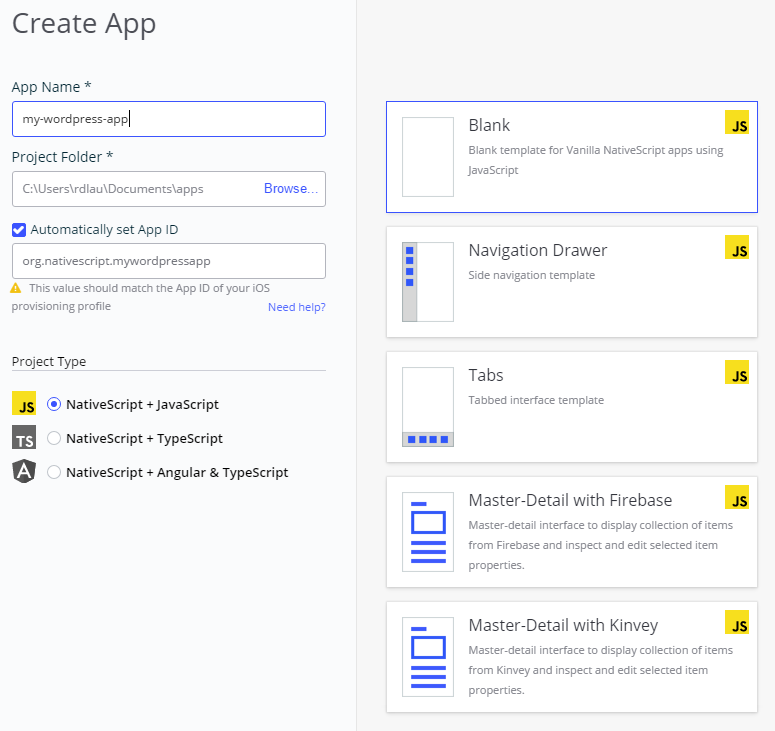
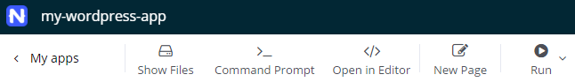
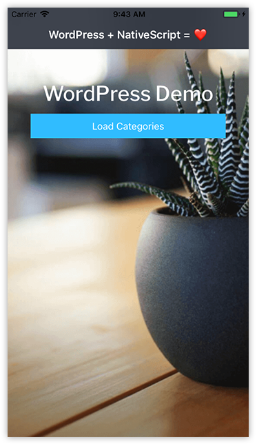
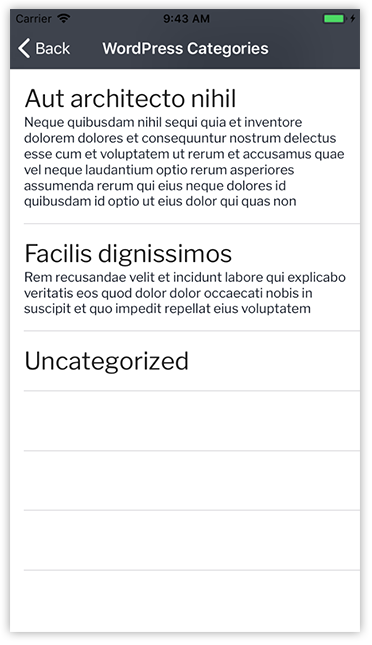

# Using WordPress Content in a Native Mobile App

WordPress is, by far, the most popular content management system (CMS) in use today. 60% of the CMS market is owned by WordPress, and further, almost 30% of **all websites** are [run on WordPress](https://w3techs.com/technologies/overview/content_management/all). This means A LOT of content in A LOT of websites that is craving to be used in new ways, on new devices. It some cases it makes perfect sense to leverage said content in a native mobile app. Enter NativeScript.

Yes, WordPress is for managing web content (HTML) and NativeScript is a great framework for building cross-platform native mobile apps (decidedly *not* HTML). So what do the two have in common?

> We don't advocate re-creating websites in mobile apps. You run the risk of violating Apple's terms for a "useful ???", and more importantly users likely will avoid your app if you are simply re-creating the same web experience. It's an opportunity to get creative! 👨‍🎨

## APIs FTW

As with any great relationship, NativeScript + WordPress = 😍 all started with a RESTful API...

Out of the box, WordPress includes RESTful API endpoints for WordPress data types, providing web developers (and mobile, and desktop) the ability to interact with stored content in new and exciting ways. And of course, the provided RESTful API endpoints are language-agnostic. Any framework that can consume JSON will happily digest what WordPress provides. Being that NativeScript is built on many web standards, consuming such an API with a simple `fetch` call in JavaScript is standard fare.

## Let's Build an App

I imagine if you are here, you have an existing WordPress site with weeks, months, or even years worth of content. The potential to re-purpose said content within a native, cross-platform, mobile app is intriguing to say the least.

I think there is no better way to learn something than to do it yourself. **So let's build an app!**

Let's put together a simple NativeScript app to leverage WordPress content categories, posts, and post content, running on both iOS and Android, all from the same shared codebase.

> While a deep dive of the WordPress API is out of the scope of this article, suffice it to say the API is well documented over at wordpress.org.

## NativeScript Sidekick

Trust me when I say every good NativeScript app starts with a starter kit provided by NativeScript Sidekick.

Sidekick is a free tool for Mac, Windows, and Linux that runs on top of the NativeScript CLI to provide you with templates, plugin management, cloud builds, and app store publishing.

> Read all about the features provided by NativeScript Sidekick in this series of articles.

Once you get Sidekick installed, open it up, **create a new app**, and choose the **Blank** template:

*I'm going to stick with plain JavaScript, but you're welcome to use TypeScript or Angular if you're more comfortable with those architectures.*

Before we open our code editor of choice, let's add a few pages to our app that we know we will need.

Click the **New Page** button and add two more pages, or views, to our app.

Both of the pages can just be **blank** pages, and you can name the first `category` and the second `post`.

## The Code

Our scaffolded app has three basic views:

- `home-page.xml` (comes with blank template)
- `category-page.xml` (you created this)
- `post-page.xml` (you also created this)

> It's a good time to note that a completed version of this app is available here on Github if you get lost!

Our `main-page` view is just going to be a button. Because who doesn't love a good button?

To render that screen, our `/home/home-page.xml` file just needs some simple layout code with a button:

	<Page xmlns="http://schemas.nativescript.org/tns.xsd"
		class="page bg"
		backgroundSpanUnderStatusBar="true">
	
	    <Page.actionBar>
	        <ActionBar title="WordPress + NativeScript = ❤️" class="action-bar">
	        </ActionBar>
	    </Page.actionBar>
		
	    <StackLayout class="p-20">
	        <Label text="WordPress Demo" class="h1 text-center m-t-30 heading"/>
	        <Button text="Load Categories" tap="showCategories" class="btn btn-primary btn-active"/>
	    </StackLayout>
	
	</Page>

...and its corresponding `home-page.js` file needs a little plumbing to wire up the button to send us to the next view, `category-page`:

	var frameModule = require('ui/frame');
	
	exports.showCategories = function() {
	  var navigationEntry = {
	    moduleName: './category/category-page',
	    animated: true
	  };
	  var topmost = frameModule.topmost();
	  topmost.navigate(navigationEntry);
	};

**Now it gets interesting.** Open up `/category/category-page.xml` and replace the existing code with the following NativeScript `ListView` (including an item template) like so:

	<Page xmlns="http://schemas.nativescript.org/tns.xsd"
		class="page bg"
		loaded="pageLoaded">
	
	    <Page.actionBar>
	        <ActionBar title="WordPress Categories" icon="" class="action-bar">
				<NavigationButton text="Back" android.systemIcon="ic_menu_back" />
	        </ActionBar>
	    </Page.actionBar>
	
		<ListView id="listview" items="{{ items }}" class="list-group">
			<ListView.itemTemplate>
				<StackLayout class="list-group-item" id="{{ id }}" tap="showPost">
					<Label text="{{ name }}" class="wp-category" />
						<Label text="{{ description }}" textWrap="true" class="wp-subtitle" />
					</StackLayout>
			</ListView.itemTemplate>
		</ListView>
		
	</Page>

This view's accompanying JavaScript file, `category-page.js`, contains two functions. `pageLoaded` is, not surprisingly, executed when the page is loaded, and `showPost` will navigate us to the next view (`post-page`), retaining the *context* of the category the user tapped:

	var frameModule = require('ui/frame');
	var Observable = require('data/observable').Observable;
	var ObservableArray = require('data/observable-array').ObservableArray;
	
	var page;
	var items = new ObservableArray([]);
	var pageData = new Observable();
	
	exports.pageLoaded = function(args) {
	  page = args.object;
	  page.bindingContext = pageData;
	
	  fetch('https://demo.wp-api.org/wp-json/wp/v2/categories')
	    .then(response => {
	      return response.json();
	    })
	    .then(function(r) {
	      pageData.set('items', r);
	    });
	};
	
	exports.showPost = function(args) {
	  var navigationEntry = {
	    moduleName: './post/post-page',
	    animated: true,
	    context: { id: args.view.id }
	  };
	  
	  var topmost = frameModule.topmost();
	  topmost.navigate(navigationEntry);
	};

Leaving us with a pleasing little screen containing our WordPress post categories:

The key code in `category-page.js` is the [fetch API](https://developer.mozilla.org/en-US/docs/Web/API/Fetch_API). `fetch` allows us to request data from a remote endpoint and return it in JSON, making it easily consumable in our app!

> You'll also quickly notice the API endpoint we are using is leveraging the WordPress demo dataset. With a lot of latin.

If we take a look at the returned JSON, we see a pretty legible dataset:

CODE

Ok, let's finish up and replace `post/post-page.xml` with another `ListView`:

	<Page xmlns="http://schemas.nativescript.org/tns.xsd"
		class="page bg"
		navigatedTo="pageNavigatedTo">
	
	    <Page.actionBar>
	        <ActionBar title="WordPress Posts" icon="" class="action-bar">
				<NavigationButton text="Back" android.systemIcon="ic_menu_back" />
	        </ActionBar>
	    </Page.actionBar>
	
		<ListView id="listview" items="{{ items }}" class="list-group">
			<ListView.itemTemplate>
				<StackLayout class="list-group-item" link="{{ link }}" tap="loadWebSite">
					<Label text="{{ title.rendered }}" class="wp-subtitle" />
					</StackLayout>
			</ListView.itemTemplate>
		</ListView>
	
	</Page>

...again, with our `post-page.js` code behind powering the view - and containing another two functions: `pageNavigatedTo` and `loadWebSite` which, respectively, perform a `fetch` request to load our posts and fire up a NativeScript WebView to show the post content's HTML output in an in-app web browser.

	var frameModule = require('ui/frame');
	var pageModule = require('ui/page');
	var webViewModule = require('ui/web-view');
	var Observable = require('data/observable').Observable;
	var ObservableArray = require('data/observable-array').ObservableArray;
	
	var page;
	var items = new ObservableArray([]);
	var pageData = new Observable();
	
	exports.pageNavigatedTo = function(args) {
	  page = args.object;
	  page.bindingContext = pageData;
	
	  var id = page.navigationContext.id;
	
	  fetch('https://demo.wp-api.org/wp-json/wp/v2/posts?categories=' + id)
	    .then(response => {
	      return response.json();
	    })
	    .then(function(r) {
	      pageData.set('items', r);
	    });
	};
	
	exports.loadWebSite = function(args) {
	  var link = args.view.link;
	
	  var factoryFunc = function() {
	    var webView = new webViewModule.WebView();
	    webView.src = link;
	    var page = new pageModule.Page();
	    page.content = webView;
	    return page;
	  };
	
	  var topmost = frameModule.topmost();
	  topmost.navigate(factoryFunc);
	};

> While I'm glossing over some of the details to save space, a reminder that all of this code is available here on Github.

	**And we are done!** Well, if you run the app as-is, it might not look exactly like these screenshots. That is until you grab the completed `app.css`, the `/images/bg.png` background image, and font files from `/fonts` from Github and add those to your app.

## Deploy Your App

Back in NativeScript Sidekick, go to the **Run** menu and choose **Run on Device**. Choose the connected device on which you want to run your app, and build the app using our cloud servers (or build locally if you have the appropriate SDKs set up).

> Any troubles deploying an app? Consult the NativeScript Sidekick docs!

SCREENSHOT (GIF?)

> Sharing website content between web and mobile platforms is one thing. **What about sharing the actual website code with mobile?** While not related to WordPress, if you're an Angular developer and interested in the NativeScript + Angular web/mobile code sharing story, be sure to check out our code sharing webinar on YouTube.

## Summary

Today we looked at how we can consume existing WordPress content with the WordPress REST API to power a truly native, cross-platform app with NativeScript. By using a little JavaScript and CSS, you can re-purpose years worth of content and provide a new, engaging, user experience for your users. Happy NativeScripting!

