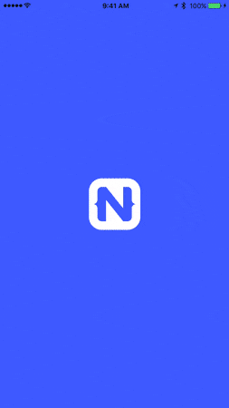

# Offloading Tasks to Worker Threads with NativeScript

Performance. Performance. Performance.

When we talk to NativeScript developers, performance consistently ranks as one of the top reasons they have chosen NativeScript. It's also something we can never get enough of. While mobile hardware continues to improve, there are always ways to improve the performance, and hence user experience, of the apps we create.

Aside from providing truly native UI across both iOS and Android, NativeScript has some additional tricks up its sleeve to allow you to customize your app for unique scenarios and squeeze *even more* out of those precious CPU cycles.

Let me introduce you to worker threads on NativeScript.

## Worker Threads

Better known in the web world as web workers (or service workers), worker threads allow you to take the single-threaded environment NativeScript provides and turn it into a multi-threaded one.

> **NOTE:** The Workers API in NativeScript is loosely based on the [Web Workers API](https://developer.mozilla.org/en-US/docs/Web/API/Web_Workers_API/Using_web_workers) and the [Web Workers Specification](https://www.w3.org/TR/workers/).

[Service workers](https://developers.google.com/web/ilt/pwa/introduction-to-service-worker) (a type of web worker) are quite popular with Progressive Web App (PWA) developers, as they allow for notifications and other non-blocking tasks. But where PWA functionality is limited, NativeScript picks up the slack.

As evidenced by this NativeScript demo app, 99% of the time the single-threaded model is just fine (as running everything on the UI thread is super fast):

There are however scenarios when operations can take longer and hence impact the app's UI. This can lead to the app feeling slower than it should.

To solve this problem, NativeScript provides a [Workers API](https://docs.nativescript.org/core-concepts/multithreading-model#workers-api) which allows you to create tasks executed on separate threads that are completely isolated from the main app context.

Let's take a look at some examples of when (and when not) to use workers with a NativeScript app.

## When to Use a Worker

Virtually any task that can run outside of synchronous UI operations is, at least in theory, a candidate for worker threads.

> **TIP:** Before you start thinking a worker thread is a silver bullet for complicated performance issues, make sure you take into account the overhead needed to spin up additional threads.

CPU-intensive, non-UI related tasks are probably the best examples of when worker threads can be beneficial. If you are *very heavy* user of Google Analytics, you may find yourself measuring every user action, page view, feature use, and remote service call in your app. Even though these calls should run asynchronously, they can still have a negative impact on the main thread.

Another good example is image processing - a CPU-intensive task on its own, made much more complicated when you mix it into the UI thread!

> A great example of offloading image processing is presented in these demo apps for [NativeScript Core](https://github.com/NativeScript/demo-workers) and [Angular](https://github.com/NativeScript/worker-loader).

## Sample Code

Lets look at how we can build a very simple worker ourselves:

	var worker = new Worker("./workers/my-worker.js");
	
The above code initiates a new thread (runtime instance) and executes the script referenced (`my-worker.js`). Next, we will want to communicate with the worker and/or receive a message or result from it. This is accomplished with messages:

	// send a message to our worker
	worker.postMessage("Hello worker thread!");
	
	// receive a message from our worker
	worker.onmessage = function(msg) {
	    console.log("Received this message from the worker thread: " + msg.data);
	}
	
In our `my-worker.js` file, we will provide the `onmessage` method to *receive* the message from the main thread:

	onmessage = function(msg) {
	    console.log("Received this message from the main thread: " + msg.data);
	    
	    // perform some crazy cpu-intensive task here!
	    
	    // send a message back to the main thread
	    postMessage("Hello main thread!");
	    
	    close();
	}
	
### Error Handling and Terminating the Thread

Using worker threads can be a bit scary, as threads left open can consume resources and potentially bloat memory usage and destroy performance. Therefore, make sure you catch any errors and close/terminate the threads when you are done:

Basic example in `my-worker.js`:

	onerror = function(e) {
	    console.log("Oh no! Worker thread error: " + e);
	    return true;
	}

And in your app code (should you want to display an error):

	worker.onerror = function(e) {
	    console.log("Worker thread error: " + e);
	}

> **IMPORTANT:** Worker threads are kept alive until explicitly terminated by the main thread or closed themselves!

Close the thread in `my-worker.js` with `close();` (as shown above). Or terminate the thread in your app code with `worker.terminate();`.

If the worker thread is not terminated/closed, the garbage collector will not collect and dispose of the worker instance.

## When NOT to Use a Service Worker

It's important to keep in mind that every time you spin up a new worker thread, you are adding to the resource and memory footprint of your app. This means that should you spin up too many at once or use them in the wrong situations, the **performance of your app may actually decrease**.

If you think a worker thread will help you process input from a form, or displaying a chart, or many other basic app features, think again. The NativeScript framework has already been optimized for the vast majority of these scenarios.

Your best bet is always to measure the functional performance of your app on a variety of both iOS and Android physical devices.

